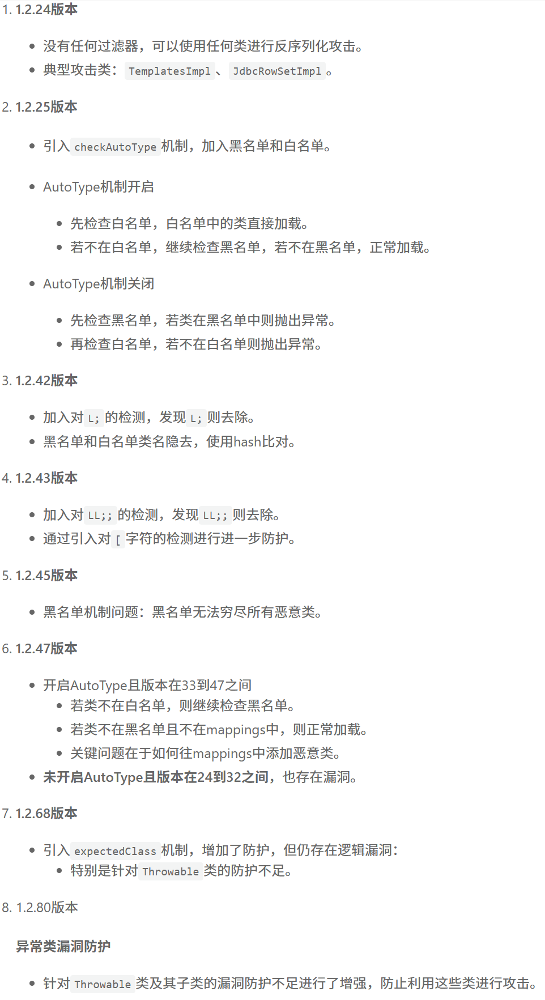

# 总览

```
常规漏洞：JWT/JDBC/MyBatis/Hibernate/RCE/SPEL/SSTI/XXE
框架安全：ServletAPI/Struts2/Spring/SpringMVC/SpringBoot
组件安全：Solr/Shiro/FastJson/Log4j/Xstream/SnakeYAML等
序列化专题：反射/RASP/JNDI/RMI/LDAP注入/gadget链/Ysoserial
链分析：URLDNS、commons-collections1-7、commons-beanutils等
相关安全：Swagger/Actuator/Druid/内存马/高版本绕过/字节码加载等
其他：免杀JSP/IIOP/T3协议/ASM/Javassist/AJP/审计CheckList表
```


- 相关靶场：

  https://github.com/whgojp/JavaSecLab

  配置：

  【PHPstudy开启mysql8.0并配置数据库账户密码】

  

  配置文件中修改。。。。。。，注意不要端口重复以及端口占用

  

  同时在application-dev.yml文件中重置数据库账户密码

  https://github.com/bewhale/JavaSec

  https://github.com/j3ers3/Hello-Java-Sec

# JavaSeclab靶场

## java的四种SQL注入

**总结：**

**黑盒：正常发现和利用即可**
**白盒：**
**1、确定数据库通讯技术【分析对方网站采用哪种技术进行sql查询，可以结合数据包的指纹|请求的路径|代码关键字|技术实现特定文件|进行分析】**
**2、确定类型后找调用写法**
**3、确定写法是否安全（预编译）**

#### JDBC

如果采用JDBC进行sql查询，关注其代码写法，存在漏洞的写法有下列方式：

1、采用Statement方法拼接SQL语句

2、PrepareStatement会对SQL语句进行预编译，但如果直接采取拼接的方式构造SQL，此时进行预编译也无用。

3、JDBCTemplate是Spring对JDBC的封装，如果使用拼接语句便会产生注入

4、自定义过滤（黑白名单）


安全写法如下：

SQL语句占位符（?） + PrepareStatement预编译

#### MyBatis

MyBatis支持两种参数符号，一种是#，另一种是$，#使用预编译，$使用拼接SQL。

1、order by注入：由于使用#{}会将对象转成字符串，形成order by "user" desc造成错误，因此很多研发会采用${}来解决，从而造成注入.

2、like 注入：模糊搜索时，直接使用'%#{q}%' 会报错，部分研发图方便直接改成'%${q}%'从而造成注入.

3、in注入：in之后多个id查询时使用#同样会报错，从而造成注入. 

#### Hibernate

1、setParameter：预编译

2、username=:username 预编译

#### JPA

username=:username 预编译


 ### java的XXE

白盒关注以下类：

```
 \* 1. XMLReader
 \* 2. SAXReader
 \* 3. DocumentBuilder
 \* 4. XMLStreamReader
 \* 5. SAXBuilder
 \* 6. SAXParser
 \* 7. SAXSource
 \* 8. TransformerFactory
 \* 9. SAXTransformerFactory
 \* 10. SchemaFactory
 \* 11. Unmarshaller
 \* 12. XPathExpression
```

 如果以上类有用到以下方法

```
1、XMLReader parse
2、SAXParser parse
```

则关注该方法解析的变量是否可控实现XXE

**总结：获取适用以上12种类函数实现，parse后续的可控变量**

### java的RCE

命令执行：

1、ProcessBuilder【使用该类时关注变量是否可控】

2、Runtime.getRuntime().exec()【使用该方法时关注其中的变量是否可控】

3、ProcessImpl【使用该反射调用类时关注变量是否可控】

代码执行：

4、GroovyShell【使用该类时关注变量是否可控】

### java的SSRF

关注URL方法


### java的URL跳转漏洞

URL跳转：

1、Spring MVC:         redirect ModelAndView【基于SepringMVC的重定向，关注这两个方法，会造成URL跳转漏洞】
2、HttpServlet:         setHeader sendRedirect【基于Servlet的重定向，关注这两个方法】
3、Spring:                 ResponseEntity setHeader【基于Spring的重定向，关注这两个方法】

**总结：关注什么技术栈实现源码，看类函数触发可控变量**

# Hello-Java-Sec靶场

### java的SPEL表达式注入

SpEL（Spring Expression Language）表达式, 是一种功能强大的表达式语言、用于在运行时查询和操作对象图，方法调用和基本的字符串模板功能。

SpelExpressionParser parseExpression

危险代码：

EvaluatiionContext evluationContext = new StandardEvluationContext

### java的SSTI注入

SSTI(Server Side Template Injection) 服务器模板注入, 服务端接收了用户的输入，将其作为 Web 应用模板内容的一部分，在进行目标编译渲染的过程中，执行了用户插入的恶意内容。

1、Thymeleaf

2、Velocity

3、Freemarker

其他语言参考：https://www.cnblogs.com/bmjoker/p/13508538.html


### SpringBoot框架

```
通过页面图标和内容发现springboot框架
利用springboot框架漏洞点：Actuator 泄露等漏洞
```

框架专扫：

https://github.com/sule01u/SBSCAN【PYTHON.exe启动】

【遇到需要登录的页面，可以添加-H "Cookie=网页登录后前端扒下来的登录用户Cokkie值"】

https://gitee.com/team-man/spring-scan【网页插件】

https://github.com/CllmsyK/YYBaby-Spring_Scan【java启动】

https://github.com/wh1t3zer/SpringBootVul-GUI

#### Swagger 未授权访问

会导致 API框架接口泄露

##### 原理：

- 该漏洞可用于快速获得网站信息

Swagger是一种用于描述API的开源框架。Swagger接口泄露漏洞是指在使用Swagger描述API时，由于未正确配置访问控制或未实施安全措施，导致API接口被不授权的人员访问和利用，从而导致系统安全风险

网站如果使用了Swagger框架，该框架会在网站生成一个所有接口及参数具体配置以及值的集合网页，如果网站未正确配置导致攻击者可以访问Swagger，攻击者就可以在该网页获取网站所有接口，目录参数，功能点，从而进行测试

- 网站通过接口实现获取信息，上传文件等功能

##### 漏洞发现

通过扫描器扫描工具扫描出swagger页面,如使用SpringBoot spring-scan插件可以扫描出网页的SWAGGER泄露目录

##### 利用

发现swagger页面找到利用口:扫描器

利用swagger页面中的接口获取漏洞：手工或工具

##### Apifox

Apifox是专业接口测试工具，在获取到swagger页面后，可以把其目录导入到Apifox工具中

- 需要登录的swagger页面不能直接导入目录，得下载swagger页面文件后导入文件

导入后可以更方便的进行测试，同时它也支持自动化测试

2、Apifox测试Swagger接口

#### Actuator 未授权访问

```
发现Actuator页面找到利用口:扫描器
利用Actuator页面中的接口获取漏洞：
要知道有哪些泄露，如Heapdump泄露泄露，druid jolokia等
```

##### 原理

代码中不安全的配置

导致Actuator页面会被未授权访问，而Actuator页面是网站所有路由及配置信息的集合，因此攻击者可以获取这些信息

##### 发现

插件扫描器扫描发现

##### 利用

###### heapdump利用

通过Actuator页面发现了Heapdump文件，下载Heapdump文件后，可以通过headump提取工具提取出网站的各种配置信息后进行分析{秘钥，账户密码，接口信息 数据库 短信 云应用......}

JDumpSpider提取器：https://github.com/whwlsfb/JDumpSpider

heapdump_tool提取器：https://github.com/wyzxxz/heapdump_tool

JDumpSpiderGUI提取器：https://github.com/DeEpinGh0st/JDumpSpiderGUI

###### 其他

druid jolokia等

# 反序列化

## 分类及概念

序列化是将Java对象转换成字节流的过程。而反序列化是将字节流转换成Java对象的过程，

**java序列化的数据一般会以标记(ac ed 00 05)开头，base64编码的特征为rO0AB**，

**JAVA常见的序列化和反序列化的方法有*AVA 原生序列化和JSON 类（fastjson、jackson）序列化等。**

**Java中可分为：原生反序列化类(ObjectInputStream.readObject()、SnakeYaml、XMLDecoder等)、三方组件反序列化(Fastjson、Jackson、Xstream等)**

## 原生序列化类函数

-SnakeYaml：

完整的YAML1.1规范Processor，支持Java对象的序列化/反序列化

-XMLDecoder：xml语言格式序列化类函数接口

-ObjectInputStream.readObject()：任何类如果想要序列化必须实现

-继承java.io.Serializable接口

## 三方组件反序列化

**Log4j**：

Apache的一个开源项目，是一个基于Java的日志记录框架。

历史漏洞：https://avd.aliyun.com/search?q=Log4j

漏洞触发：logger.error logger.info

**Shiro**：

Java安全框架，能够用于身份验证、授权、加密和会话管理。

历史漏洞：https://avd.aliyun.com/search?q=Shiro

漏洞触发：CookieRememberMeManager黑盒特征：数据包cookie有没有rememberme

**Jackson**：

当下流行的json解释器，主要负责处理Json的序列化和反序列化。

历史漏洞：https://avd.aliyun.com/search?q=Jackson

漏洞触发：readValue

**XStream**：

开源Java类库，能将对象序列化成XML或XML反序列化为对象

历史漏洞：https://avd.aliyun.com/search?q=XStream

漏洞触发：fromXML 

**FastJson**：

阿里巴巴公司开源的json解析器，它可以解析JSON格式的字符串，支持将JavaBean序列化为JSON字符串，也可以从JSON字符串反序列化到JavaBean。

历史漏洞：https://avd.aliyun.com/search?q=fastjson

漏洞触发：parseObject parse

## payload工具使用


-https://github.com/qi4L/JYso

-https://github.com/frohoff/ysoserial

-https://github.com/welk1n/JNDI-Injection-Exploit

### Java-chains

-https://github.com/vulhub/java-chains

在webtool启动，为网页版本

指导手册：[Payload Generation | Java Chains](https://java-chains.vulhub.org/docs/module/generate)

```
eg: Generate模块中的JavaNativePayload功能，可以指定利用链，命令，脏数据等然后生成payload
eg： 
对于Javasec靶场的readobject靶场，可以在JavaNativePayload功能页面选择
K1链：CommonsCollectionsK1(CC3.2.1 invokerTransformer链)----Templateslmpl(TemplatesImpl加载字节码)----BytecodeConvert(处理字节码)----Exec
然后生成payload代码并提交
```


### Yakit

-Yakit https://yaklang.com/

一个应用程序

```
如何通过Yakit生成payload：
eg:
打开Yakit，选择本地配置文件yakit ,  选择返连模块，选择Revhack分组中的Yso-java Hack功能
选择利用链：BeanShell1/win_cmd，自己随便起一个类名，输入要执行的命令eg:calc
点击生成，查看生成的代码
```


## Javasec靶场

```
搭建与使用：
详细见D：/小迪2024资料/102
```

### 原生类

#### readobject

漏洞原理：

```
Java 反序列化
序列化是将 Java 对象转换成字节流的过程。而反序列化是将字节流转换成 Java 对象的过程
java序列化的数据一般会以标记(ac ed 00 05)开头，base64编码后的特征为rO0AB
JAVA 常见的序列化和反序列化的方法有JAVA 原生序列化和 JSON 类（fastjson、jackson）序列化
序列化和反序列化通过ObjectInputStream.readObject()和ObjectOutputStream.writeObject()方法实现。在java中任何类如果想要序列化必须实现java.io.Serializable接口
java.io.Serializable其实是一个空接口，在java中该接口的唯一作用是对一个类做一个标记，让jre确定这个类是可以序列化的。
同时java中支持在类中定义writeObject、readObject函数，这两个函数不是java.io.Serializable的接口函数，而是约定的函数
如果一个类实现了这两个函数，那么在序列化和反序列化的时候ObjectInputStream.readObject()和ObjectOutputStream.writeObject()会主动调用这两个函数。这也是反序列化产生的根本原因
Windows： java -jar ysoserial-0.0.6-SNAPSHOT-BETA-all.jar CommonsCollections5 "cmd /c calc" | base64 -w0
Macos： java -jar ysoserial-0.0.6-SNAPSHOT-BETA-all.jar CommonsCollections5 "open -a Calculator" | base64
```

#### xmldecoder

接受xml数据，在xml中指向java的lang利用类processBuilder【自带的原生类】，再注入命令

#### SnakeYaml

原理：

```
SnakeYAML 反序列化
SnakeYAML 在反序列化时可以指定 class 类型和构造方法的参数
结合 JDK 自带的 javax.script.ScriptEngineManager 类，可实现加载远程 jar 包，完成任意代码执行
```

### 第三方组件

#### Fastjson

Fastjson 是阿里巴巴的开源 JSON 解析库，它可以解析 JSON 格式的字符串，支持将 Java Bean 序列化为 JSON 字符串，也可以从 JSON 字符串反序列化到 JavaBean

#### Jackson

Jackson-databind 支持 Polymorphic Deserialization 特性（默认情况下不开启），当 json 字符串转换的 Target class 中有 polymorph fields，即字段类型为接口、抽象类或 Object 类型时， 攻击者可以通过在 json 字符串中指定变量的具体类型 (子类或接口实现类)，来实现实例化指定的类，借助某些特殊的 class，如 TemplatesImpl，可以实现任意代码执行。


## Fastjson专题

FastJson是阿里巴巴的的开源库，用于对JSON格式的数据进行解析和打包。其实简单的来说就是处理json格式的数据的。例如将json转换成一个类。或者是将一个类转换成一段json数据。Fastjson 是一个 Java 库，提供了Java 对象与 JSON 相互转换。

#### Fastjson版本区别



#### 反序列化利用链

```
#FastJson反序列化各版本利用链分析
参考文章：https://xz.aliyun.com/news/14309
参考文章：https://mp.weixin.qq.com/s/t8sjv0Zg8_KMjuW4t-bE-w

应用知识：
1、序列化方法：
JSON.toJSONString()，返回字符串；
JSON.toJSONBytes()，返回byte数组；
2、反序列化方法：
JSON.parseObject()，返回JsonObject；
JSON.parse()，返回Object；
JSON.parseArray(), 返回JSONArray；
将JSON对象转换为java对象：JSON.toJavaObject()；
将JSON对象写入write流：JSON.writeJSONString()；
3、常用：
JSON.toJSONString(),JSON.parse(),JSON.parseObject()

使用引出安全：
1、序列化固定类后：
parse方法在调用时会调用set方法
parseObject在调用时会调用set和get方法
2、反序列化指定类后：
parseObject在调用时会调用set方法

```

