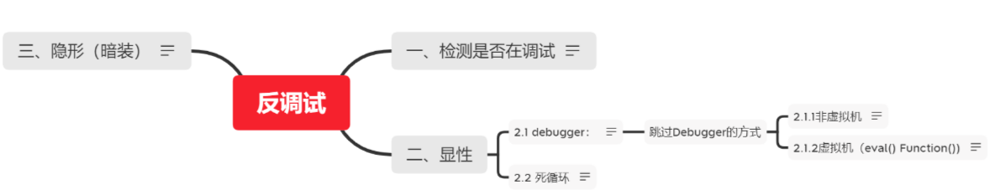
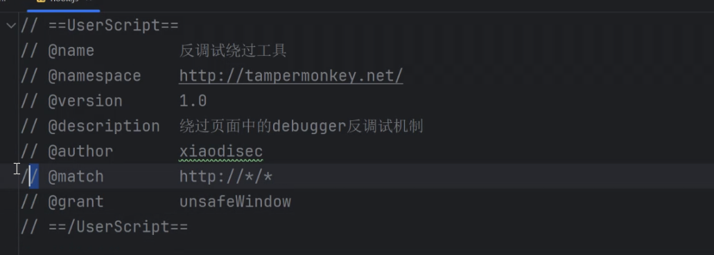
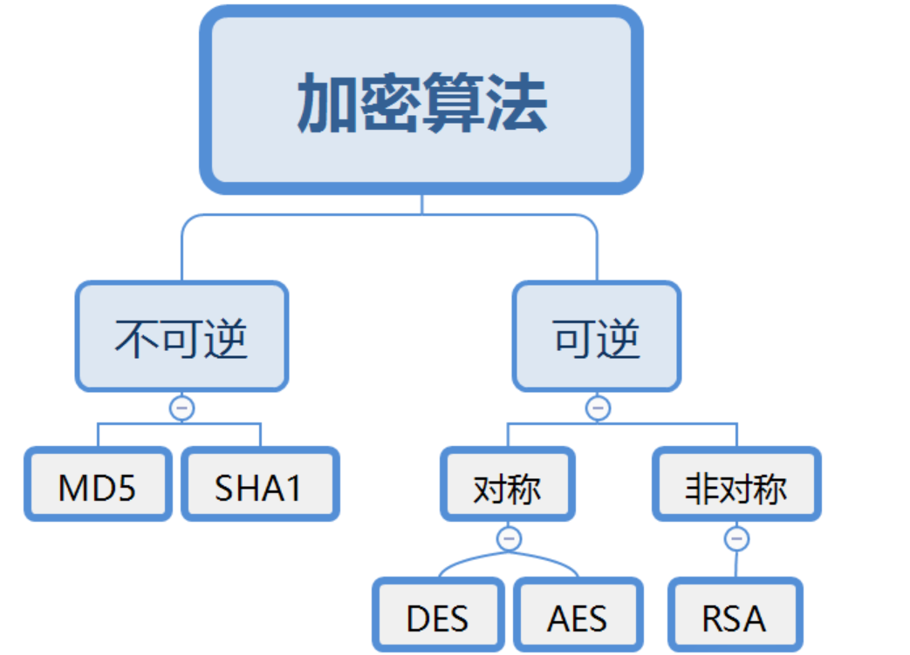
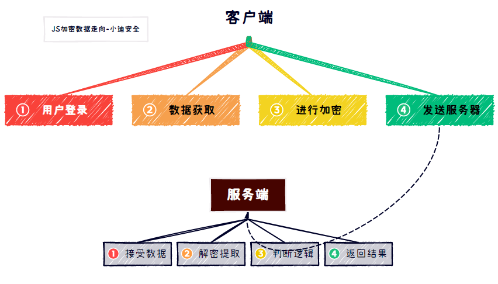

# 什么是JS逆向

JS逆向与安全

事实上，前端的逆向通俗来说就是在浏览器的调试器中，对存在的前端代码（这里的前端代码包括html、js、css见上图差异对比）进行分析，通过分析其逻辑获取其中的路由、加密方式、敏感信息泄露等。

*应用场景：

例子1：某登录框加密传输时，枚举爆破攻击手法

例子2：某电商前端计算折扣，逆向JS篡改价格

例子3：某操作验证码认证时，生成验证码可预测

例子4：某平台的X-Sign签名，逆向后可构造任意请求

例子5：某应用参数加密时，逆向算法可改Payload测试

# F12开发者工具

### 元素

当前页面的源代码

### 网络

访问一个网页，网络会显示加载了哪些数据包，如包括加载的资源，加载的文件，js文件登

#### 保留日志

有时页面重新载入或载入新的页面时，旧的数据包会自动删除，保留日志可以保留网站的数据包

#### 停用缓存

一些网站加载一遍后就会有缓存，再次访问时就不在加载数据包

#### 筛选

在chom浏览器中图案是一个漏斗，可以快速筛选关键字和文件类型

##### 启动器

启动器可以查看网页的加载顺序，也可以以此来查看网页逻辑

### 源代码

#### 网页

##### 断点

参考：https://mp.weixin.qq.com/s/E-eip5LXjGHFYmNlrNK-bg

###### 普通断点

选中一行代码，在左侧单击即可启动普通断点

断点后访问网站，网站会执行代码至断点处并停止网页

当执行断点后，开发者工具支持下一步【查看下一帧】

###### DOM断点

基于事件断点

###### 条件断点

当满足写入的条件时执行断点

###### XHR/提取断点

基于网址目录的断点，当网址包含输入的目录时，执行断点

##### 作用域

简单来说就是运行后相关的数据值

本地仅查看当前网站的相关数据值，全局则查看整个浏览器的相关数据值

断点后查看作用域，即可查看代码执行到这一步时网站传递的变量值，查看断点后的下一帧时，作用域同步更新，可以以此查看前端的明文什么时候在什么地方用了怎样的方式变成了密文

##### 调用堆栈

简单来说就是代码的执行逻辑顺序，可以以此查看文件的先后执行顺序，从而明白网页逻辑

要从下往上看

##### 搜索

ctrl+f可以调用搜索，可以进行关键字搜索

### 控制台

可以输入一些js语句并执行

控制台支持在引入网站文件的库与配置信息的基础上，执行命令

如可以直接使用网站通过加载自己的文件来 自定义的函数

### 演示案例

**申通快递会员中心登录页面泄露加密算法**：

打开my.sto.cn页面,随便输入账户密码，点击登录【显示登录失败】，打开F12开发者工具，选择网络，找到LoginResult请求数据包，在其中的载荷可以看到提交的账户密码电话，但是发现是加密后的密文

选择LoginResult请求数据包中的启动器，查看请求调用堆栈，从下往上看，找到匿名，login,ajax,send【ajax是网站发送数据的一种技术】,猜测对明文的加密算法具体代码在这四步中，则详细查看这四步的代码

打开匿名的代码，发现了效验账号密码电话的代码以及加密明文的代码，开始审计加密明文的代码，发现对方设置了秘钥参数并以此使用了encrypt函数加密

在效验账号密码电话的代码处设置断点，然后再次尝试登录网站，查看作用域，发现此时账户密码仍为明文，一帧一帧往后看并关注作用域，直到发现作用域中的账户密码有字段开始变密文，确定具体加密的代码行

UserName = encodeURI(encrypt.encrypt(numMobile));

在控制台做进一步确定：在控制台执行命令encodeURI(encrypt.encrypt(123456))，查看执行结果的密文，再到网站中的手机号也输入123456并查看表单的加密密文，确定是否一致，一致说明没有问题

对代码中的encrypt字段选中，并对其ctrl+f进行全局搜索，找到定义该加密算法的文件：

var encrypt = new JSEncrypt();，同时发现了加密公钥的参数值。

再对JSEncrypt字段进行选中，查看其来源文件【选中后鼠标放上去】：jsencrype.min.js:8

-------

之后想要进行爆破需要加密，就可以直接下载jsencrype.min.js文件并调用，设置加密公钥参数值，然后对字典中所有明文用此算法进行加密即可

### 辅助工具

##### V_Jstools

```
https://github.com/Zjingwen/v-jstools

浏览器插件拓展，它并不是一款单一的工具，而是集 AST、hook、代码注入、请求修改等等功能于一体的工具箱。
```

当工具激活时，成功注入hook后，控制台会显示对应呼入的JSHOOK名字

此时再访问被注入的网页时，就会自动找到关键的地方：如登录页面在提交数据后，会显示解密后的载荷与响应结果以及登录页面涉及的代码

##### autoDecoder

```
https://github.com/f0ng/autoDecoder

Burp插件，根据自定义来达到对数据包的处理（适用于加解密、爆破等），类似mitmproxy，不同点在于经过了burp中转，在自动加解密的基础上，不影响APP、网站加解密正常逻辑等。
```

BP添加该插件，成功添加后BP就会多出一个该插件的配置页面，配置成功后抓数据包包，在数据包的内置页面也会多出一个页面，是使用该插件生成的页面

在配置页面，有自带算法加解密功能，接口加解密【自己定义解密并写成JS文件，然后该插件使用接口对文件进行使用来解密数据】

##### JSRPC

```
https://github.com/jxhczhl/JsRpc

执行：resouces/JsEnv_Dev.js
var demo = new Hlclient("ws://127.0.0.1:12080/ws?group=xiaodi");

import requests

if __name__ == '__main__':
​     js_code = '''
​        console.log("hello");
​     '''
​     url = "http://localhost:12080/execjs"
​     data = { "group": "xiaodi", "code": js_code }
​     res = requests.post(url, data=data)
```


# 逆向核心技术

### 反调试技术



反调试技术：

实现防止他人调试、动态分析自己的代码

##### 调试检测方法

###### 无限Debugger技术

通过断点技术以及源码让其无限循环在debugger代码

在网页写一个反调试的源码，源码内容为debugger，设置断点在debugger，一但触发反调试，网页就无限循环在debugger

###### 键盘监听（F12）

网站设置网页对用户的键盘进行监听，如一旦监听到用户按F12，就触发网页的一些操作，如触发无限Debugger

###### 加密混淆

为了避免攻击者通过搜索关键字找到反调试技术相关的代码，可以采用对反调试基础代码进行加密，然后把密文和解密的代码放到PHP文件中

-检测浏览器的高度插值

-检测开发者人员工具变量是否为true

-利用console.log调用次数

-利用代码运行的时间差

-利用toString

-检测非浏览器


##### 绕过方式

###### 禁用所有断点

通过停用所有断点来禁止一些反调试技术(以断点为基础的反调试技术)，但也会使用户无法使用断点

###### 禁用局部断点

假如一旦进行调试就会触发断点，网页停止在某行代码，可以对此行代码进行局部禁用断点【右击代码行左侧-一律不在此处暂停】

```
eg:

Scrape在线视频`antispider8.scrape.center/page/3`
在该网页一旦尝试F12进行调试，就会触发断点停止网页，对停止的代码行进行禁用局部断点，刷新页面，再次进行调试，会断点在另一行代码，也对其进行禁用局部断点，刷新页面，绕过成功
```

###### 设置条件断点

将断点的暂停代码行，手工再次设置其为断点，并选择为条件断点，设置其条件为false

-----------------------------------------以上均为常规简易绕过，看运气---------------------------------------------------

###### 替换文件执行

- 利用文件重定向

由于js文件是前端文件，运行在浏览器处，用户可以在客户端对文件进行修改，而反调试技术的源码就写在前端js文件中

【网页想要进行反调试，就必须最少加载反调试相关的前端文件，攻击者就可以通过已加载的网页源码找到反调试相关的文件】

因此攻击者可以重写反调试技术相关的js文件，将反调试技术功能的代码删除，并替代原来网站的js文件【源代码-替换-防止替换项的文件夹-选择替换文件所在的文件夹，在“替换”中打开该文件夹】

选择断点的暂停代码行所在的文件，将其拖放至“替换“中选择的文件件，在其中对其代码进行修改注释或删除反调试技术代码并保存

```
eg:

中国空气在线监测平台 aqistudy.cn/html/city_realtime.php
1.直接右键网页会被拦截：检测到非法调试，管理员禁用右键
2.F12会被拦截：检测到非法调试，管理员禁用F12
3.反复按F12有几率打开开发者工具，但进去就进入无限Debugger

先反复F12打开开发者工具，进入无限Debugger，但是打开了开发者工具，多访问几个网页让网络多记录一些文件，ctrl+f搜索关键词“检测到非法调试”，找到反调试技术相关的文件，审计源码，发现了对方使用了endebug函数，再去搜索这个函数，找到相关文件jquery.min.js%3Fv=1.3
对其使用替换文件执行，删除对endebug函数的定义的代码
此时重新访问发现还是不行
事实上对方网页还在city_realtime.php文件中也写了反调试的代码，并对其进行加密混淆，无法通过直接搜索关键字检测到非法调试“来找到这个文件，需要自己找到这个文件，

- 后面是eval混淆还原，可以跳到相关知识查看具体
然后发现有一行代码是对一大串密文进行解密，将其放到控制台进行执行，发现执行的结果为解密的反调试技术相关代码，则对该文件同样使用替换文件执行
此时就绕过了该网页的反调试
```

###### 通过Burp修改匹配

- 利用流量到BURP修改返回

BP有一个功能为匹配修改【代理设置-HTTP匹配和替换规则】，可以自动将数据包中字段替换成其他字段

网站第一次被访问时，后端发来前端需要加载的js文件页面，通过bp将后端发来的文件中的反调试相关的代码关键词替换成其他或空，使其反调试功能相关的代码失效

- 使用该方法，通过bp过滤响应数据包后访问网页时，要保证js文件都被加载（CTRL+5强制加载）

另一方面，要注意BP过滤响应数据包时的过滤设置中要带上过滤js文件

###### 油管猴插件配合HOOK

详细看HOOK模块的实战应用

### HOOK

##### 什么是HOOK?

JS Hook（钩子，注入劫持）是一种通过拦截和修改JavaScript函数或对象行为的技术，

主要用于：

*动态分析网页行为

*修改页面功能

*调试和逆向工程

*自动化测试

*安全研究

##### HOOK的原理

网页的js文件在被用户请求后会存在于前端，攻击者可以通过前端的控制台进行覆写，也就是注入劫持，如用户可以二次自定义网页js文件函数：

```
如网页原代码：
function test()
{
 consle.log("test");
}
test；

攻击者在控制台输入代码：
var _test=test;
      function test()
      {
      debugger
      _test;
       }  
       
 
网页就会在执行网页源代码中的tset;时跳到 
function test(){
      debugger
      _test;}
由于var _test=test,因此就会无限循环执行debugger
```

- 刷新页面就会请求后端发来新的js文件，覆写的代码就会失效
- 实战中最基本的手法是function置空网页的构造函数，让debugger函数相关的应用或具体代码被置空而使debugger失效

##### HOOK标注

```
@name         定义脚本的名称
@namespace    用于区分不同脚本的作用域
@version      定义脚本的版本号
@description  描述脚本的功能或用途
@author       定义脚本的作者
@match        定义脚本的运行匹配规则，针对哪些网址时该脚本生效
@icon         定义脚本的图标
@grant        定义脚本所需的特殊权限
```



如上，配合脚本猴使用时@namespace  为http://tampermonky.net

@match为全网址匹配，不建议这样使用，建议针对网站写：https://xxxxx.xxxx.com/*

@grant的值unsafeWindow可以调用unsafeWindow的方法

###### 钩子的固定开头

```
//hook标注
//hook标注
//hook标注
......

（function():void{
'use strict'；
```

##### 实战应用

通过油管猴插件配合HOOK，先找到网页反调试的Debugger的功能代码点，将代码发给ai，让ai帮忙写一个绕过以上debugger的篡改猴hook【记得标明目标地址】，然后放到篡改猴中应用

eg:

```
jishulink.com/video/c246316,技术邻在线学习视频网站
当打开网页按F12没有问题，观看视频时打开F12会触发dubugger
首先打开F12重新加载网页来使”网络“加载网页的所有资源，然后打开视频，触发debugger，在所有已加载的资源中搜索关键字debugger，筛选出debugger的实现功能代码：
fuction(){}
.constructor("debugger")(),
将其交给ai：
fuction(){}.constructor("debugger")() 利用篡改猴写一个hook绕过debugger的代码，目标地址：htttps://jishulink.com/video/c246316
打开浏览器安装的篡改猴页面-添加新脚本，将ai给出的代码粘贴进去，保存并启用
此时重新加载视频网页，查看hook是否成功绕过debugger
```

### 加密算法识别



网页由于为了防止被爆破等原因，会在前端先对要提交的数据包中的一些明文数据进行加密后再方法哦数据包中发给后端，因此我们想要看懂数据包/篡改数据包，就需要对网页前端的JS加密算法进行识别

##### JS加密数据走向



##### 分析方法：

1.根据调用堆栈找加密前后定位

2、根据提交URL,参数名等搜索定位【查看调用堆栈过于复杂时可以尝试】

##### 请求数据加密分析：

```
只提供思路，实战去参考案例：
1.提交数据，查看网页发送的数据包，发现加密的密文

------

第二三步说白了就是通过数据包中发现的密文进行一步一步的往前追踪，找到加密模块的代码，搞清楚整个加密逻辑以及可能存在的秘钥/盐/偏移量值

2.通过定位算法的两种方法找到加密模块，找到具体实现加密的函数
对参数进行分析时可以采用断点后执行，根据参数传递的值分析参数是干什么的

3.进一步追踪加密函数，找到加密函数的文件以及具体实现代码
4.本地复现算法进行验证
```

###### 演示案例：参数逆向

login.zhangin.com账户登录页面

先在网页随便输入账户密码

提交数据，查看网页网络中新刷新的数据包【发送的数据包，即发送的数据包中】的载荷【网页提交数据包的表单】，发现加密的密文，开始分析算法

先查看该数据包的启动器中的请求调用栈，发现过于复杂，则根据参数名搜索定位，在网页发送的数据包中发现密文的参数为param:，全局搜索param:

发现·LoginView-y4edJkk4.js文件中存在param:o代码，打开并分析，想知道O参数传递的是什么值，在param:o下面的代码行设置断点，刷新网页，查看param:o的执行结果，发现O为加密数据的值，

则往前溯源O变量，发现代码：

const O = za(c.value,S);

再追踪S变量，发现S变量的代码 let S的断点后执行结果为111111<><>22222<><>aavl【测试时输入的账户为111111，密码为222222，验证码为aavl】，大仙S值为账户密码，说明就是把账户密码的明文给S，再通过za()函数加密成O变量，追踪za()函数,鼠标放上去查看来源【FunctionLocation】，找到另一个文件LoginView-y4edJkk4.js:19

查看代码，发现za加密函数的具体代码：

```
za = (e,n) => {
const t = _0.enc.Latinl.parse(e)
, r = _0.enc.Latinl.parse(e);
return _0.AES.encrypt(n,t,{
  iv:r,
  mode: _0.mode.CBC,
  padding: _0.pad.ZeroPadding
}).toString()
}
```

发现该加密函数的具体实现代码算法为AES，

偏移量为r=54oQDepNSHj4zCup【r=_0.enc.Latinl.parse(e),而e为za = (e,n)中传来的参数值，则说明r来源于za的第一个参数，往上面的代码追踪，const O = za(c.value,S)，za的第一个参数是c.value，查看c.value的值，为“54oQDepNSHj4zCup”,则r=54oQDepNSHj4zCup】

CBC模式

Zeropaddingt填充

秘钥为t=54oQDepNSHj4zCup【t = _0.enc.Latinl.parse(e),跟r一样，来源于za的第一个参数】

以上得出算法的加密方式以及具体秘钥/偏移量/加密模式，则进行本地验证：

在本地打开加密工具，选取AES-CBC模式，输入秘钥key以及偏移量IV，选取填充模式padding mode为ZeroPadding，输出模式Output为base64，对数据111111<><>22222<><>aavl进行加密，发现结果与O变量断点调试测试时的结果一致，说明算法分析正确

###### 演示案例：调用栈逆向

auth.xincheng.com新域控股统一登录页面

先打开开发者控制台-网络实现监听

输入账户123456密码666666验证码111111提交进行测试

网络中新出现的数据包为刚刚提交的数据包，查看LoginService.ashx数据包,发现载荷的表单数据中存在

```
vcode:111111
txtUserName:123456
hidetxtPassword:CAQ6ydjMJHRXXXXXXXXXXXXXXXXXXxxxxxxxxxxxxxxxxxihIg==
```

说明密码666666被加密成密文，开始分析

先查看该数据包的启动器中的请求调用堆栈

```
send	@	jquery-1.10.2.min.js:23
ajax	@	jquery-1.10.2.min.js:23
login	@	(索引):755
(匿名)	@	(索引):651
dispatch	@	jquery-1.10.2.min.js:22
v.handle	@	jquery-1.10.2.min.js:22
```

，发现并不复杂，则进行分析,查看login的代码，点击@ (索引) ：755

发现代码：

```
jQuery.ajax({
type:"POST",
dataType:"json",
url:"LoginService.ashx"
data: { vcode: $("#vcode").val(), lang: 'en-us', systemCode: $("#systemCode").val(), rememberPassword: false, challengeNumber: $("#challengeNumber").val(), randomDate: randomDate, hidetxtPassword: hidetxtPassword, txtIsTrustAccessor: $("#txtIsTrustAccessor").val(), txtUserName: submitusername, txtVerificationCode: "" },
......
})
```

根据代码进行的分析确定该代码实现提交数据包的功能，在data参数中传递数据，其中传递的密文为hidetxtPassword

但我们要找的是加密模块，要看该代码以前的代码，发现这串代码上面紧接着一串代码

```
  if (IsPasswordEncrypt == "true") {
                var encrypt = new JSEncrypt();
                encrypt.setPublicKey($("#Public_key").val());
                hidetxtPassword = encrypt.encrypt($("#txtPassword").val());
                if (hidetxtPassword.endWith('==') == false) {              
                   hidetxtPassword = encrypt.encrypt($("#txtPassword").val());
                }
            }
            var submitusername = myTrim($("#txtUserName").val());
```

找到了加密模块的代码：

```
 var encrypt = new JSEncrypt();
 encrypt.setPublicKey($("#Public_key").val());
 hidetxtPassword = encrypt.encrypt($("#txtPassword").val());
```

分析该代码理清逻辑：

定义一个JSEncrypt类的对象，再拿该对象与秘钥Public_key对密码进行加密，

先查看JSEncrypt()函数，来源于jsencrypt.min.js文件，查看该代码，发现没有什么算法相关的关键字，说明对方使用的可能是自定义的加密算法，为了后续我们复现该算法，我们可以直接把jsencrypt.min.js文件下载到本地，使用时直接本地调用该文件常见JSEncrypt类的对象即可

然后我们需要查看秘钥Public_key的值，全局搜索Public_key，在索引的表单中找到了Public_key的值

```
 <textarea id="Public_key" rows="15" style="width: 100%; display: none;">MIIBIjANBgkqhkiG9w0BAQEFAAOCAQ8AMIIBCgKCAQEAynjrCVuQRQscFBs+f9MBN6HA7ES9E/elS8wyJspi/N0dBXPmimgtdvDV/QI4BkE4irvM0vMJIEZzQJ22TEimD0oi4e9aMF5u+82/oIFEaCuAkdpxuF9XWfC5HNFivRzdMaX80UOajOkx+8cVjaiaXxR9KFFkJwyHv88v0B08vJHaSpP7igSJAAon0htj43JwZSNDQWQNkkw18zISGKASIz9ZNik00CAWXNEnkOq7bLClcp4yH4gGz/USf0PJimTWjfDLNRhvdwn9YlZpjepQTPux3BWzhBu1pMB0QtZd1SKxLMsrMV9yn9TUIVllg1B8eE+f1fbyZfS+SwQAE6u+xQIDAQAB</textarea>
```

后续进行本地复现：

先下载jsencrypt.min.js文件，将其放到一个新文件夹中，然后使用js开发工具WebStorm打开该文件夹

在该文件夹目录下创建新html文件，输入以下代码：

```
<!DOCTYPE html>
<html lang="en">
<head>
   <meta charset="UTF-8">
   <title>Title</title>
</head>
<body>
<script src="jsencrypt.min.js"></script>
<script>

 var encrypt = new JSEncrypt();
 encrypt.setPublicKey("MIIBIjANBgkqhkiG9w0BAQEFAAOCAQ8AMIIBCgKCAQEAynjrCVuQRQscFBs+f9MBN6HA7ES9E/elS8wyJspi/N0dBXPmimgtdvDV/QI4BkE4irvM0vMJIEZzQJ22TEimD0oi4e9aMF5u+82/oIFEaCuAkdpxuF9XWfC5HNFivRzdMaX80UOajOkx+8cVjaiaXxR9KFFkJwyHv88v0B08vJHaSpP7igSJAAon0htj43JwZSNDQWQNkkw18zISGKASIz9ZNik00CAWXNEnkOq7bLClcp4yH4gGz/USf0PJimTWjfDLNRhvdwn9YlZpjepQTPux3BWzhBu1pMB0QtZd1SKxLMsrMV9yn9TUIVllg1B8eE+f1fbyZfS+SwQAE6u+xQIDAQAB");
 
 hidetxtPassword = encrypt.encrypt("666666");
 console.log(hidetxtPassword);
  
</script>
</body>
</html>
```

在浏览器中打开该html文件页面，通过控制台查看666666加密后的结果，发现与网站加密后的密文一致，算法分析正确

之后就可以在数据包中修改密码的密文来尝试测试sql注入等漏洞

##### 返回数据加密分析：

查看数据包的响应，发现返回的数据为加密的密文

```

```


###### -演示案例：WEBpackge打包/url逆向

eg:

endata.com.cn/BoxOffice/BO/Month/oneMonth.html 艺恩-数据智能服务商

打开网络实现监听，刷新页面，选择Fetch/XHR,看到刷新的数据包的响应为密文

先查看启动器中的调用栈，发现过于复杂，则用第二种方法，尝试搜寻url，找了该数据包请求的网址url【标头-请求网址】:GetData.ashx，全局搜索，发现一个文件Comnmo.js?v=2021.10.1

打开文件分析代码

```
$.ajax({
   url:xxxxxxxxx
   data:xxxxxxxxxx
   type:"POST"
   xxxxxx
   xxxx
   success:function(e,t,n){
   xxxxxxx
   }
})
```

猜测function为加密模块具体代码实现，里面具体的代码有JSON.parse(webInstace.shell(e))，根据断点查看e的数据值，发现e为数据，则猜测JSON.parse(webInstace.shell(e))为加密函数

查看webInstace.shell()的来源，发现为webDES.js文件，则说明确实为加密文件【关键词DES】，加密算法为webInstace.shell()

跳到该文件，发现其代码被混淆，用到了WEBpackge技术将代码打包混淆

使用WEBpackge打包技术的文件不能直接向上面第二个案例一样直接引用该文件并使用其算法

需要用到node运行调用，要在Node.js环境中调用WEBpack打包的前端JS文件

将该文件下载到本地，直接把该文件交给ai：

```
已知webDES.min.js为webpack打包的代码，如何运行调用webDES.min.js里面的webInstace.shell
```


###### -演示案例： 2

- 跳跳跳，用到开发的东西，还没学

-------

### SIGN签名绕过分析

##### 什么是SIGN签名？

```
Sign（签名）机制广泛应用于API请求、数据传输、身份验证等场景，用于确保数据的完整性和来源可信性。它对渗透测试（Penetration Testing）带来了显著的影响，既有安全增强作用，也增加了测试的挑战，测试人员需要结合逆向分析、动态Hook、服务器逻辑测试等方法，才能有效发现潜在的绕过漏洞。
```

##### 影响

```
正面影响
1、提高安全性，减少低风险漏洞
防篡改：Sign通常基于HMAC、RSA、AES等算法，确保数据在传输过程中未被篡改，减少中间人攻击（MITM）风险。
防重放攻击（Replay Attack）：时间戳（Timestamp）和Nonce机制使得截获的请求无法直接重放。
防未授权访问：请求必须携带正确的签名，否则会被服务器拒绝，减少越权漏洞（如未授权API访问）。
2、推动更深入的测试方法
迫使更关注业务逻辑漏洞（如绕过签名校验），而非仅依赖自动化工具扫描。
负面影响
1、增加渗透测试的复杂度
逆向分析难度大：如果Sign算法被混淆或加密，测试人员需花费大量时间逆向JavaScript/App代码。动态调试受限：Burp Suite、Fiddler等工具难以直接修改请求，因为签名错误会导致请求失效。自动化扫描失效：大多数Web漏洞扫描器（如AWVS、Nessus）无法自动处理签名，导致误报或漏报。
2、可能掩盖漏洞，导致误判
误以为“有Sign=安全”：开发人员可能过度依赖Sign，忽略其他安全措施（如输入过滤、权限控制）。签名绕过漏洞：如果签名校验逻辑存在缺陷（如客户端计算签名、弱密钥、算法可预测），仍可能被绕过。
3、影响测试效率
每次测试需重新生成签名，手动测试效率降低。
如果Sign机制频繁变更（如密钥轮换），测试脚本可能失效。
```

##### 原理

sign签名是由数据包的明文经过一些算法加密成的一串明文

sign签名用于效验数据包的完整性，sign签名会被附带在数据包中，一旦数据包的某个数据更改，sign签名就会跟着改变，如果攻击者只改变数据包中的数据而不更改sign签名，sign签名验证就会报错，因此攻击者必须获取sign签名的机制

而sign签名生成的文件存在于前端，可以通过前端js逆向找到该文件，攻击者通过理清并复现加密算法，从而可以随意得到不同数据的sign签名，进而绕过验证


##### 演示案例

###### 1

Yakit靶场-进入默认数据库-设置-试验性功能-靶场（vulinbox）-高级前段加解密与验签实战-第一个

进入后端管理登录页面，出现账户密码登录页面，可以爆破账户密码，但是提交后会验证sign签名

【请求体中多出了signature：xxxxx数据】

如果直接爆破，sign签名验证就会拦截，签名验证失败

先提交账户密码，然后网络监听，找到新出现的数据包

发现数据包载荷中有签名，看调用栈，只有一个，直接查看，发现代码：

```
function submitJSON(event) {
        event.preventDefault();

        const url = "/crypto/sign/hmac/sha256/verify";
        let jsonData = getData();
        let submitResult = JSON.stringify(outputObj(jsonData), null, 2)
        console.log("key", key)
        fetch(url, {
            method: "POST",
            headers: {
                "Content-Type": "application/json"
            },
            body: submitResult,
        })
```

为提交数据包格式的代码，直接在该代码后面下个断点查看参数值，发现submitResult的值为签名值，则追踪该参数

看到代码

```
 let submitResult = JSON.stringify(outputObj(jsonData), null, 2)
```

说明该参数通过outputObj函数加密，则追踪outputObj()函数，发现代码：

```
function outputObj(jsonData) {
        const word = `username=${jsonData.username}&password=${jsonData.password}`;;
        return {
            "signature": Encrypt(word),
            "key": key.toString(),
            username: jsonData.username, password: jsonData.password,
        }
    }
```

可以看到word是被加密的值，加密方法为Encrypt(),则追踪该函数，发现代码如下：

同时追踪key可以得到秘钥值：key等于1234123412341234的16进制值：31323334313233343132333431323334

```
 function Encrypt(word) {
        console.info(word);
        return  CryptoJS.HmacSHA256(word, key.toString(CryptoJS.enc.Utf8)).toString(); 
    }
```

这里可以看到key被拿去用时是CryptoJS.HmacSHA256(word, key.toString(CryptoJS.enc.Utf8)).toString();

翻译过来就是通过HMAC，HEX16进制，秘钥为31323334313233343132333431323334，SHA256方案来加密word：username=admin&password=123456

则使用加解密工具CyberChef进行加密，得出密文值，发现与sign的签名值一致，绕过成功

后续爆破利用-调用插件/写脚本

###### 2

考试宝：kaoshibao.com/online/paper/detail/?paperid=16882563

网络监听，刷新网页，选择Fetch/SHR筛选。发现有一个lists数据包，在标头中存在Sign字段，说明存在sign签名认证

开始尝试找到sign加密的代码，尝试搜寻关键字sign,查看调用栈，都发现过于复杂，因此选择从网址入手

直接选择在请求的网址下断点（复制部分网址api/questions/lists-源代码-XHR/提取断点-+-添加网址）

执行断点，查看作用域，在m字段中发现SIGN字段数据,说明在断点之前以及进行了sign加密，则往回追踪，查看调用栈，按顺序从上往下看【倒着推】，看每个调用栈的代码的sign值，直到找到前后sign签名值有差别的文件，一直往前推。最后推到了第一个文件【也就是最下面的文件】，前面都没变化，只能在这个文件了，直接在当前文件中搜索关键字sign来搜寻sign相关的代码，找到sign的生成代码

找到代码如下：

```
  t.headers.Sign = h,
```

说明sign的签名值来自h,而h的代码为

```
 h = bs()(o + c + r + n + o)
```

分别追踪每个变量还有bs函数

```
o = "12b6bb84e093532fb72b4d65fec3f00b"               o为固定值
c = l.$cookies.get("uu")               c为获取到的cookie中的uu参数的值
r = t.url.replace("/api", "")          去控制台执行t.url查看值，得出t.url='/api/querstion/lists'
n = (new Date).getTime()                n为当前的时间戳

bs在控制台执行后得知为md5加密
```

理清逻辑关系：

签名值等于o,c,r,b四个值通过md5加密后得到的值

然后交给ai写复现代码：

```
 h = bs()(o + c + r + n + o)
 o = "12b6bb84e093532fb72b4d65fec3f00b" 
 c为获取到的cookie中的uu参数的值,为d0349f91-7d9a-42f3-8b17-984fcc016df3
 r= t.url.replace("/api", "")   t.url='/api/querstion/lists'
 bs() = MD5函数
 n = (new Date).getTime() 
 写一个node运行的代码结果
```

WEBStorm新建js文件，输入ai代码

```

const crypto = require('crypto');

// 定义常量
const o = "12b6bb84e093532fb72b4d65fec3f00b";
const c = "dbbc7981-906b-45c5-8102-edf02376f9c4";
const r = "/api/questions/lists".replace("/api", "");
const n = new Date().getTime();

// 生成签名函数
function generateSignature() {
    try {
        const sign = crypto
            .createHash('md5')
            .update(`${o}${c}${r}${n}${o}`)
            .digest('hex');

        return sign;
    } catch (error) {
        console.error('生成签名时出错:', error.message);
        return null;
    }
}

// 执行并输出结果
const signature = generateSignature();
if (signature) {
    console.log('生成的签名:', signature);
}


```

这里遇到了时间戳，会动态变化，n不是固定值，因此需要用到python脚本

先复制lists数据包的所有请求标头以及请求体【负载】

然后交给ai：

```
利用以上sign逻辑，写一个python访问一下数据包的代码，将生产的sign值替换数据包中的sign
xxxxxxxxx请求标头xxxxxxxx
请求体：
{
  "paperid": "13715302",
  "type": "all",
  "size": 10,
  "page": 1
}
```

得到python脚本：

```
import requests
import hashlib
import time
import uuid

# 定义常量
o = "12b6bb84e093532fb72b4d65fec3f00b"
c = "dbbc7981-906b-45c5-8102-edf02376f9c4"
r = "/api/questions/lists".replace("/api", "")


# 生成签名函数
def generate_signature():
    try:
        n = int(time.time() * 1000)  # 获取当前时间戳（毫秒）
        sign_text = f"{o}{c}{r}{n}{o}"
        sign = hashlib.md5(sign_text.encode('utf-8')).hexdigest()
        return sign, n
    except Exception as e:
        print(f'生成签名时出错: {str(e)}')
        return None, None


# 生成签名和时间戳
sign, timestamp = generate_signature()
if not sign:
    exit(1)

# 构建请求头
headers = {
    "Accept": "application/json, text/plain, */*",
    "Accept-Encoding": "gzip, deflate, br, zstd",
    "Accept-Language": "zh-CN,zh;q=0.9",
    "CLIENT-IDENTIFIER": c,
    "Cache-Control": "no-cache",
    "Connection": "keep-alive",
    "Content-Type": "application/json;charset=UTF-8",
    "Cookie": f"uu={c}; Hm_lvt_975400bd703f587eef8de1efe396089d=1747289753; HMACCOUNT=B1F5F9C0A75C62CF; UM_distinctid=196d295c6559ab-0cf300fe37d38c-26011a51-384000-196d295c6563197; CNZZDATA1278923901=126141021-1747289753-%7C1747294931; Hm_lpvt_975400bd703f587eef8de1efe396089d=1747294931",
    "Host": "www.kaoshibao.com",
    "Origin": "https://www.kaoshibao.com",
    "Pragma": "no-cache",
    "REQUEST-ID": str(uuid.uuid4()),  # 生成唯一ID
    "Referer": "https://www.kaoshibao.com/online/paper/detail/?paperid=16882563",
    "Sec-Fetch-Dest": "empty",
    "Sec-Fetch-Mode": "cors",
    "Sec-Fetch-Site": "same-origin",
    "Sign": sign,  # 使用计算的签名
    "TimeStamp": str(timestamp),  # 使用当前时间戳
    "User-Agent": "Mozilla/5.0 (Windows NT 10.0; Win64; x64) AppleWebKit/537.36 (KHTML, like Gecko) Chrome/133.0.0.0 Safari/537.36",
    "VERSION": "2.4.2",
    "platform": "web",
    "sec-ch-ua": '"Not(A:Brand";v="99", "Google Chrome";v="133", "Chromium";v="133"',
    "sec-ch-ua-mobile": "?0",
    "sec-ch-ua-platform": '"Windows"'
}

# 请求体示例（根据实际需求修改）
payload = {"paperid":"16882563","type":"all","size":10,"page":1}


# 发送请求
try:
    response = requests.post(
        "https://www.kaoshibao.com/api/questions/lists",
        headers=headers,
        json=payload
    )
    response.raise_for_status()  # 检查请求是否成功

    print(f"请求成功 (状态码: {response.status_code})")
    print("生成的签名:", sign)
    print("时间戳:", timestamp)
    print("响应内容:", response.json())

except requests.exceptions.RequestException as e:
    #print(f"请求失败: {e}")
    if response:
        print(f"状态码: {response.status_code}")
        print(f"响应内
```

运行脚本，最终返回的数据为加密的密文，配合上面学的返回数据加密分析即可进行漏洞挖掘

###### 3

金山词霸

网络监听，刷新网页，选择Fetch/SHR筛选。发现有一个index.php数据包，标头中存在sign字段

调用栈过于复杂，尝试搜寻关键词sign，发现并不复杂，

### 代码混淆还原

##### javascript代码混淆意义

\#混淆JavaScript代码主要意义：

1、防止代码被逆向工程：混淆使得代码的逻辑变得晦涩难懂，使攻击者难以理解代码的运行原理。这可以防止恶意用户或竞争对手直接分析、修改或复制代码。

2、保护知识产权：混淆代码可以防止他人盗用和复制您的代码。通过混淆，您可以更好地保护您的知识产权，确保您的代码不会被滥用或未经授权使用。

3、减少代码大小：混淆技术可以压缩和优化代码，从而减小代码的大小，提高加载速度和性能。

4、提高安全性：通过混淆代码，可以隐藏敏感信息、算法和逻辑，从而增加代码的安全性。这对于处理敏感数据或执行关键任务的应用程序特别重要。

5、避免自动化攻击：混淆代码可以使自动化攻击工具难以识别和分析代码。这可以有效地阻止一些常见的攻击，如代码注入、XSS（跨站点脚本）和CSRF（跨站点请求伪造）等。

##### 常见混淆手法与还原

还原：

1.使用网上的项目或者在线还原接口

2.使用AST语法树

###### *eval

特征：出现关键字eval

还原：控制台输出（去除eval()后）给函数名，新建JS文件优化

**靶场案例**：

https://scrape.center/的spa9题目

打开控制台网络监听-刷新网页，发现网页主文件spa9.scrape.center

在网页主文件的响应代码中发现代码：

```
<script>eval(function(p,a,c,k,e,r){e=function(c){return(c<62?'':e(parseInt(c/62)))+((c=c%62)>35?String.fromCharCode(c+29):c.toString(36))};if('0'.replace(0,e)==0){while(c--)r[e(c)]=k[c];k=[function(e){return r[e]||e}];e=function(){return'[0-9a-zA-D]'};c=1};while(c--)if(k[c])p=p.replace(new RegExp('\\b'+e(c)+'\\b','g'),k[c]);return p}('g h=[{0:\'凯文-杜兰特\',4:\'durant.5\',1:\'b-09-c\',2:\'i\',3:\'108.j\'},{0:\'勒布朗-詹姆斯\',4:\'james.5\',1:\'k-12-30\',2:\'206cm\',3:\'113.l\'},{0:\'斯蒂芬-库里\',4:\'curry.5\',1:\'b-7-14\',2:\'m\',3:\'83.j\'},{0:\'詹姆斯-哈登\',4:\'harden.5\',1:\'1989-n-26\',2:\'196cm\',3:\'99.8\'},{0:\'扬尼斯-安特托昆博\',4:\'antetokounmpo.5\',1:\'o-12-d\',2:\'p\',3:\'109.8\'},{0:\'拉塞尔-威斯布鲁克\',4:\'westbrook.5\',1:\'b-11-12\',2:\'m\',3:\'90.7KG\'},{0:\'凯里-欧文\',4:\'irving.5\',1:\'1992-7-23\',2:\'q\',3:\'r.9\'},{0:\'安东尼-戴维斯\',4:\'davis.5\',1:\'1993-7-11\',2:\'i\',3:\'114.8\'},{0:\'乔尔-恩比德\',4:\'embiid.5\',1:\'o-7-16\',2:\'s\',3:\'127.0KG\'},{0:\'克雷-汤普森\',4:\'thompson.5\',1:\'t-u-n\',2:\'198cm\',3:\'97.9\'},{0:\'考瓦伊-莱昂纳德\',4:\'leonard.5\',1:\'1991-d-c\',2:\'201cm\',3:\'102.1KG\'},{0:\'达米安-利拉德\',4:\'lillard.5\',1:\'t-07-15\',2:\'q\',3:\'r.9\'},{0:\'卡梅罗-安东尼\',4:\'anthony.5\',1:\'k-v-c\',2:\'203cm\',3:\'108KG\'},{0:\'尼科拉-约基奇\',4:\'jokic.5\',1:\'w-u-19\',2:\'s\',3:\'128.8\'},{0:\'卡尔-安东尼-唐斯\',4:\'towns.5\',1:\'w-11-15\',2:\'p\',3:\'112.9\'},{0:\'克里斯-保罗\',4:\'paul.5\',1:\'1985-v-d\',2:\'185cm\',3:\'79.l\'},];new Vue({el:\'#app\',data:function(){x{h,a:\'NAhwcEVLEnRoJA7acv6eZGvXWjtijppyHXh\'}},methods:{getToken(y){e a=6.f.z.A(this.a);g{0,1,2,3}=y;e B=6.f.Base64.stringify(6.f.z.A(0));e C=6.DES.encrypt(`${B}${1}${2}${3}`,a,{D:6.D.ECB,padding:6.pad.Pkcs7});x C.toString()}}})',[],40,'name|birthday|height|weight|image|png|CryptoJS|03|8KG|5KG|key|1988|29|06|let|enc|const|players|208cm|9KG|1984|4KG|191cm|08|1994|211cm|188cm|88|213cm|1990|02|05|1995|return|player|Utf8|parse|base64Name|encrypted|mode'.split('|'),0,{}))</script>
```

还原：

将eval()函数里面的代码复制出来再控制台执行

提示报错Uncaught SyntaxError: Function statements require a function name

将其赋给一个函数

```
xiaodi=function(p,a,c,k,e,r){e=function(c){return(c<62?'':e(parseInt(c/62)))+((c=c%62)>35?String.fromCharCode(c+29):c.toString(36))};if('0'.replace(0,e)==0){while(c--)r[e(c)]=k[c];k=[function(e){return r[e]||e}];e=function(){return'[0-9a-zA-D]'};c=1};while(c--)if(k[c])p=p.replace(new RegExp('\\b'+e(c)+'\\b','g'),k[c]);return p}('g h=[{0:\'凯文-杜兰特\',4:\'durant.5\',1:\'b-09-c\',2:\'i\',3:\'108.j\'},{0:\'勒布朗-詹姆斯\',4:\'james.5\',1:\'k-12-30\',2:\'206cm\',3:\'113.l\'},{0:\'斯蒂芬-库里\',4:\'curry.5\',1:\'b-7-14\',2:\'m\',3:\'83.j\'},{0:\'詹姆斯-哈登\',4:\'harden.5\',1:\'1989-n-26\',2:\'196cm\',3:\'99.8\'},{0:\'扬尼斯-安特托昆博\',4:\'antetokounmpo.5\',1:\'o-12-d\',2:\'p\',3:\'109.8\'},{0:\'拉塞尔-威斯布鲁克\',4:\'westbrook.5\',1:\'b-11-12\',2:\'m\',3:\'90.7KG\'},{0:\'凯里-欧文\',4:\'irving.5\',1:\'1992-7-23\',2:\'q\',3:\'r.9\'},{0:\'安东尼-戴维斯\',4:\'davis.5\',1:\'1993-7-11\',2:\'i\',3:\'114.8\'},{0:\'乔尔-恩比德\',4:\'embiid.5\',1:\'o-7-16\',2:\'s\',3:\'127.0KG\'},{0:\'克雷-汤普森\',4:\'thompson.5\',1:\'t-u-n\',2:\'198cm\',3:\'97.9\'},{0:\'考瓦伊-莱昂纳德\',4:\'leonard.5\',1:\'1991-d-c\',2:\'201cm\',3:\'102.1KG\'},{0:\'达米安-利拉德\',4:\'lillard.5\',1:\'t-07-15\',2:\'q\',3:\'r.9\'},{0:\'卡梅罗-安东尼\',4:\'anthony.5\',1:\'k-v-c\',2:\'203cm\',3:\'108KG\'},{0:\'尼科拉-约基奇\',4:\'jokic.5\',1:\'w-u-19\',2:\'s\',3:\'128.8\'},{0:\'卡尔-安东尼-唐斯\',4:\'towns.5\',1:\'w-11-15\',2:\'p\',3:\'112.9\'},{0:\'克里斯-保罗\',4:\'paul.5\',1:\'1985-v-d\',2:\'185cm\',3:\'79.l\'},];new Vue({el:\'#app\',data:function(){x{h,a:\'NAhwcEVLEnRoJA7acv6eZGvXWjtijppyHXh\'}},methods:{getToken(y){e a=6.f.z.A(this.a);g{0,1,2,3}=y;e B=6.f.Base64.stringify(6.f.z.A(0));e C=6.DES.encrypt(`${B}${1}${2}${3}`,a,{D:6.D.ECB,padding:6.pad.Pkcs7});x C.toString()}}})',[],40,'name|birthday|height|weight|image|png|CryptoJS|03|8KG|5KG|key|1988|29|06|let|enc|const|players|208cm|9KG|1984|4KG|191cm|08|1994|211cm|188cm|88|213cm|1990|02|05|1995|return|player|Utf8|parse|base64Name|encrypted|mode'.split('|'),0,{})
```

即可执行，执行后的结果代码即是原代码

复制粘贴给自己在网页新建的一个js文件，再访问该网页即可看见排布美化后的代码 

或者交给ai让其优化

###### Obfuscator

 特征：包含很多——0x字母无意义的字符串，阅读难度增加,还可能有关键字push,call

还原：控制台输出美化代码断点调试输出分析，利用AST技术解密还原

- 不全部还原，先美化代码结构然后调试分析，猜测某一段代码为关键，再利用AST技术解密还原

靶场案例：

https://scrape.center/的spa13题目

打开main.js可看到代码：

```
const _0x4afa = ['\x31\x39\x39\x33\x2d\x30\x33\x2d\x31\x31', '\x37\x39\x2e\x34\x4b\x47', '\x31\x39\x38\x34\x2d\x30\x35\x2d\x32\x39', '\x73\x74\x72\x69\x6e\x67\x69\x66\x79', '\x31\x32\x38\x2e\x38\x4b\x47', '\x31\x39\x39\x31\x2d\x30\x36\x2d\x32\x39', '\x31\x39\x38\x63\x6d', '\x64\x61\x76\x69\x73\x2e\x70\x6e\x67', '\x32\x30\x38\x63\x6d', '\u5361\u5c14\x2d\u5b89\u4e1c\u5c3c\x2d\u5510\u65af', '\x31\x38\x38\x63\x6d', '\x31\x39\x36\x63\x6d', '\x61\x6e\x74\x65\x74\x6f\x6b\x6f\x75\x6e\x6d\x70\x6f\x2e\x70\x6e\x67', '\x38\x33\x2e\x39\x4b\x47', '\x31\x31\x32\x2e\x35\x4b\x47', '\x74\x6f\x53\x74\x72\x69\x6e\x67', '\x65\x6d\x62\x69\x69\x64\x2e\x70\x6e\x67', '\x38\x38\x2e\x35\x4b\x47', '\x31\x31\x34\x2e\x38\x4b\x47', '\x32\x30\x33\x63\x6d', '\x32\x30\x36\x63\x6d', '\u65af\u8482\u82ac\x2d\u5e93\u91cc', '\x31\x39\x38\x38\x2d\x30\x33\x2d\x31\x34', '\x4a\x44\x38\x77\x67\x42\x4d\x67\x56\x6a\x64\x51\x62\x42\x55\x56\x62\x4d\x61\x72\x70\x5a\x4d\x41\x61\x64\x4c\x44\x37\x79\x76\x66\x7a\x56\x56', '\x42\x61\x73\x65\x36\x34', '\u8003\u74e6\u4f0a\x2d\u83b1\u6602\u7eb3\u5fb7', '\u626c\u5c3c\u65af\x2d\u5b89\u7279\u6258\u6606\u535a', '\x6c\x65\x6f\x6e\x61\x72\x64\x2e\x70\x6e\x67', '\u5b89\u4e1c\u5c3c\x2d\u6234\u7ef4\u65af', '\u8fbe\u7c73\u5b89\x2d\u5229\u62c9\u5fb7', '\x31\x30\x39\x2e\x38\x4b\x47', '\x68\x61\x72\x64\x65\x6e\x2e\x70\x6e\x67', '\x39\x39\x2e\x38\x4b\x47', '\x64\x75\x72\x61\x6e\x74\x2e\x70\x6e\x67', '\x31\x30\x32\x2e\x31\x4b\x47', '\x70\x61\x75\x6c\x2e\x70\x6e\x67', '\x31\x39\x38\x39\x2d\x30\x38\x2d\x32\x36', '\x31\x39\x38\x35\x2d\x30\x35\x2d\x30\x36', '\x6b\x65\x79', '\x70\x61\x72\x73\x65', '\x32\x30\x31\x63\x6d', '\x31\x31\x33\x2e\x34\x4b\x47', '\x31\x30\x38\x2e\x39\x4b\x47', '\x31\x39\x38\x38\x2d\x31\x31\x2d\x31\x32', '\x55\x74\x66\x38', '\x39\x30\x2e\x37\x4b\x47', '\u5c3c\u79d1\u62c9\x2d\u7ea6\u57fa\u5947', '\x32\x31\x33\x63\x6d', '\x70\x61\x64', '\x65\x6e\x63', '\u5361\u6885\u7f57\x2d\u5b89\u4e1c\u5c3c', '\x77\x65\x73\x74\x62\x72\x6f\x6f\x6b\x2e\x70\x6e\x67', '\x65\x6e\x63\x72\x79\x70\x74', '\x31\x32\x37\x2e\x30\x4b\x47', '\x74\x68\x6f\x6d\x70\x73\x6f\x6e\x2e\x70\x6e\x67', '\x31\x39\x39\x34\x2d\x31\x32\x2d\x30\x36', '\x69\x72\x76\x69\x6e\x67\x2e\x70\x6e\x67', '\x31\x38\x35\x63\x6d', '\x6c\x69\x6c\x6c\x61\x72\x64\x2e\x70\x6e\x67', '\u62c9\u585e\u5c14\x2d\u5a01\u65af\u5e03\u9c81\u514b', '\x31\x39\x39\x30\x2d\x30\x32\x2d\x30\x38', '\x61\x6e\x74\x68\x6f\x6e\x79\x2e\x70\x6e\x67', '\x31\x39\x31\x63\x6d'];
(function(_0x35db0b, _0x4afab2) {
    const _0x343162 = function(_0x6f5802) {
        while (--_0x6f5802) {
            _0x35db0b['\x70\x75\x73\x68'](_0x35db0b['\x73\x68\x69\x66\x74']());
        }
    };
    _0x343162(++_0x4afab2);
}(_0x4afa, 0xed));
const _0x3431 = function(_0x35db0b, _0x4afab2) {
    _0x35db0b = _0x35db0b - 0x0;
    let _0x343162 = _0x4afa[_0x35db0b];
    return _0x343162;
    ...............
```

符合Ob混淆的特征

把代码交给在线还原平台做美化以及部分还原

综合断点调试以及控制台执行【不知道一串密文是什么，直接打到控制台看看是什么东西】

后续需要用到AST技术解密还原

###### JJEncode,AAEncode,JSFuck

特征:包含很多$

特征:包含很多颜文字

特征：包含很多[ ]、()、+、!                   

还原：控制台输出（一般去除()调用后）点击查看或直接运行

- ```
  靶场案例：
  
  https://scrape.center/的spa10,11,12题目
  
  发现网页主文件密文代码，复制到控制台，去除代码最后面的（）然后执行【包括里面的内容】，即可看到原代码
  
  - 以jsfuck为例，如果控制台运行完还是一串密文或者执行不了，则把去除（）的代码放到webstorm上运行
  ```

  

##### 工具推荐

**在线还原平台**：

https://jsdec.js.org/

https://lelinhtinh.github.io/de4js/

- 能美化代码以及部分还原

**OB混淆还原**：

https://obfuscator.io/

https://deobfuscate.io/

https://webcrack.netlify.app/

https://deli-c1ous.github.io/javascript-deobfuscator/

**在线混淆加密平台**：

https://www.jshaman.com/

https://c.runoob.com/front-end/51/

https://tool.ip138.com/javascript/

https://www.sojson.com/jsjiemi.html

https://utf-8.jp/public/jjencode.html

https://tool.chinaz.com/tools/jscodeconfusion.aspx

https://github.com/mishoo/UglifyJS


##### 实际案例

```
中国空气在线监测平台 aqistudy.cn/html/city_realtime.php
。。。。。。
确定是eval混淆加密
```

```
sohu.com
在账户登录页面进行网络监听，随便登录一个账户，监听到一个code文件
看其响应代码，发现[]密文，说明为jsfuck混淆
把代码扔到控制台执行//或者扔到在线还原平台即可
```

- 如果撞见别人自己开发的一套混淆加密规则，那就想办法整到人家的联系方式然后开社|去网上搜该加密的指纹特征关键字

### AST

AST抽象语法树

简单来说AST就是源代码的抽象语法结构的树状表示，树上的每个节点都表示源代码的一种结构，这种数据结构其实可以类比成一个大的JSON对象。

##### 概念

```
简单来说AST就是源代码的抽象语法结构的树状表示，树上的每个节点都表示源代码的一种结构，这种数据结构其实可以类比成一个大的JSON对象。
官网：https://astexplorer.net/
第一词法分析
一段代码首先会被分解成段段有意义的词法单元，
比如const name="qc”这段代码，它可被折分成四部分：
1、const
2、name
3、=
4、qc
每个部分都具备一定的含义。

第二语法分析
接着编译器会尝试对一个个法单元进行语法分析，将其转换为能代表程序语法结构的数据结构。
比如
1、const就被分析为VariableDeclaration类型，代表变量声明的具体定义；
2、name就被分析为ldentifier类型，代表一个标识符
3、qc就被分析为Literal类型，代表文本内容；

第三指令生成
最后将AST转为可执行指令并执行

Literal:简单理解就是字面量，比如3、"abc"、null这些都是基本的字面量。在代码中又细分为数字字面量，字符字面量等；
Declarations:声明，通常声明方法或者变量。
Expressions:表达式，通常有两个作用：一个是放在赋值语句的右边进行赋值，另外还可以作为方法的参数。
Statemonts:语句。
Identifier:标识符，指代变量名，比如上述例子中的name就是ldentifier。
Classes:类，代表一个类的定义。
Functions:方法声明。
Modules:模块，可以理解为一个Node.js模块。
Program:程序，整个代码可以称为Program。

```

##### 为什么AST技术可以还原代码？

AST技术会把代码进行结构分层，让用户可以清晰的看到某串字符串是标识符还是变量还是值，在代码中的位置等，可以把密文换成一串语法树，

读取混淆代码，解析成AST语法树，提取字符串数组，再去替换节点

```
AST技术流程：
1.解析原始代码为AST
2.识别并提取字符串表
3.替换字符串引用
4.简化控制流结构
5.重命名有意义的变量
6.生成可读性更高的代码
```

```
用户：
AST技术还原OB混淆代码的原理：
这串密文我解不了，通过AST技术搞清楚这串密文是干啥的，然后把代码中所有这串密文的引用都换成一个能理解的字符串，让代码最后可读
我这样理解对吗？


ai:
你的理解基本正确，但需要更准确地描述AST技术在反混淆中的作用。我来帮你梳理整个流程：

AST技术核心作用：

不是直接解密密文，而是将代码解析成抽象语法树（Abstract Syntax Tree）

通过分析树结构理解代码的真实逻辑

允许安全地修改代码结构而不破坏功能

典型反混淆流程：

解析阶段：将混淆代码转换为AST

分析阶段：

识别密文相关的解密函数【因为代码被加密时就用了一些加密级别参数，也就是按照固定手法进行混淆】

追踪密文如何被使用（比如作为参数传递给哪些函数）

转换阶段：

将密文的解密结果计算出来（如果是简单加密）

用明文字符串替换所有密文引用

移除不再需要的解密逻辑（死代码消除）

你的案例具体应用：

如果密文是通过类似obfuscator.transform("密文")的方式使用

AST分析可以：

找到该函数的定义

确定其解密逻辑（如base64/ROT13等简单加密）

预计算所有调用处的解密结果

直接替换为明文字符串

注意事项：

不是所有密文都能静态解密（有些可能是运行时动态生成的）

高级混淆会使用环境检测（比如浏览器API检查），需要模拟执行环境

字符串拼接型混淆（如"a"+"b"+"c"）需要常量折叠优化
```


##### 实战使用：

手工写的话可以参考以下文章

参考：
https://mp.weixin.qq.com/s/bOc8PYbFdTyFRQcfSppo8w
https://mp.weixin.qq.com/s/rURCR085HiojW2_67enJkA

实际使用时由于学习成功过大，因此可以在了解原理后通过ai来写脚本

eg:       node写出利用AST技术还原上传的JS文件OB混淆代码

。。。。。。

### 小程序

#### 工具反编译：

##### 项目：

微信小程序反编译项目：小迪第24天

HOOK项目：

简略一点，用于做信息搜集：https://github.com/eeeeeeeeee-code/e0e1-wx

详细一点，要查看分析代码：https://github.com/biggerstar/wedecode

微信与小程序特定版本：

https://github.com/tom-snow/wechat-windows-versions

https://github.com/JaveleyQAQ/WeChatOpenDevTools-Python

##### 小程序运行目录寻找

在微信设置中可以看到文件储存位置，Wechat Files/Applet就是小程序的运行目录【webpage】

```
打开小程序，在任务管理器中管理微信小程序的进程任务，展开会有一大堆wechat小程序进程，查看其中一个文件的文件位置，在目录中可以看到该小程序对应的版本数字
```

##### 使用

通过HOOK脚本对小程序进行反编译然后提取数据

#### 在线调试：

1.可以使用官方在线调试器：微信开发者工具【比较繁琐】
2.也可以尝试在浏览器打开然后在线调试【改数据包指纹尝试访问相关网页】

- 如何得知相关网站：工具监听，然后查看HTTP历史记录

3.使用hook脚本做工具注入【可以理解成在微信小程序页面注入一个F12功能，但是可能会少加载一些文件，需要配合工具反编译提取数据】


##### 演示案例

医疗程序

进入手机号登录页面，通过hook脚本做工具注入开发者工具并打开网络开始监听，可以看到password字段的密码值被加密，在尝试password关键字和调用栈方式后，都发现过于复杂，搜索该数据包的请求地址做关键字login/password，找到另一个文件

审查文件源码，后续做一系列的函数与变量关键字搜寻，最终找到了登录页面的实现代码
