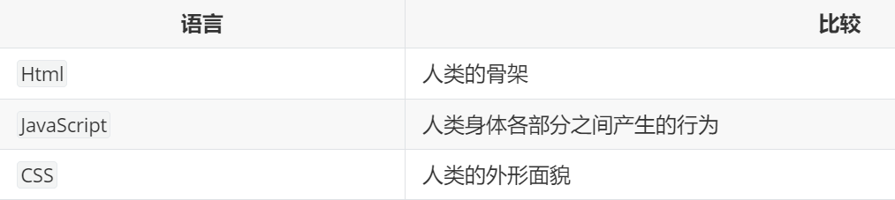

## 什么是JavaScript

JavaScript被广泛用于Web应用开发，常用来为网页添加各式各样的动态功能,为用户提供更流畅美观的浏览效果。嵌入动态文本于HTML页面；对浏览器事件做出响应，读写HTML元素，在数据被提交到服务器之前验证数据；检测访客的浏览器信息；控制用户凭据，包括创建和修改等。



### 安全结合

1、发现更多的有利用价值的信息（URL、域名、路径等等）

测试站、后台路径、未公开的路径、api地址等等

2、发现敏感信息（硬编码的帐号、pass、API密钥、注释等等）

硬编码帐号可登录、测试帐号可被登录、密钥泄露、注释中开发信息等等

3、发现危险的代码（eval、dangerouslySetInnerHTML等等）

URL跳转，XSS跨站、模版注入（SSTI）等

4、了解网站的逻辑校验功能

前端检测，加密逆向，数据走向等

### 学习文档

1、原生JS教程

https://www.w3school.com.cn/js/index.asp

2、jQuery库教程

https://www.w3school.com.cn/jquery/index.asp

3、Axios库教程

https://www.axios-http.cn/docs/intro

## JS基础

### JS开发工具

推荐WebStorm

### 语法

[JavaScript Const](https://www.w3school.com.cn/js/js_const.asp)

var定义全局变量

let定义块{}内变量     块作用域

const定义常量，常量数组可以更改{增删改}，但不能重新赋值

<script type="text/javascript">
声明javascript代码
</script>    

document.write(123)    把123输出到网页

console.log(123)   把123输出到控制台

## Ajax技术

全称为Asynchronous JavaScript And XML【异步的 JavaScript 和 XML】

AJAX 并不是编程语言,AJAX 是一种从网页访问 Web 服务器的技术。

### 作用

javascript代码通过Ajax技术进行数据的提交和返回数据的提取，JAVASCRIPT通过Ajax实现与网站数据的操作

```
AJAX作用：
1、数据交换：通过AJAX可给服务器发送请求，并获取服务器响应的数据
2、后台发送：浏览器的请求是后台js发送给服务器的，js会创建单独的线程发送异步请求，这个线程不会影响浏览器的线程运行。
3、局部刷新：浏览器接收到结果以后进行页面局部刷新
```

### 使用

有三种方式来让javascript使用Ajax技术：原生JS语法，调用jQuery库，调用Axios库