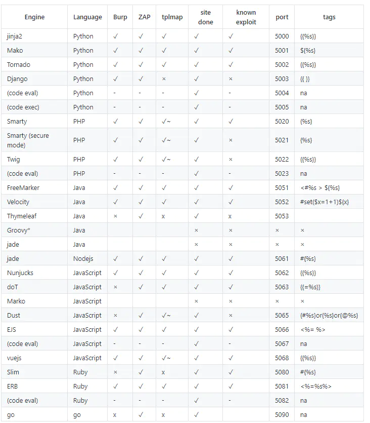

# 基础知识

### 主流开发语言对应模版引擎

### 什么是模版引擎？

模版引擎主要用于美观和数据渲染

模板引擎是以业务逻辑层和表现层分离为目的的，将规定格式的模板代码转换为业务数据的算法实现。

它可以是一个过程代码、一个类，甚至是一个类库。不同的模板引擎其功用也不尽相同，但其基本原理都差不多。

### 什么是SSTI注入

SSTI(Server Side Template Injection) 服务器模板注入, 服务端接收了用户的输入，将其作为 Web 应用模板内容的一部分，在进行目标编译渲染的过程中，执行了用户插入的恶意内容。

参考：https://www.cnblogs.com/R3col/p/12746485.html

# 利用

### 利用思路

1、确定模板引擎

​	改参数看报错

​	看模板语法

​	引擎寻找构造

2、构造payload的思路

​	寻找可用对象（比如字符串、字典，或者已给出的对象）

​	通过可用对象寻找原生对象（object）

​	利用原生对象实例化目标对象（比如os）

​	执行代码

3、如果手工有困难，可用使用Tqlmap或SSTImap代替

### 工具推荐

https://github.com/epinna/tplmap

https://github.com/vladko312/SSTImap

