# 总览

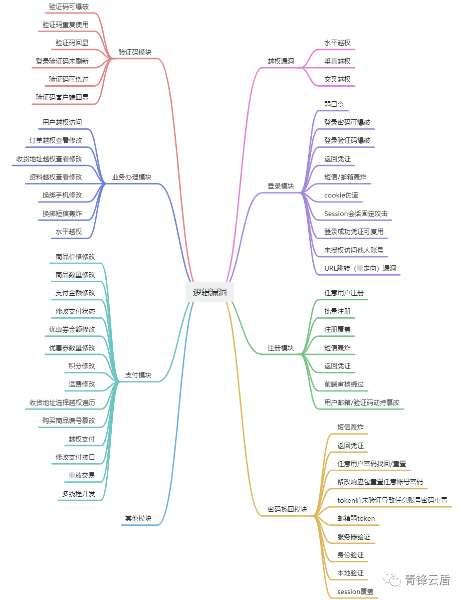

# 越权

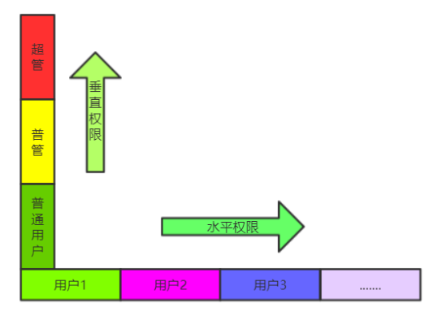

## 分类

### 水平越权

水平越权：同级别的用户之间权限的跨越

eg:通过更换类似于ID之类的身份，从而让同一级别的用户A获取、删除、修改等B账户的数据

#### 原理

网站通过指纹识别用户

当用户以自己的身份去请求一些操作时，请求数据包中会含有该用户的指纹（类似于用户名，用户id，cookie等）来识别该用户，此时更改该指纹为其他用户的指纹就可以以其他用户的身份请求操作

#### 挖掘思路

##### 替换用户id

数据包中发现由请求参数控制的用户ID，可以尝试替换爆破其余用户id

- 用户ID复杂不可预测，如何获取其他用户id？

通过评论区。论坛查看其他用户等方式获取其他用户id


### 垂直越权

低级别用户到高级别用户权限的跨越

eg：通过低权限身份的账号，发送高权限账户才能有的请求，从而进行高权限的操作

#### 挖掘思路

##### 参数控制权限

有时数据包中的一些参数值会代表当前用户的权限，一些页面或功能需要验证该参数值对应的权限，通过修改该参数值，普通用户测试高级别用户功能，尝试垂直越权

##### 替换管理员数据包

首先获取到进行某个管理员操作时需要发送的请求数据包【即进行网站某种操作时发送的数据包，如你要创建一个用户，对应的请求数据包中就有请求创建这个用户的数据】(我们想做管理员操作，首先应该要知道管理员操作的请求数据包格式然后发送出去才可以请求进行这个操作)。

然后获取自己的指纹（比如查看网站源码或者抓包）。假如现在在登录自己的账户，你要进行某种管理员操作，由于你是普通用户，所以网站有可能都不会给你进行某个管理员操作的按钮，这时就需要自己发送获取到的进行某个管理员操作时网站发送的请求数据包。

但是光这样不行，因为你直接发送某个管理员操作时的青秀区数据包中的指纹是那个管理员的，而你当前用的是普通用户登录，网站识别的指纹你普通用户的，所以就需要把发送的管理员操作的请求数据包中的管理员指纹改为你目前正在登陆的普通用户的指纹然后再发送数据包。

**eg:**

以pikachu靶场的Over Permission关卡垂直越权为例：

我们已知了一个用户和一个管理员的账户名与密码，以普通用户的身份登录进去后发现是后台管理系统，但是只有查看权限，没有增加删除权限（没有增加，删除用户按钮）；以管理员的身份登录进去后发现是有增加删除权限（有这两个按钮）；

目标是以普通用户的身份添加一个用户。首先抓取管理员添加一个用户时的数据包，然后登陆普通用户的账号，抓取用户的数据包找到用户的指纹（cookie:preesid：.....),然后用普通用户的指纹替换管理员增加用户时发送的请求数据包里的管理员指纹，发送数据包，完成操作：以普通用户的身份进行管理员操作：添加用户。

### 未授权访问

通过无级别用户能访问到需验证应用或页面

eg:通过删改请求中的认证信息后发送该请求，从而继续访问

#### 利用

##### 信息泄露

通过信息泄露获取对方网站的一些隐秘页面，且对方对应页面未做用户验证，导致可直接未授权访问

## 工具推荐

BP插件：

https://github.com/smxiazi/xia_Yue

https://github.com/Ed1s0nZ/PrivHunterAI

 需要配置ai

https://github.com/WuliRuler/AutorizePro

需要外接ai，推荐阿里云的通义qwcn百炼模型

- 详细使用可以看小迪2024-79天

## 案例

详细看HW蓝队-漏洞库-越权-实战SRC越权未授权挖掘分享案例

# 密码找回

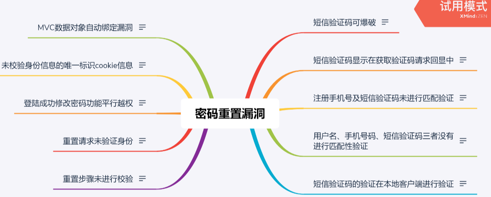

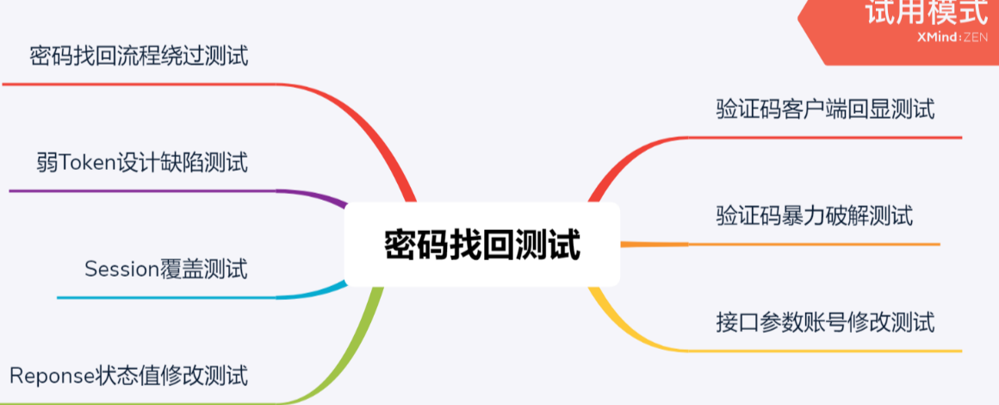

## 原理

为了防止用户遗忘密码，大多数网站都提供了找回密码功能。常见的找回密码方式有：邮箱找回密码、根据密码保护问题找回密码、根据手机号码找回密码等。其中密码找回漏洞在逻辑漏洞中占了较大的比例。测试密码找回漏洞与其他逻辑漏洞的方法相同，

## 分析步骤

必经的两个步骤是：熟悉业务流程（密码找回过程）与对流程中的HTTP数据包请求进行分析。

## 利用

### 弱token


###### 案例

https://mp.weixin.qq.com/s/DHFQ5tZ7nmLzThE0zJz6qA

### 重定向用户

先拿账户1走网站的密码重置流程，收到账户1的邮箱验证码后输入回网站，抓效验完验证码后网站发送的重置密码数据包

对方网站只做验证码正确性，没有效验邮箱与用户的绑定性时，可以尝试更改 在输入1账户邮箱重置密码收到的正确验证码后点击重置密码时发送的数据包中的账户，改为账户2，【即替换效验完正确验证码后发送的重置密码数据包账户】，发现成功更改账户2的密码

eg:

**修改用户对象重置任意用户**

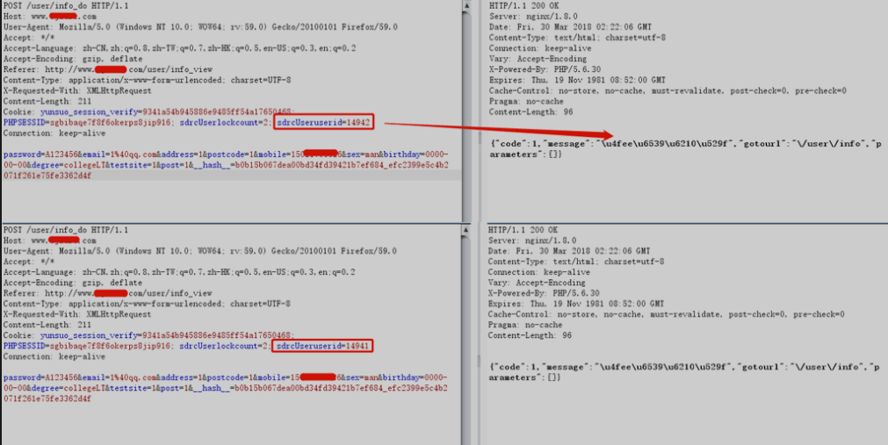

###### 案例

[实战攻防|业务逻辑漏洞篇之任意用户密码重置](https://mp.weixin.qq.com/s/5A5L1MHJh9JtokyYRrfqeg)

[src 挖掘| 奇怪的任意用户重置密码组合拳漏洞](https://mp.weixin.qq.com/s/hnEwAJpcbe7FsSlQOWuNUw)

### 重定向地址

一些网站在重置或忘记密码的功能会被设计为要求用户输入一个邮箱，然后为用户输入的邮箱发送一个重置密码的消息

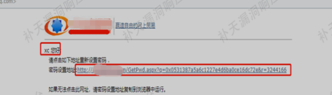

攻击者自己开一台服务器，如用linux系统的nc监听90邮箱端口，然后在发送邮箱的数据包的url处从/xxxx/xxxx/xxx.xxxx.php?改为xxxx.xxxx.php?met_host=192.168.1.5:90

- 即在向网站服务器发送用户输入的邮箱地址的数据包中除了数据包中的自带参数，也可以尝试自己根据网站分析出的逻辑加入别的参数尝试更改网站服务器最终发送消息的邮箱地址

### 跳过步骤

在找回密码的地方假如正常逻辑是点击找回密码-发送邮箱验证码-输入验证码-网站效验验证码-进入重置密码页面-发送重置密码数据包

而网站并没有对完整的业务逻辑的每一步都做效验，先得到发送重置密码的数据包后，直接向网站发送修改后的重置密码的数据包中的账户密码，如果对方没有验证前面的逻辑，

就可以直接跳过步骤，可以直接修改账户密码


###### SRC案例

[记一次企业src的逻辑漏洞（任意密码重置）](https://mp.weixin.qq.com/s/u6PC_ZR-QCJhZOuBEOL4Cg)

### 修改响应包

对方网站在步骤的效验上选择前端效验，即收到正确数据包后就会前端效验成功后跳到重置密码的页面

在输入错误验证码后点击效验，抓服务器效验验证码后回显的效验失败的响应包，把其中的数据【如请求体的json数据】改为效验成功的响应包，发现进入重置密码页面

- 注意：有时就算成功跳到重置密码页面后，向网站后端服务器发送重置密码的数据包后发现发现没有成功修改密码，这说明对方网站服务器不接受这数据。

eg:小程序蚍蜉剧场，在个人信息页面，刷新查询个人页面，抓响应包，修改其中的ID和资产K币【J数据包请求体SON数据的money字段和id字段】、然后放给前端小程序，发现修改成功

eg:

**修改响应包重置任意用户**

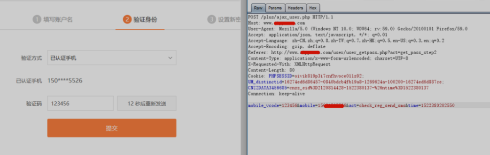

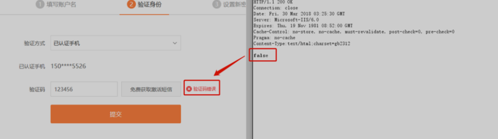

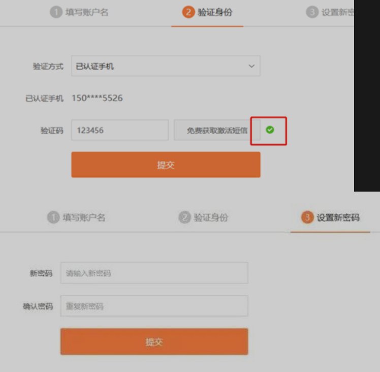


###### SRC案例

[实战|记一次SRC挖掘中任意密码重置的利用](https://mp.weixin.qq.com/s/zsHHSXZHaLmiJFkgsjoHKg)

https://xz.aliyun.com/t/11757#toc-0

# 支付模块

### 支付逻辑常见测试点

1、熟悉常见支付流程

选择商品和数量-选择支付及配送方式-生成订单编号-订单支付选择-完成支付

2、熟悉那些数据篡改

商品ID，购买价格，购买数量，订单属性，折扣属性，支付方式，支付状态等

3、熟悉那些修改方式

替换支付，重复支付，最小额支付，负数支付，溢出支付，优惠券支付等

```
替换支付
支付低价格的商品来买高价格的商品
最小额支付
修改价格为 0.01、绕过金额判断
负数支付
使用 -10.0 做付款金额，若系统未验证，可导致反向
优惠券支付
重复使用优惠券、伪造未绑定优惠券 ID
溢出支付
通过提交异常的金额值（如超出上限或负数）触发系统计算错误
并发
万物皆可并发，懂得都懂
```

4、熟悉那些另类方法

无限试用，越权支付，并发兑换，四舍五入半价购，循环优惠券，支付签约逻辑等

5、羊毛省钱促销机制

新老用户差异，积分兑换制度，邀请分享绕过机制，红包渠道等

### 支付逻辑如何挖掘

1、找到关键的数据包

可能一个支付操作有三四个数据包，我们要对数据包进行挑选。

2、分析数据包

支付数据包中会包含很多的敏感信息（账号，金额，余额，优惠等）

要尝试对数据包中的各个参数进行分析。

```
通常来说敏感字段有这些：
productid 商品id
price 价格 
count 数量
discount 折扣
couponPrice 优惠券
payType 支付方式
payStatus支付状态
finalAmount 最终价格
use_coupon 优惠卷
```

3、不按套路出牌

多去想想开发者没有想到的地方，如算法拼接，关闭开启返优惠券等

4、PC端尝试过，APP端也看看，小程序也试试

### 利用

1.直接修改参数值，如订单id，价格，数量等

[【相关分享】记一次小程序支付逻辑漏洞](https://mp.weixin.qq.com/s/VKFpGSQPIlOV2iunhObc-g)

2.替换数据包，把需要高价购买的订单的数据包中的对应数据替换成低价购买的订单的数据包数据，实现低价购买高价商品【订单对冲】

[一次奇妙的降价支付逻辑漏洞挖掘之旅](https://mp.weixin.qq.com/s/Lof30nJ31axpoQmVCsMWgw)

3.支付方式选择时尝试修改callback

```
#### 调用第三方接口时的Callback

##### 什么是Callback?

网站调用第三方接口时（用到第三方的网站）,用户访问第三方接口后的结果信息会返回回网站，比如支付时网站会跳转到支付宝，用户支付完成后支付宝会返回支付成功的信息给网站，而这个返回信息就叫做Callback

##### Callback的利用：

由于Callback时json格式的语言，而且如果要返回到网站前端，网站前端就必须定义Callback

比如一个登录网站的url就是`http://i.2haohr.com/oauth/wechat?callback=https......`这个url就说了callback的回显信息发送给了`https.....`这个网站，

而基于这样，Callback就有可能产生xss攻击，由于网站要定义callback并有可能显示出来【你查看网站的源代码，搜索`callback=callback对应的值`这样的语句，如果有那就说明这个被网站表达显示出来了，我们就可以尝试自定义callback的值（比如在url处修改）为xss的恶意语句

- 一般callback就有可能固定或者有过滤，所以不是一定可以利用
```

[某运营商支付逻辑漏洞的意外发现](https://mp.weixin.qq.com/s/Is_TLS0V8fltrLvzJXwfuA)

4.优惠卷，对比使用优惠卷和没有使用优惠卷的数据包找到效验优惠卷的参数，之后对该参数（use_coupon）尝试测试【优惠卷复用/优惠卷叠加】

[汉堡白吃？某连锁餐饮 App 竟藏"0元购"漏洞！](https://mp.weixin.qq.com/s/RigIT0U72oq6gpBjEaHqLg)

5.使用积分时尝试修改数据包中的积分值为负数尝试增加积分

[补天权重大于1怎么刷洞-支付逻辑篇](https://mp.weixin.qq.com/s/uKL9E3H1PKLnN1Of3m4EgA)

### 案例

看Hw蓝队-漏洞库-支付逻辑

# 验证码模块

[奇安信攻防社区-验证码渗透最全总结](https://forum.butian.net/share/2602)

## 网站验证码

##### 图形验证码随机值可控

图形验证码是后端随机生成的，如果对方网站代码逻辑有问题，可能会让攻击者可以控制该随机值


##### 回显验证码

验证码在请求或响应数据包中加密或明文传输

eg：

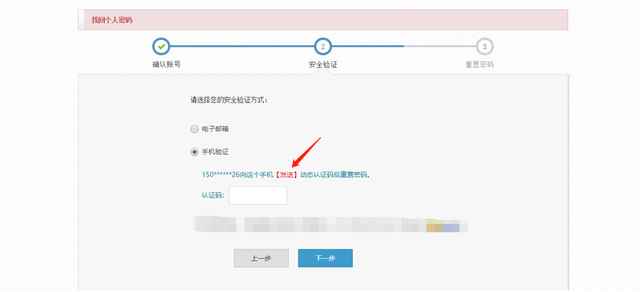

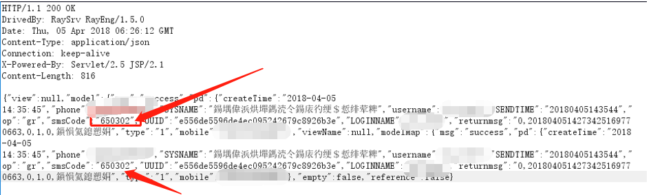

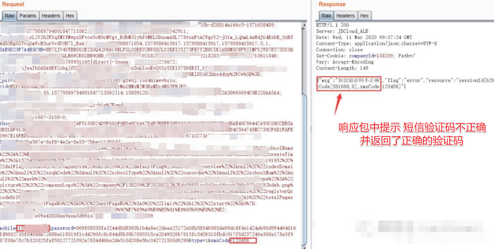

##### 验证码爆破

比如对方是4位数字验证码，且未对短时间收到大量错误验证码做限制

不知道目标验证码，直接爆破验证码，通过看payload长度寻找爆破成功的正确验证码的数据包

###### 验证码图片识别

- 验证码爆破
- 识别[自动识别图片中的字母]

验证码识别插件工具推荐：captcha-killer【可以装到burpsuite的Extender模块】、Pkav_Http_Fuzz、reCAPTCHA等

https://github.com/sml2h3/ddddocr

https://github.com/smxiazi/xp_CAPTCHA

https://github.com/smxiazi/NEW_xp_CAPTCHA

https://github.com/f0ng/captcha-killer-modified

eg:图片验证码的绕过原理：

网站的图片验证码对应着一个网址，每访问一次这个网址就会刷新一次图片，把工具指向这个地址，工具就会在每次爆破时自动访问这个地址并识别图片

- 若对方每次验证码图片的网址都会变化或者其他情况，则插件无法解决，尝试验证码复用或自己写脚本写一个脚本将对方网站路径图片爬下来并转化成自己的固定网址

##### 验证码复用

【验证码的数据包可以二次使用】

[验证码机制之验证码重复使用_验证码复用是危害漏洞吗_星球守护者的博客-CSDN博客](https://blog.csdn.net/qq_41901122/article/details/109451715)

[Web 攻防之业务安全：验证码重复使用 || 前端JS代码实现的验证码 测试._验证码复用_半个西瓜.的博客-CSDN博客](https://blog.csdn.net/weixin_54977781/article/details/123773454?ops_request_misc=&request_id=&biz_id=102&utm_term=验证码复用讲解&utm_medium=distribute.pc_search_result.none-task-blog-2~all~sobaiduweb~default-3-123773454.142^v93^insert_down1&spm=1018.2226.3001.4187)

##### 万能验证码/验证码绕过

开发者开发时为省事写了万能验证码，但是遗留下来没有删除

案例文章：[浅谈SRC中关于密码重置漏洞的相关思路](https://mp.weixin.qq.com/s/iFsEa2IYLo9gOZBPYIHssw)

验证码绕过：

有时候开发，会写两套图形验证码流程，一套是在生产运行阶段必须使用正确验证码才能通过服务器校验。另外一套是在测试 SIT 环境下，把验证码设置为只要是 null 或者是空都可以登录验证码置为空，提高开发工作效率。还有的时候，将验证码修改为 true 就好了。这个是因为开发在进行图形验证码判断的时候，只要是验证码收到的是 true 就会通过

##### 其它

滑块验证码-宏命令

包括sign绕过 在后续JS逆向中有涉及Yakit热加载绕过等

https://blog.csdn.net/shuryuu/article/details/104576559

同理也可以适用在Token，sign在页面代码中自动获取自动填入后绕过验证

##### 案例

https://mp.weixin.qq.com/s/5A5L1MHJh9JtokyYRrfqeg

https://mp.weixin.qq.com/s/DHFQ5tZ7nmLzThE0zJz6qA

## 短信验证码

目标密码找回，任意用户登录，敏感操作验证安全问题

###### 短信轰炸

纵向：

短时间对一个手机号发送大量验证码，造成骚扰

横向：

短时间控制一个网站对多个手机号发送大量验证码，浪费短信资源

###### 修改返回包

返回包返回验证码效验失败的结果，将返回包的结果强制修改成TRUE进行尝试

###### 验证码劫持/请求包劫持修改

网站数据包中明文传输要发送的手机号，可以尝试增删改，如phone=xxxxxxxxx,改为phone=aaaaaaaa或phone=xxxxxxxxx,aaaaaaaaa[看多写一个手机号，网站会不会把短信验证码同时发给多个手机号]

比如233乐园，2025年4月28号为止仍存在该漏洞：

请求体中多加一个手机号，就会同时发送验证码给多个手机

请求包劫持修改：

短信验证码功能发送的是短信，那么我们就有可能把短信内容给更改。

如果发现短信内容由请求包传输，则可以尝试修改请求体中的短信内容从而篡改短信

###### 验证码爆破

尝试爆破网站发送的验证码或者万能验证码

###### 验证码复用

 向手机A发送验证码，收到验证码后登入的时候使用手机B登入，并使用手机A收到的验证码进行登录【类似重定向】

###### 验证码不校验

在网站的验证码模块，不点击发送验证码，直接随便输入一些数字尝试是否可以直接进入

###### 验证码明文回显

返回的响应包中含带着发送的验证码

##### 演示案例

看Hw蓝队-漏洞库-短信验证码

##### 短信炸弹的绕过

[奇安信攻防社区-验证码渗透最全总结](https://forum.butian.net/share/2602)

##### 接口测试

短信纵向轰炸的原理是短时间调用多个网站的短信接口对同一个手机号进行发送，而有的网站会设置在发送的上一个验证码没有失效之前不会再发送新的验证码，难以被调用去轰炸，因此就需要了解如何测试一个网站的接口是否可以利用

推荐工具：

短信接口测试：BP插件https://github.com/yuziiiiiiiiii/SMS_Bomb_Fuzzer

会尝试各种绕过测试数据包尝试绕过限制【技术来自“短信炸弹的绕过”】尝试短信接口是否可以被滥用

