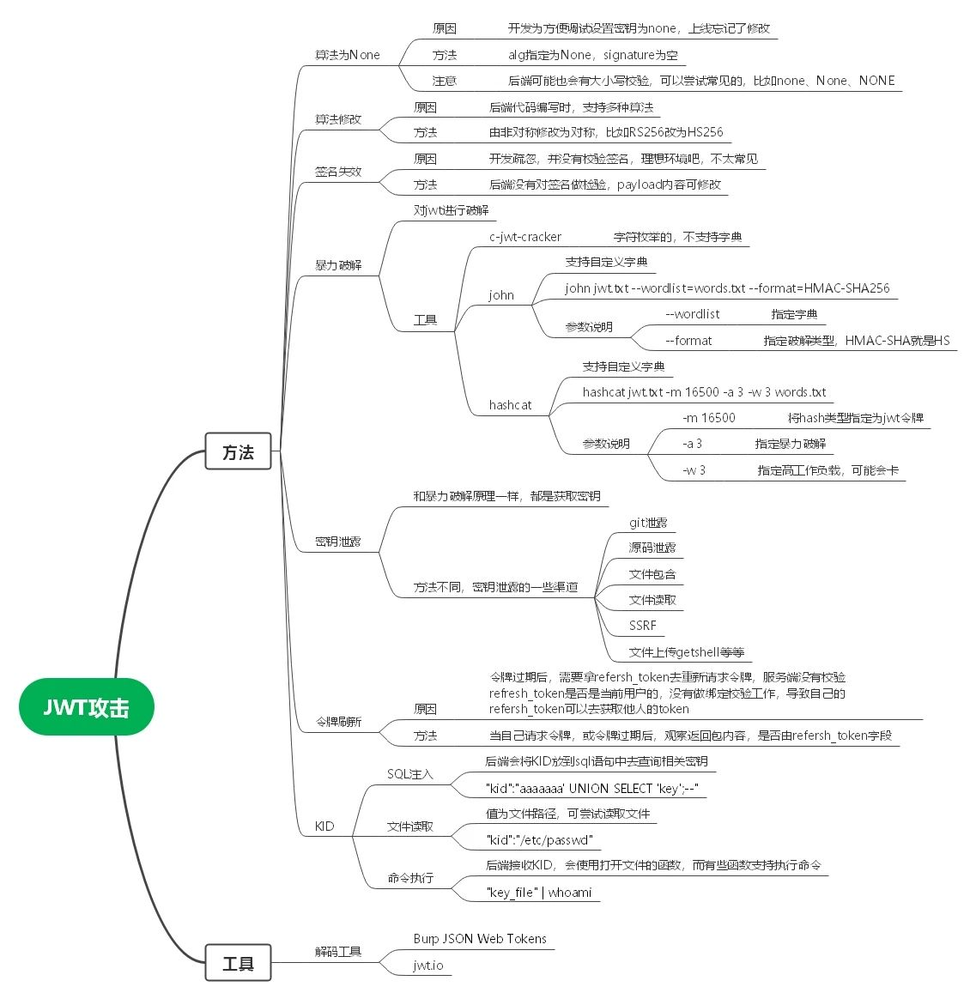
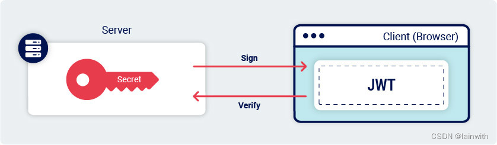
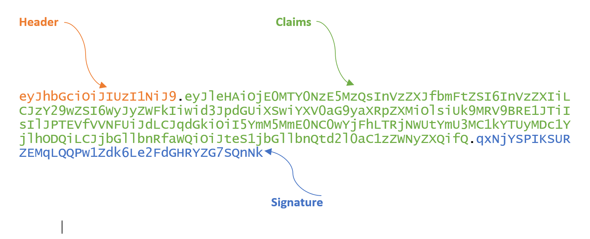
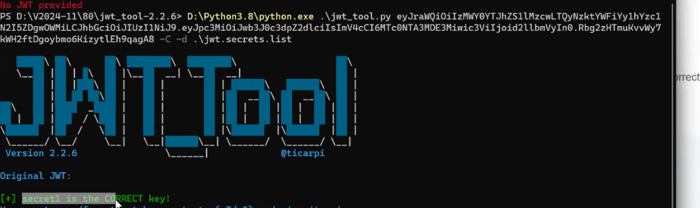

# 总览







# 基础知识

## 什么JWT?

JSON Web Token(JWT)。它遵循JSON格式，将用户信息加密到token里，

服务器不保存任何用户信息，只保存密钥信息，

通过使用特定加密算法验证token，通过token验证用户身份。

基于token的身份验证可以替代传统的cookie+session身份验证方法。这使得JWT成为高度分布式网站的热门选择，在这些网站中，用户需要与多个后端服务器无缝交互。

```
Token、Cookie+Session 完整区别（面试简答版，漏洞挖掘高频考点）
一、基础概念
Cookie
浏览器本地小型文本存储，由服务器下发，每次 HTTP 请求自动携带，存储在客户端，有大小、域名、过期限制。
Session（服务端会话）
服务端开辟一块内存 / 数据库空间保存用户会话数据；
仅向客户端下发一条 SessionID，存于 Cookie 里；
客户端每次请求带 Cookie，服务端拿 SessionID 匹配对应会话数据。
Token（令牌，常见 JWT/OAuth）
一段加密 / 签名字符串，本身承载全部用户身份、权限信息；
不依赖服务端存储会话，客户端存 Cookie、LocalStorage 均可。
二、核心差异对比
1. 存储位置
Session：数据存在服务端，客户端只存 SessionID
Token：全部身份数据存在 Token 字符串内，存储在客户端
2. 服务端状态（有无状态）
Session：有状态
服务端要维护会话池，用户多会占用大量内存；集群环境需要 Session 共享（Redis）。
Token(JWT)：无状态
服务端不用存会话，只校验签名；天然适配分布式、微服务。
3. 数据承载能力
Session：SessionID 只是索引，真实用户信息存在服务端，可存大量数据。
Token：字符串有长度限制，不宜存放超大业务数据。
4. 跨域、跨服务适配
Session 依赖 Cookie，浏览器同源策略限制，跨域难；多系统单点登录实现复杂。
Token 可放 Header（Authorization: Bearer xxx），轻松跨域、多服务单点登录（OAuth2.0）。
5. 注销 / 失效逻辑
Session：服务端直接删除对应会话记录，立刻失效，可控性强。
Token：无服务端存储，标准 JWT 无法主动销毁，只能等过期；黑名单方案需额外 Redis 存储，增加成本。
6. 安全相关（漏洞挖掘重点）
Session
风险：Session 劫持（XSS 偷 Cookie）、Session 固定、CSRF；
防护：HttpOnly、Secure、SameSite、Session 随机刷新。
Token(JWT)
风险：密钥泄露可伪造任意 Token；未校验签名可篡改载荷；过期未校验；敏感信息明文存放；
无 CSRF 风险（不放 Cookie、放请求头时）。
三、最简单一句话总结
Cookie+Session：客户端只拿 ID，用户数据存在服务器，有状态，适合传统单体 Web；
Token (JWT)：用户权限信息全部加密写在令牌里，服务端不存会话，无状态，适合分布式、跨域、单点登录。
面试精简回答（直接背）
Cookie 是客户端存储载体，Session 是服务端会话存储，二者配套使用，依靠 Cookie 传递 SessionID，服务端维护会话状态，存在内存压力、跨域困难、易受 CSRF 攻击；
Token（如 JWT）将用户身份、权限加密封装在令牌内，客户端存储，服务端无需保存会话，无状态，天然适配分布式与跨域单点登录，但存在无法主动注销、密钥泄露风险。
```


## JWT数据格式

JWT通过数据包的cookie传值，采用token方式

eg:、

fofa在用户登录后，可以在网站页面的cookie中发现fofa_token=......



#### 1、标头（Header）

Header是JWT的第一个部分，是一个JSON对象，主要声明了JWT的签名算法，如"HS256”、"RS256"等，以及其他可选参数，如"kid"、"jku"、"x5u"等

alg字段通常用于表示加密采用的算法。如"HS256"、"RS256"等

typ字段通常用于表示类型

还有一些其他可选参数，如"kid"、"jku"、"jwk"等

 

#### 2、有效载荷（Payload）

Payload是JWT的第二个部分，这是一个JSON对象，主要承载了各种声明并传递明文数据，用于存储用户的信息，如id、用户名、角色、令牌生成时间和其他自定义声明。

iss：该字段表示jwt的签发者。

sub：该jwt面向的用户|用户名。

aud：jwt的接收方。

exp：jwt的过期时间,通常来说是一个时间戳。

iat：jwt的签发时间,常来说是一个时间戳。

jti：此jwt的唯一标识。通常用于解决请求中的重放攻击。该字段在大多数地方没有被提及或使用。因为使用此字段就意味着必须要在服务器维护一张jti表， 当客户端携带jwt访问的时候需要在jti表中查找这个唯一标识是否被使用过。使用这种方式防止重放攻击似乎让jwt有点怪怪的感觉, 毕竟jwt所宣称的优点就是无状态访问

 

#### 3、签名（Signature）

Signature是对Header和Payload进行签名，具体是用什么加密方式写在Header的alg 中。同时拥有该部分的JWT被称为JWS，也就是签了名的JWT。

对Header和Payload进行签名，具体是用什么加密方式写在Header的alg中。

同时拥有该部分的JWT被称为JWS，也就是签了名的JWT。

 

第一部分：对 JSON 的头部做 base64 编码处理得到

第二部分：对 JSON 类型的 payload 做 base64 编码处理得到

第三部分：分别对头部和载荷做base64编码，并使用.拼接起来

使用头部声明的加密方式，对base64编码前两部分合并的结果加盐加密处理，作为JWT

## -对称加密与非对称加密区别

#### HS256与RS256

HS256：对称性加密（同一的密钥加密和解密），可尝试爆破

RS256：非对称性加密（公钥和私钥，私钥解密公钥加密或私钥加密公钥加密），爆破难度过大

## -JWT头部参数注入

根据JWS规范，只有头部参数alg是必需的。然而实际中，JWT头部（也称为JOSE头部）通常包含其他几个参数。以下是攻击者特别感兴趣的参数：

jwk（JSON Web Key）：提供一个表示密钥的嵌入式JSON对象。
jku（JSON Web Key Set URL）：提供一个URL，服务器可以从中获取一组包含正确密钥的密钥。
kid（Key ID）：提供一个ID，在有多个密钥可供选择的情况下，服务器可以使用该ID来识别正确的密钥。根据密钥的格式可能还有一个匹配的kid参数。
如上，这些用户可控制的参数用于告诉接收方服务器在验证签名时使用哪些密钥。
原文链接：https://blog.csdn.net/weixin_44288604/article/details/128562796

### JWK

JWT数据头部多了一个JWK参数

JWS（签名后的JWT）规范描述了一个可选的 jwk 头部参数，服务器可以用它将其公钥直接嵌入JWK格式的令牌本身。

JWK（JSON Web密钥）是一种标准化的格式，用于将密钥表示为JSON对象。

公钥和私钥：
如果你不熟悉术语“公钥”和“私钥”，BurpSuite提供了详细的资料，请参阅 对称算法与非对称算法

JWT头部示例如下：

```
{
    "kid": "ed2Nf8sb-sD6ng0-scs5390g-fFD8sfxG",
    "typ": "JWT",
    "alg": "RS256",
    "jwk": {
        "kty": "RSA",
        "e": "AQAB",
        "kid": "ed2Nf8sb-sD6ng0-scs5390g-fFD8sfxG",
        "n": "yy1wpYmffgXBxhAUJzHHocCuJolwDqql75ZWuCQ_cb33K2vh9m"
    }
}

```

理想情况下，服务器应该只使用有限的公钥白名单来验证 JWT 签名。但是，配置错误的服务器有时会使用嵌入在jwk参数中的任何密钥。因此攻击者可以用自己的RSA私钥对修改过的JWT进行签名，然后在jwk头部中嵌入对应的公钥。
可以使用bp插件“JWT Editor”很方便的完成这种攻击。（你也可以通过jwk自己添加标头来手动执行此攻击。但是，你可能还需要更新 JWT 的kid标头参数以匹配kid嵌入密钥的参数。该扩展的内置攻击会为您处理此步骤）

在加载该扩展后，在Burp的主选项卡栏中，转到JWT Editor Keys选项卡。
创建一个新的RSA密钥。
向Burp Repeater发送一个包含JWT的请求。
在消息编辑器中，切换到扩展生成的JSON Web Token选项卡，并以你喜欢的方式修改令牌的载荷。
点击Attack按钮，然后选择Embedded JWK。当收到提示时，选择新生成的RSA密钥。
发送请求，测试服务器的响应情况。

### JKU

### KID


# 工具推荐

#### 识别检测利用项目：

BURP插件：Hae     &    JSON Web Tokens    &     WT Editor

https://jwt.io/


https://github.com/ticarpi/jwt_tool

https://github.com/wallarm/jwt-secrets


jwt综合测试工具：

https://github.com/z-bool/Venom-JWT

可选工具模式，可选渗透思路与常见攻击手法，比较综合


jwt安全扫描工具：

bp扩展：

https://github.com/CompassSecurity/jwt-scanner


# 漏洞发现

## 黑盒

首先找到需要JWT鉴权后才能访问的页面，如个人资料页面，将请求重放测试：

1）未授权访问：删除Token后仍然可以正常响应对应页面

2）敏感信息泄露：通过JWt.io解密出Payload后查看其中是否包含敏感信息，如弱加密的密码等

3）破解密钥+越权访问：通过JWT.io解密出Payload部分内容，通过空加密算法或密钥爆破等方式实现重新签发Token并修改Payload部分内容，重放请求包，观察响应包是否能够越权查看其他用户资料

4）检查Token时效性：解密查看payload中是否有exp字段键值对（Token过期时间），等待过期时间后再次使用该Token发送请求，若正常响应则存在Token不过期

5）通过页面回显进行探测：如修改Payload中键值对后页面报错信息是否存在注入，payload中kid字段的目录遍历问题与sql注入问题

# 常见攻击手法

- 参考文章：[细说——JWT攻击_jwt漏洞-CSDN博客](https://blog.csdn.net/weixin_44288604/article/details/128562796)

### 实验室案例

在小迪给的实验室靶场

#### 第一关-空签名直接修改jwt值

进入输入账户密码登录页面，先尝试抓包，数据包中什么都没有，然后登录靶场给的用户账户密码后，数据包中cookie的session字段发现JWT，通过BP的JSON Web Tokens插件查看解密后的JWT数据，发现对方没有签名验证部分

则通过修改BP的JSON Web Tokens页面中payload的sub字段为administrator，可以获取到管理员权限，因为对方没有签名验证

实际案例：

InfluxDB JWT未授权漏洞（CVE-2019-20933）：

https://mp.weixin.qq.com/s/obiU3BaFoZ7272z2vS0QgQ


#### 第二关-有签名但算法可自定义

同第一关一样，在登录页面，没有登录的情况下数据包中无JWT数据，登录后通过BP的JSON Web Tokens插件发现JWT数据，发现对方有签名验证，但是jwt头部写明了alg的值为HS256

由于对方代码采取的方式不是固定一个算法解密签名进行验证，而是自动识别数据包中的算法并对签名进行解密，也就是以接收到的数据包中的ALG的值为主

因此通过修改jwt头部的alg的值为none,并删除签名部分来绕过验证

此时再修改sub字段为administrator即可访问/admin页面

#### 第三关-对称算法弱秘钥爆破

- 对称算法可以尝试爆破

登录后查看数据包的jwt数据，发现对方有签名且alg值写明了为“HS256”,尝试改空并删除签名，再修改sub字段为administrator访问/admin页面，发现失败

说明对方不以数据包中的alg字段为主，则尝试爆破秘钥

对方采用的算法为HS256,为对称加密

通过工具jwt_tool以及小迪的字典进行爆破



获取到秘钥为secret1

在BP的重放器的功能的JSON Web Tokens扩展页面选择Recalculate选项并输入秘钥，然后再修改sub字段为administrator即可访问/admin页面

实际案例：[一次完整的Jwt伪造漏洞实战案例](https://mp.weixin.qq.com/s/ITVFuQpA8OCIRj4wW-peAA)

#### -第四关-通过jwk标头注入


#### -第五关-通过jku标头注入

和jwk一样都是自定义算法 只不过用远程的方式去加载

#### -第六关-通过kid头路径遍历

### CTFSHOW

#### JWT-Web349 公私钥泄露

对方泄露了网站源码，通过代码审计，得知对方采用的为RS256加密，采用私钥加密，公钥解密

由于RS256为非对称加密，因此不能采用爆破

对方网站泄露了公钥与私钥文件目录，访问目录后下载公钥与私钥

通过python写以下脚本

```
pip install PyJWT==1.7.1
```

```
import jwt
public = open('private.key', 'r').read()
payload={"user":"admin"}
print(jwt.encode(payload, key=public, algorithm='RS256'))

//只需要通过私钥对修改后的数据进行加密即可，对方会接受并采用公钥进行解密
```

获取到修改user为admin后的加密JWT

将数据包中的Cookie字段修改成上面的结果，由于对方网站代码写明接受post数据，修改提交方式为POST，得到flag

- 实战情况

实战中公私钥泄露的来源：

源码泄露+审计

由于jwt使用了base64编码，可以解码后查看是否存在密钥、账号等敏感信息。

- 实战案例

konga默认秘钥泄露：[SRC挖掘中的权限绕过，导致的任意用户登录](https://mp.weixin.qq.com/s/st0xma6KoRbo1NUp9rtZhw)

Spring Blade框架配合nday：[记一次项目中快速挖掘漏洞](https://mp.weixin.qq.com/s/9OL5jZK7S1MiEUb8Q_F1Pw)

#### JWT--Web350 算法篡改

题目给了源码，审计源码可以发现对方采用hs512非对称加密，私钥加密，公钥解密，源码中有公钥文件，但是没有私钥文件，因此无法使用对方的算法

审计源码可以得知对方没有固定对称与非对称，因此可以修改非对称加密为对称加密，修改请求数据包中的算法为hs256[对称解密]，然后使用公钥进行加密

# 实战案例

虚假JWT：[奇葩逻辑漏洞分享之虚假的 JWT 认证](https://mp.weixin.qq.com/s/xuY1oTwFcM1pyiql0U3NPQ)

空签名绕过：InfluxDB JWT未授权漏洞（CVE-2019-20933）：https://mp.weixin.qq.com/s/obiU3BaFoZ7272z2vS0QgQ

弱秘钥爆破：[一次完整的Jwt伪造漏洞实战案例](https://mp.weixin.qq.com/s/ITVFuQpA8OCIRj4wW-peAA)
